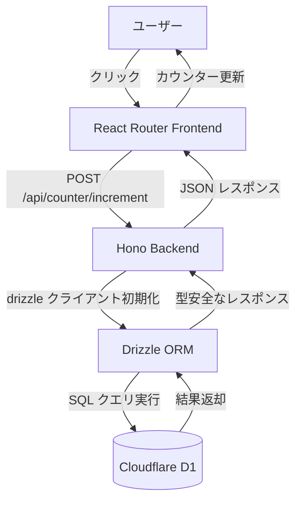
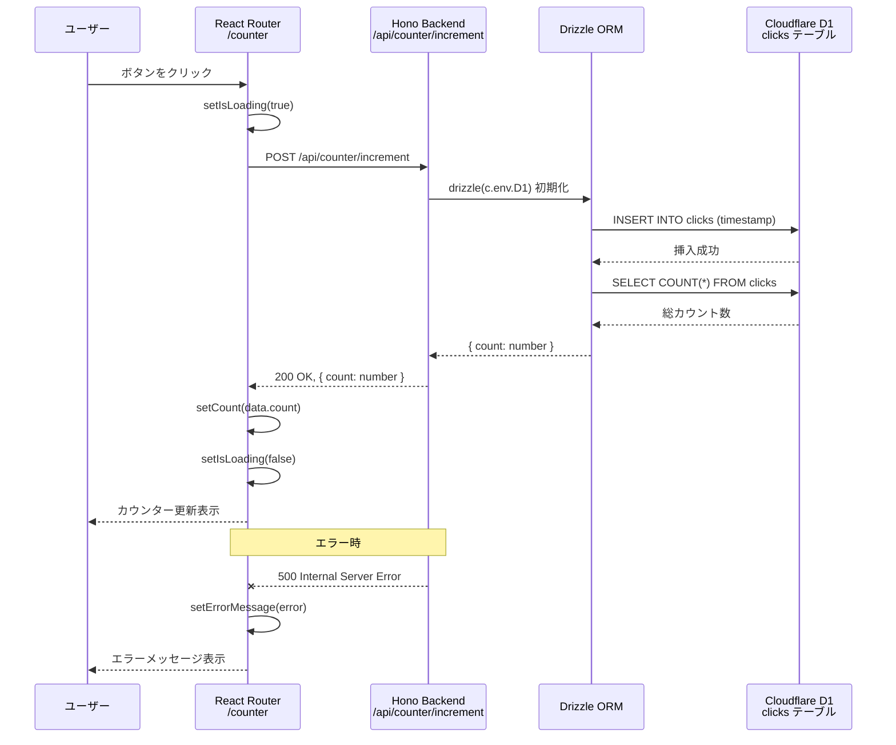
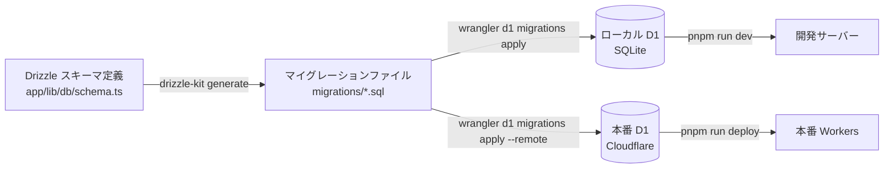
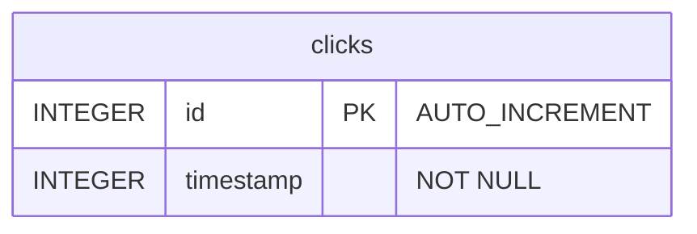
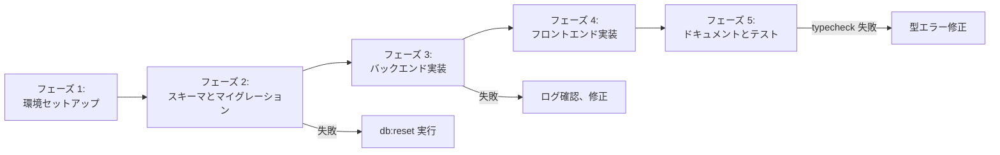

# 技術設計書

## 概要

本機能は、Cloudflare D1 データベースと Drizzle ORM を既存の React Router 7 + Hono + Cloudflare Workers アーキテクチャに統合し、クリックカウンター機能を持つデモアプリケーションを実装します。これにより、yantene.net におけるエッジデータベース統合のリファレンス実装として機能し、型安全なデータベース操作のベストプラクティスを提供します。

**目的**: D1 データベースと Drizzle ORM の統合パターンを実証し、開発者が将来的なデータベース機能を実装する際の基盤を構築する。

**ユーザー**: 開発者がローカル開発環境と本番環境の両方でデータベース操作を実行でき、エンドユーザーはクリックボタンを押してカウンターが更新される視覚的なフィードバックを得る。

**影響**: 既存のアーキテクチャに新しいデータ層を追加するが、既存のフロントエンドとバックエンドのパターンは維持される。

### ゴール

- Cloudflare D1 データベースと Drizzle ORM のセットアップを完了し、ローカル開発環境と本番環境の両方で動作可能にする
- 型安全なデータベース操作を実装し、TypeScript strict mode と ESLint ルールに準拠する
- シンプルで理解しやすいリファレンス実装を提供し、将来的な拡張の基盤とする
- クリックカウンター機能を通じて、データベース連携が正しく動作することを視覚的に確認できるデモを提供する

### 非ゴール

- クリーンアーキテクチャ（リポジトリパターン、ドメイン層分離）のフル実装
- 複数環境（development, staging, production）の自動デプロイメント設定
- 高度なデータベース機能（リレーション、トランザクション、カスタム型定義）
- パフォーマンスベンチマークや負荷テスト

## アーキテクチャ

> 詳細な調査結果は `research.md` に記載。本設計書は設計判断と契約を中心に記述。

### 既存アーキテクチャ分析

既存のシステムは以下のパターンを採用しており、これらを維持します。

- **Hono ファクトリパターン**: `getApp(handler)` が React Router ハンドラーをラップし、API ルートと SSR を共存させる
- **パスエイリアス**: `~/` が `./app/` にマッピングされ、フロントエンド、バックエンド、共有ユーティリティで一貫した import を実現
- **TypeScript strict mode**: 厳格な型チェックと ESLint ルールにより、ランタイムエラーを防止
- **TailwindCSS v4**: 既存のスタイリング設定をそのまま使用

### アーキテクチャパターンと境界マップ



**アーキテクチャ統合**:

- **選択したパターン**: Simplified Approach（参照実装のベストプラクティスを活用しつつ、クリーンアーキテクチャは省略）
- **理由**: カウンターデモは単一テーブルの単純な CRUD 操作のみ。過剰な抽象化を避け、シンプルで理解しやすいコードを優先
- **ドメイン/機能境界**:
  - **フロントエンド層**: UI とユーザーインタラクション（React Router）
  - **バックエンド層**: API ハンドラーとビジネスロジック（Hono）
  - **データ層**: データベーススキーマと ORM 操作（Drizzle ORM + D1）
- **既存パターンの維持**:
  - Hono ファクトリパターン: `getApp(handler)` を拡張して新しい API エンドポイントを追加
  - React Router ルートパターン: 既存の `app/frontend/routes/` に新しいルートを追加
  - 共有型定義: `app/lib/types/` に API レスポンス型を配置
- **新規コンポーネントの根拠**:
  - **データベーススキーマ**: D1 テーブル定義と型安全性を提供
  - **API エンドポイント**: クリックカウンター操作を処理
  - **フロントエンドルート**: カウンター UI を表示
- **ステアリング準拠**: TypeScript strict mode、ESLint ルール、パスエイリアス、ファクトリパターンを維持

### テクノロジースタック

| レイヤー                       | 選択 / バージョン                | 機能での役割                                                             | 備考                                                 |
| ------------------------------ | -------------------------------- | ------------------------------------------------------------------------ | ---------------------------------------------------- |
| フロントエンド                 | React 19.1.1, React Router 7.9.2 | カウンター UI、API 通信、状態管理                                        | 既存スタック維持                                     |
| バックエンド                   | Hono 4.10.7                      | `/api/counter/increment` エンドポイント実装、エラーハンドリング          | 既存スタック維持                                     |
| データ / ストレージ            | **Drizzle ORM 0.45.1** (新規)    | 型安全な D1 データベース操作、スキーマ定義                               | プロダクション対応、D1 完全サポート                  |
| データ / ストレージ            | **Cloudflare D1** (新規)         | SQLite ベースのエッジデータベース、clicks テーブル保存                   | Cloudflare Workers エッジ環境で動作                  |
| インフラ / ランタイム          | Cloudflare Workers               | エッジデプロイメント、D1 バインディング提供                              | 既存スタック維持                                     |
| ビルドツール / マイグレーション | **Drizzle Kit 0.31.8** (新規)    | マイグレーション生成、スキーマ管理                                       | 開発時のみ使用                                       |
| ビルドツール / マイグレーション | **Wrangler 4.51.0**              | D1 マイグレーション適用、ローカルエミュレーション                        | 既存バージョン維持、D1 コマンドを追加               |
| スタイリング                   | TailwindCSS 4.1.13               | カウンター UI のスタイリング                                             | 既存スタック維持                                     |

**新規依存関係の追加**:
- `drizzle-orm@0.45.1`: D1 データベース操作用 ORM
- `drizzle-kit@0.31.8`: マイグレーション生成とスキーマ管理（devDependencies）

**設定変更**:
- `wrangler.jsonc`: D1 バインディング設定と `nodejs_compat` フラグ追加
- `drizzle.config.ts`: Drizzle Kit 設定ファイル新規作成
- `package.json`: npm scripts 追加（`db:generate`, `db:migrate`, `db:reset`）

## システムフロー

### クリックカウンター操作フロー



**主要な判断**:
- **挿入と取得の 2 ステップ**: INSERT 後に COUNT(*) を実行してカウンター値を取得（トランザクション不要）
- **エラーハンドリング**: API でエラーをキャッチし、500 レスポンスを返す。UI 側でエラーメッセージを表示
- **ローディング状態**: ボタンを無効化し、視覚的なフィードバックを提供

### マイグレーション管理フロー



**主要な判断**:
- **マイグレーション生成**: Drizzle Kit を使用してスキーマから SQL を自動生成
- **マイグレーション適用**: Wrangler CLI を使用してローカルまたはリモートに適用
- **リセット機能**: `db:reset` で全テーブル削除 + マイグレーション再適用（開発時のみ）

## 要件トレーサビリティ

以下の表は、各要件が設計要素（コンポーネント、インターフェース、フロー）によって実現されることを示します。

| 要件 | 概要                                      | コンポーネント                                      | インターフェース                                   | フロー                                 |
| ---- | ----------------------------------------- | --------------------------------------------------- | -------------------------------------------------- | -------------------------------------- |
| 1.1  | clicks テーブルスキーマ定義               | Database Schema (app/lib/db/schema.ts)              | Drizzle スキーマ定義                               | マイグレーション管理フロー             |
| 1.2  | Drizzle スキーマ定義ファイル              | Database Schema (app/lib/db/schema.ts)              | clicks テーブル型定義                              | —                                      |
| 1.3  | マイグレーション生成仕組み                | Drizzle Kit 設定 (drizzle.config.ts)                | npm scripts (db:generate)                          | マイグレーション管理フロー             |
| 1.4  | Wrangler D1 バインディング設定            | Wrangler 設定 (wrangler.jsonc)                      | D1 バインディング (D1)                             | —                                      |
| 1.5  | ローカル開発環境初期化ドキュメント        | README.md 更新                                      | npm scripts (db:migrate)                           | マイグレーション管理フロー             |
| 1.6  | 本番 D1 バインディング検証                | Wrangler 設定 (wrangler.jsonc)                      | D1 バインディング (D1)                             | —                                      |
| 2.1  | Drizzle ORM クライアント初期化            | Counter API Endpoint (app/backend/index.ts)         | drizzle(c.env.D1)                                  | クリックカウンター操作フロー           |
| 2.2  | Hono コンテキストから D1 アクセス         | Counter API Endpoint (app/backend/index.ts)         | c.env.D1                                           | クリックカウンター操作フロー           |
| 2.3  | /api/counter/increment POST 処理          | Counter API Endpoint (app/backend/index.ts)         | POST /api/counter/increment                        | クリックカウンター操作フロー           |
| 2.4  | clicks テーブルにレコード挿入             | Counter API Endpoint (app/backend/index.ts)         | db.insert(clicks).values({ timestamp })            | クリックカウンター操作フロー           |
| 2.5  | 総クリック数取得                          | Counter API Endpoint (app/backend/index.ts)         | db.select({ count: count() }).from(clicks).get()   | クリックカウンター操作フロー           |
| 2.6  | JSON レスポンス返却                       | Counter API Endpoint (app/backend/index.ts)         | c.json({ count: number })                          | クリックカウンター操作フロー           |
| 2.7  | エラーハンドリング                        | Counter API Endpoint (app/backend/index.ts)         | try-catch, c.json({ error }, 500)                  | クリックカウンター操作フロー（エラー） |
| 2.8  | 明示的な戻り値型定義                      | Counter API Endpoint, Shared Types                  | Promise<Response>, CounterResponse                 | —                                      |
| 3.1  | /counter ルート提供                       | Counter Route (app/frontend/routes/counter.tsx)     | React Router ルート                                | —                                      |
| 3.2  | 総クリック数表示                          | Counter Route (app/frontend/routes/counter.tsx)     | useState<number>                                   | クリックカウンター操作フロー           |
| 3.3  | カウントアップボタン配置                  | Counter Route (app/frontend/routes/counter.tsx)     | <button onClick={handleIncrement}>                 | —                                      |
| 3.4  | POST リクエスト送信                       | Counter Route (app/frontend/routes/counter.tsx)     | fetch("/api/counter/increment", { method: "POST" }) | クリックカウンター操作フロー           |
| 3.5  | ローディング状態表示                      | Counter Route (app/frontend/routes/counter.tsx)     | useState<boolean>, disabled={isLoading}            | クリックカウンター操作フロー           |
| 3.6  | カウンター数値更新                        | Counter Route (app/frontend/routes/counter.tsx)     | setCount(data.count)                               | クリックカウンター操作フロー           |
| 3.7  | エラーメッセージ表示                      | Counter Route (app/frontend/routes/counter.tsx)     | useState<string \| null>, setErrorMessage          | クリックカウンター操作フロー（エラー） |
| 3.8  | TailwindCSS スタイリング                  | Counter Route (app/frontend/routes/counter.tsx)     | className="..."                                    | —                                      |
| 3.9  | Boolean 変数命名規則                      | Counter Route (app/frontend/routes/counter.tsx)     | isLoading, errorMessage                            | —                                      |
| 4.1  | Drizzle スキーマからの型定義              | Database Schema, Shared Types                       | clicks テーブル型                                  | —                                      |
| 4.2  | API レスポンス型定義共有                  | Shared Types (app/lib/types/counter.ts)             | CounterResponse                                    | —                                      |
| 4.3  | 明示的な戻り値型アノテーション            | Counter API Endpoint, Counter Route                 | Promise<Response>, Promise<void>                   | —                                      |
| 4.4  | ESLint 厳格ルール適用                     | 既存 ESLint 設定                                    | —                                                  | —                                      |
| 4.5  | pnpm run typecheck 完了                   | TypeScript strict mode                              | —                                                  | —                                      |
| 4.6  | インライン型インポート                    | Counter API Endpoint, Counter Route                 | import { type CounterResponse }                    | —                                      |
| 4.7  | Vitest テスト環境                         | 既存 Vitest 設定                                    | —                                                  | —                                      |
| 5.1  | pnpm run dev で D1 エミュレート           | Wrangler 設定, npm scripts                          | wrangler dev                                       | —                                      |
| 5.2  | マイグレーション適用ドキュメント          | README.md 更新                                      | npm scripts (db:migrate)                           | マイグレーション管理フロー             |
| 5.3  | pnpm run build                            | 既存ビルド設定                                      | —                                                  | —                                      |
| 5.4  | pnpm run deploy                           | 既存デプロイ設定                                    | —                                                  | —                                      |
| 5.5  | D1 セットアップ手順ドキュメント           | README.md 更新                                      | —                                                  | マイグレーション管理フロー             |
| 5.6  | D1 バインディング名定義                   | Wrangler 設定 (wrangler.jsonc)                      | "binding": "D1"                                    | —                                      |
| 6.1  | D1 接続エラーハンドリング                 | Counter API Endpoint (app/backend/index.ts)         | try-catch, c.json({ error }, 500)                  | クリックカウンター操作フロー（エラー） |
| 6.2  | Drizzle クエリエラーハンドリング          | Counter API Endpoint (app/backend/index.ts)         | try-catch, console.error                           | クリックカウンター操作フロー（エラー） |
| 6.3  | 不正な HTTP メソッドエラー                | Hono デフォルト動作                                 | 405 Method Not Allowed                             | —                                      |
| 6.4  | フェッチエラー検出                        | Counter Route (app/frontend/routes/counter.tsx)     | try-catch, setErrorMessage                         | クリックカウンター操作フロー（エラー） |
| 6.5  | 構造化エラーログ出力                      | Counter API Endpoint (app/backend/index.ts)         | console.error("Counter increment error:", error)   | —                                      |
| 6.6  | マイグレーション失敗ドキュメント          | README.md 更新                                      | —                                                  | マイグレーション管理フロー             |

## コンポーネントとインターフェース

### コンポーネント概要

以下のコンポーネントが新規作成または拡張されます。

| コンポーネント                     | ドメイン / レイヤー | 意図                                                       | 要件カバレッジ                        | 主要な依存関係（P0/P1）                     | 契約                           |
| ---------------------------------- | ------------------- | ---------------------------------------------------------- | ------------------------------------- | ------------------------------------------- | ------------------------------ |
| Database Schema                    | データ              | clicks テーブルのスキーマ定義と型安全性提供                | 1.1, 1.2, 4.1                         | Drizzle ORM (P0)                            | State                          |
| Counter API Endpoint               | バックエンド        | クリックカウンター操作の API 処理                          | 2.1, 2.2, 2.3, 2.4, 2.5, 2.6, 2.7, 2.8, 6.1, 6.2, 6.5 | D1 バインディング (P0), Drizzle ORM (P0)   | API, Service                   |
| Counter Route                      | フロントエンド      | カウンター UI とユーザーインタラクション                   | 3.1, 3.2, 3.3, 3.4, 3.5, 3.6, 3.7, 3.8, 3.9, 6.4 | Counter API Endpoint (P0)                   | State                          |
| Shared Types                       | 共有ユーティリティ  | フロントエンドとバックエンド間の型定義共有                 | 4.2, 4.6                              | —                                           | —                              |
| Drizzle Kit 設定                   | ビルドツール        | マイグレーション生成とスキーマ管理                         | 1.3                                   | Database Schema (P0)                        | —                              |
| Wrangler 設定                      | インフラ            | D1 バインディング設定とマイグレーション適用                | 1.4, 1.6, 5.6                         | —                                           | —                              |
| npm scripts                        | ビルドツール        | データベース操作の自動化                                   | 1.5, 5.2                              | Drizzle Kit (P0), Wrangler (P0)             | —                              |
| README.md 更新                     | ドキュメント        | D1 セットアップ手順とマイグレーション手順のドキュメント化  | 1.5, 5.5, 6.6                         | —                                           | —                              |

### データ層

#### Database Schema

| フィールド             | 詳細                                                   |
| ---------------------- | ------------------------------------------------------ |
| 意図                   | clicks テーブルのスキーマ定義と型安全性提供            |
| 要件                   | 1.1, 1.2, 4.1                                          |
| オーナー / レビュアー  | （省略可）                                             |

**責務と制約**:

- Drizzle ORM を使用して clicks テーブルのスキーマを定義
- TypeScript strict mode に準拠した型定義を提供
- マイグレーション生成の入力として機能

**依存関係**:

- External: Drizzle ORM (`drizzle-orm/sqlite-core`) — スキーマ定義（P0）

**契約**: State [x]

##### State Management

**State モデル**:

```typescript
// app/lib/db/schema.ts
import { integer, sqliteTable } from "drizzle-orm/sqlite-core";

export const clicks = sqliteTable("clicks", {
  id: integer("id").primaryKey({ autoIncrement: true }),
  timestamp: integer("timestamp").notNull(),
});
```

**永続化と整合性**:

- D1 データベースに SQLite テーブルとして永続化
- `id` は自動インクリメントの主キー
- `timestamp` は UNIX タイムスタンプ（ミリ秒、INTEGER 型）

**実装ノート**:

- **統合**: Drizzle Kit が `drizzle.config.ts` の `schema` パスからこのファイルを読み込み、マイグレーションを生成
- **検証**: TypeScript コンパイラが型チェックを実行し、ESLint が命名規則を検証
- **リスク**: カラム追加時はマイグレーションの生成と適用が必要。既存データへの影響を考慮

### バックエンド層

#### Counter API Endpoint

| フィールド             | 詳細                                                                   |
| ---------------------- | ---------------------------------------------------------------------- |
| 意図                   | /api/counter/increment エンドポイントで clicks テーブルにレコードを追加し、総クリック数を返す |
| 要件                   | 2.1, 2.2, 2.3, 2.4, 2.5, 2.6, 2.7, 2.8, 6.1, 6.2, 6.5                 |
| オーナー / レビュアー  | （省略可）                                                             |

**責務と制約**:

- Hono コンテキストから D1 バインディングを取得し、Drizzle クライアントを初期化
- clicks テーブルに新しいレコードを挿入（timestamp は現在時刻）
- 総クリック数を取得し、JSON レスポンスとして返却
- エラー発生時は 500 レスポンスを返却し、エラーログを出力

**依存関係**:

- Inbound: Counter Route (app/frontend/routes/counter.tsx) — POST リクエスト受信（P0）
- Outbound: Database Schema (app/lib/db/schema.ts) — clicks テーブル参照（P0）
- Outbound: Shared Types (app/lib/types/counter.ts) — CounterResponse 型参照（P0）
- External: Drizzle ORM (`drizzle-orm/d1`) — D1 クライアント初期化（P0）
- External: Cloudflare D1 (`c.env.D1`) — データベースバインディング（P0）

**契約**: Service [x] / API [x]

##### Service Interface

```typescript
// app/backend/index.ts 内の型定義（抜粋）
interface CounterIncrementHandler {
  (context: Context<{ Bindings: Env }>): Promise<Response>;
}
```

**事前条件**:

- D1 バインディング（`c.env.D1`）が利用可能であること
- clicks テーブルがマイグレーションによって作成済みであること

**事後条件**:

- clicks テーブルに新しいレコードが追加される
- 総クリック数が正確にカウントされる
- 200 OK レスポンスまたは 500 エラーレスポンスが返却される

**不変条件**:

- timestamp は常に正の整数（UNIX タイムスタンプ）
- count は常に 0 以上の整数

##### API Contract

| メソッド | エンドポイント            | リクエスト | レスポンス                   | エラー |
| -------- | ------------------------- | ---------- | ---------------------------- | ------ |
| POST     | /api/counter/increment    | なし       | `{ count: number }`          | 500    |

**リクエスト**:
- メソッド: POST
- ボディ: なし
- ヘッダー: なし

**レスポンス（成功）**:
```json
{
  "count": 42
}
```

**レスポンス（エラー）**:
```json
{
  "error": "Failed to increment counter"
}
```

**エラー処理**:
- **500 Internal Server Error**: D1 接続エラー、Drizzle クエリ失敗、予期しないエラー

**実装ノート**:

- **統合**: `app/backend/index.ts` の `getApp()` ファクトリ関数内で `.post("/api/counter/increment", ...)` を追加
- **検証**: TypeScript 戻り値型 `Promise<Response>` を明示的に指定し、ESLint ルールに準拠
- **リスク**: D1 データベースが未初期化の場合、エラーが発生。マイグレーション適用を事前に実行する必要がある

### フロントエンド層

#### Counter Route

| フィールド             | 詳細                                                   |
| ---------------------- | ------------------------------------------------------ |
| 意図                   | /counter ルートでカウンター UI を表示し、クリックイベントを処理 |
| 要件                   | 3.1, 3.2, 3.3, 3.4, 3.5, 3.6, 3.7, 3.8, 3.9, 6.4      |
| オーナー / レビュアー  | （省略可）                                             |

**責務と制約**:

- カウンター UI を表示（現在のカウント数、カウントアップボタン、エラーメッセージ）
- ボタンクリック時に `/api/counter/increment` へ POST リクエストを送信
- ローディング状態を管理し、ボタンを無効化
- API レスポンスを受け取り、カウンター数値を更新
- エラー発生時にエラーメッセージを表示

**依存関係**:

- Outbound: Counter API Endpoint (app/backend/index.ts) — POST リクエスト送信（P0）
- Outbound: Shared Types (app/lib/types/counter.ts) — CounterResponse 型参照（P0）
- External: React Router 7 — ルート定義、meta 関数（P0）
- External: React 19 — useState, fetch API（P0）
- External: TailwindCSS v4 — スタイリング（P1）

**契約**: State [x]

##### State Management

**State モデル**:

```typescript
// app/frontend/routes/counter.tsx
const [count, setCount] = useState<number>(0);
const [isLoading, setIsLoading] = useState<boolean>(false);
const [errorMessage, setErrorMessage] = useState<string | null>(null);
```

**状態遷移**:

1. **初期状態**: `count=0, isLoading=false, errorMessage=null`
2. **ローディング状態**: `isLoading=true` → ボタン無効化
3. **成功状態**: `count` 更新、`isLoading=false`
4. **エラー状態**: `errorMessage` 設定、`isLoading=false`

**実装ノート**:

- **統合**: `app/frontend/routes/counter.tsx` を新規作成し、React Router のルートとして登録
- **検証**: Boolean 変数命名規則（`isLoading`, `errorMessage`）を ESLint が検証
- **リスク**: ネットワークエラー時にエラーメッセージが表示されることを確認

### 共有ユーティリティ層

#### Shared Types

| フィールド             | 詳細                                                   |
| ---------------------- | ------------------------------------------------------ |
| 意図                   | フロントエンドとバックエンド間で API レスポンス型を共有 |
| 要件                   | 4.2, 4.6                                               |
| オーナー / レビュアー  | （省略可）                                             |

**責務と制約**:

- CounterResponse 型を定義し、フロントエンドとバックエンドの両方から参照可能にする
- TypeScript strict mode に準拠した型定義を提供

**依存関係**:

- なし

**実装ノート**:

```typescript
// app/lib/types/counter.ts
export type CounterResponse = {
  count: number;
};
```

- **統合**: フロントエンド（`counter.tsx`）とバックエンド（`backend/index.ts`）の両方から `import { type CounterResponse } from "~/lib/types/counter"` でインポート
- **検証**: TypeScript strict mode と ESLint が型チェックを実行
- **リスク**: なし

### ビルドツール層

#### Drizzle Kit 設定

| フィールド             | 詳細                                                   |
| ---------------------- | ------------------------------------------------------ |
| 意図                   | Drizzle Kit を設定し、マイグレーション生成を自動化     |
| 要件                   | 1.3                                                    |
| オーナー / レビュアー  | （省略可）                                             |

**責務と制約**:

- Drizzle Kit の設定ファイル（`drizzle.config.ts`）を作成
- スキーマパス、マイグレーション出力パス、ドライバーを指定

**依存関係**:

- Outbound: Database Schema (app/lib/db/schema.ts) — スキーマ参照（P0）

**実装ノート**:

```typescript
// drizzle.config.ts
import { defineConfig } from "drizzle-kit";

export default defineConfig({
  dialect: "sqlite",
  schema: "./app/lib/db/schema.ts",
  out: "./migrations",
  driver: "d1-http",
});
```

- **統合**: `pnpm run db:generate` で Drizzle Kit がこの設定を読み込み、マイグレーションファイルを `./migrations/` に生成
- **検証**: Drizzle Kit のバリデーション機能が設定ファイルをチェック
- **リスク**: `schema` パスが誤っていると、マイグレーション生成に失敗

#### Wrangler 設定

| フィールド             | 詳細                                                   |
| ---------------------- | ------------------------------------------------------ |
| 意図                   | D1 バインディング設定とマイグレーション適用            |
| 要件                   | 1.4, 1.6, 5.6                                          |
| オーナー / レビュアー  | （省略可）                                             |

**責務と制約**:

- D1 データベースバインディング設定を追加
- マイグレーションディレクトリを指定
- `nodejs_compat` フラグを有効化

**依存関係**:

- なし

**実装ノート**:

```jsonc
// wrangler.jsonc（拡張）
{
  "$schema": "node_modules/wrangler/config-schema.json",
  "name": "yantene",
  "compatibility_date": "2025-04-04",
  "compatibility_flags": ["nodejs_compat"],
  "main": "./workers/app.ts",
  "vars": {
    "VALUE_FROM_CLOUDFLARE": "Hello from Cloudflare"
  },
  "observability": {
    "enabled": true
  },
  "d1_databases": [
    {
      "binding": "D1",
      "database_name": "yantene-development",
      "database_id": "00000000-0000-0000-0000-000000000000",
      "migrations_dir": "./migrations"
    }
  ],
  "env": {
    "production": {
      "d1_databases": [
        {
          "binding": "D1",
          "database_name": "yantene-production",
          "database_id": "<本番環境で作成したD1データベースのID>",
          "migrations_dir": "./migrations"
        }
      ]
    }
  }
}
```

- **統合**: Wrangler が `d1_databases` セクションを読み込み、Workers 環境で `c.env.D1` として D1 バインディングを提供
- **検証**: Wrangler CLI の設定バリデーション機能が設定ファイルをチェック
- **環境分離**:
  - ローカル環境: デフォルトの `d1_databases` セクション（dummy UUID で `--local` フラグを使用）
  - 本番環境: `env.production` セクション（実際のデータベースIDで `--env production --remote` フラグを使用）
  - 将来の拡張: `env.staging` などのステージング環境を追加可能
- **リスク**: `database_id` が未設定またはダミー UUID の場合、ローカル開発では問題ないが、本番環境ではエラーが発生

#### npm scripts

| フィールド             | 詳細                                                   |
| ---------------------- | ------------------------------------------------------ |
| 意図                   | データベース操作の自動化（マイグレーション生成、適用、リセット） |
| 要件                   | 1.5, 5.2                                               |
| オーナー / レビュアー  | （省略可）                                             |

**責務と制約**:

- `db:generate`: Drizzle Kit でマイグレーション生成
- `db:dev:migrate`: Wrangler CLI でローカル環境のマイグレーション適用
- `db:dev:reset`: ローカル環境の全テーブル削除 + マイグレーション再適用
- `db:prod:migrate`: Wrangler CLI で本番環境のマイグレーション適用（--remote）
- `db:prod:reset`: 本番環境の全テーブル削除 + マイグレーション再適用（--remote、慎重に使用）

**依存関係**:

- Outbound: Drizzle Kit 設定 (drizzle.config.ts) — マイグレーション生成（P0）
- Outbound: Wrangler 設定 (wrangler.jsonc) — マイグレーション適用（P0）

**実装ノート**:

```json
// package.json（scripts セクション追加）
{
  "scripts": {
    "db:generate": "drizzle-kit generate",
    "db:dev:migrate": "wrangler d1 migrations apply yantene-development --local",
    "db:dev:reset": "wrangler d1 execute yantene-development --local --command 'DROP TABLE IF EXISTS clicks' && pnpm run db:dev:migrate",
    "db:prod:migrate": "wrangler d1 migrations apply yantene-production --env production --remote",
    "db:prod:reset": "wrangler d1 execute yantene-production --env production --remote --command 'DROP TABLE IF EXISTS clicks' && pnpm run db:prod:migrate"
  }
}
```

- **統合**:
  - ローカル環境: `pnpm run db:generate` → `pnpm run db:dev:migrate`
  - 本番環境: `pnpm run db:generate` → `pnpm run db:prod:migrate`
- **検証**: 各スクリプトが正常に実行されることを確認
- **リスク**: `db:prod:reset` は本番環境の全テーブル削除を実行するため、非常に慎重に使用すること（開発初期段階のみ推奨）
- **拡張性**: 将来的に `db:stg:migrate` など、ステージング環境用のスクリプトを追加可能

### ドキュメント層

#### README.md 更新

| フィールド             | 詳細                                                   |
| ---------------------- | ------------------------------------------------------ |
| 意図                   | D1 セットアップ手順とマイグレーション手順のドキュメント化 |
| 要件                   | 1.5, 5.5, 6.6                                          |
| オーナー / レビュアー  | （省略可）                                             |

**責務と制約**:

- D1 データベースのセットアップ手順を記載
- マイグレーション生成と適用の手順を記載
- マイグレーション失敗時のロールバック手順を記載

**依存関係**:

- なし

**実装ノート**:

README.md に以下のセクションを追加:

```markdown
## D1 Database Setup

### ローカル開発環境

1. 依存関係のインストール:
   ```bash
   pnpm install
   ```

2. マイグレーション生成:
   ```bash
   pnpm run db:generate
   ```

3. マイグレーション適用:
   ```bash
   pnpm run db:dev:migrate
   ```

4. 開発サーバー起動:
   ```bash
   pnpm run dev
   ```

5. カウンターデモにアクセス:
   http://localhost:5173/counter

### マイグレーション失敗時のロールバック

ローカル開発環境でマイグレーションに失敗した場合、以下のコマンドでリセット:

```bash
pnpm run db:dev:reset
```

### 本番環境へのデプロイ

1. Cloudflare ダッシュボードで D1 データベースを作成:
   - データベース名: `yantene-production`
   - 作成後、データベース ID をコピー

2. `wrangler.jsonc` の `env.production.d1_databases[0].database_id` を更新:
   ```jsonc
   {
     "env": {
       "production": {
         "d1_databases": [{
           "database_id": "<コピーしたデータベースID>"
         }]
       }
     }
   }
   ```

3. マイグレーション適用（本番環境）:
   ```bash
   pnpm run db:prod:migrate
   ```

4. デプロイ:
   ```bash
   pnpm run deploy
   ```

**注意**:
- 本番環境のマイグレーション適用は慎重に実行してください。
- `db:prod:reset` は本番データベースの全テーブルを削除します。開発初期段階でのみ使用し、本番運用開始後は使用しないでください。
```

- **統合**: README.md に上記セクションを追加
- **検証**: ドキュメントの内容が正確で、手順が実行可能であることを確認
- **リスク**: なし

## データモデル

### ドメインモデル

**集約とトランザクション境界**:

- **Click 集約**: clicks テーブルの単一レコードが 1 つの集約
- トランザクション境界: 単一の INSERT 操作（D1 は SQL BEGIN/COMMIT 非対応のため、複数操作の場合は `db.batch()` を使用）

**エンティティ、値オブジェクト、ドメインイベント**:

- **Click エンティティ**: `{ id: number, timestamp: number }`
  - `id`: 主キー（自動インクリメント）
  - `timestamp`: クリック時刻（UNIX タイムスタンプ、ミリ秒）
- 値オブジェクト: なし（シンプルなデータ構造）
- ドメインイベント: なし（イベント駆動アーキテクチャは非採用）

**ビジネスルールと不変条件**:

- `timestamp` は常に正の整数
- `id` は自動インクリメントされ、重複しない
- クリックカウンターは常に 0 以上

### 論理データモデル

**構造定義**:



**エンティティ関係とカーディナリティ**:

- clicks テーブルは単一テーブルのみ（リレーションなし）

**属性と型**:

- `id`: INTEGER, PRIMARY KEY, AUTO_INCREMENT
- `timestamp`: INTEGER, NOT NULL（UNIX タイムスタンプ、ミリ秒）

**自然キーと識別子**:

- 主キー: `id`（自動生成）
- 自然キー: なし

**参照整合性ルール**:

- 外部キー制約なし（単一テーブル）

**整合性と整合性**:

- **トランザクション境界**: 単一 INSERT 操作（トランザクション不要）
- **カスケードルール**: なし
- **時間的側面**: `timestamp` でクリック履歴を記録（更新や削除は不要）

### 物理データモデル

**SQLite テーブル定義**:

```sql
CREATE TABLE clicks (
  id INTEGER PRIMARY KEY AUTOINCREMENT,
  timestamp INTEGER NOT NULL
);
```

**主キー/外部キーと制約**:

- 主キー: `id` (AUTO_INCREMENT)
- 外部キー: なし
- NOT NULL 制約: `timestamp`

**インデックスとパフォーマンス最適化**:

- デフォルト: 主キー（`id`）に自動インデックス
- 追加インデックス: なし（カウンターデモでは不要）
- 将来的な最適化: timestamp に索引を追加することで、時間範囲クエリを高速化可能

**パーティショニング戦略**:

- なし（D1 は SQLite ベースで、パーティショニング非対応）

### データ契約と統合

**API データ転送**:

**リクエストスキーマ**:
- `/api/counter/increment` はリクエストボディなし

**レスポンススキーマ**:
```typescript
// app/lib/types/counter.ts
export type CounterResponse = {
  count: number;
};
```

**バリデーションルール**:
- `count` は 0 以上の整数
- レスポンスは常に JSON 形式

**シリアライゼーションフォーマット**:
- JSON (Content-Type: application/json)

**イベントスキーマ**:

- なし（イベント駆動アーキテクチャは非採用）

**クロスサービスデータ管理**:

- なし（単一サービス内で完結）

## エラーハンドリング

### エラー戦略

カウンターデモでは、シンプルなエラーハンドリングパターンを採用します。

**エラーカテゴリと対応**:

1. **ユーザーエラー（4xx）**:
   - **405 Method Not Allowed**: POST 以外のメソッドで `/api/counter/increment` を呼び出した場合
   - **対応**: Hono がデフォルトで 405 を返却

2. **システムエラー（5xx）**:
   - **500 Internal Server Error**: D1 接続エラー、Drizzle クエリ失敗、予期しないエラー
   - **対応**: try-catch でエラーをキャッチし、`c.json({ error: "Failed to increment counter" }, 500)` を返却
   - **ログ出力**: `console.error("Counter increment error:", error)` で構造化ログを出力

3. **ビジネスロジックエラー（422）**:
   - なし（カウンターデモにビジネスルールは存在しない）

**リカバリーメカニズム**:

- **バックエンド**: エラー発生時は 500 レスポンスを返却（リトライなし）
- **フロントエンド**: エラーメッセージを表示し、ユーザーに再試行を促す

### 監視

**エラー追跡**:

- バックエンド: `console.error()` で構造化ログを出力（Cloudflare Workers のログストリームに記録）
- フロントエンド: `setErrorMessage()` でエラーメッセージを UI に表示

**ログ**:

- エラーメッセージ、スタックトレース、コンテキスト情報（エンドポイント、リクエスト情報）を記録
- Cloudflare Workers の Observability 機能を活用（`observability.enabled: true` in wrangler.jsonc）

**ヘルスモニタリング**:

- なし（カウンターデモでは不要）
- 将来的には `/health` エンドポイントを追加可能

## テスト戦略

### ユニットテスト

**テスト対象**:

1. **Database Schema (app/lib/db/schema.ts)**:
   - Drizzle スキーマ定義が正しく読み込まれることを確認
   - TypeScript 型定義が生成されることを確認

2. **Shared Types (app/lib/types/counter.ts)**:
   - CounterResponse 型が正しく定義されることを確認

3. **Counter API Endpoint (app/backend/index.ts)**:
   - モック D1 バインディングを使用して、clicks テーブルへの挿入と COUNT クエリが正しく実行されることを確認
   - エラー発生時に 500 レスポンスが返却されることを確認

**テストツール**: Vitest, happy-dom（モック D1 バインディングは手動で作成）

### 統合テスト

**テスト対象**:

1. **API エンドポイント統合**:
   - `/api/counter/increment` に POST リクエストを送信し、正常なレスポンスが返却されることを確認
   - 複数回リクエストを送信し、カウンターが正しくインクリメントされることを確認

2. **マイグレーション適用**:
   - `pnpm run db:migrate` でマイグレーションが正常に適用されることを確認
   - clicks テーブルが作成されることを確認

**テストツール**: Vitest, Wrangler CLI（ローカル D1 データベース）

### E2E/UI テスト

**テスト対象**:

1. **/counter ルート**:
   - カウンターページにアクセスし、UI が正しく表示されることを確認
   - カウントアップボタンをクリックし、カウンターが更新されることを確認
   - ローディング状態が正しく表示されることを確認

2. **エラーハンドリング**:
   - API がエラーを返した場合、エラーメッセージが表示されることを確認

**テストツール**: Vitest, React Testing Library, happy-dom

### パフォーマンス/ロード（該当する場合）

**テスト対象**:

1. **同時リクエスト処理**:
   - 複数のクライアントから同時に `/api/counter/increment` にリクエストを送信し、正しくカウントされることを確認

2. **D1 クエリパフォーマンス**:
   - clicks テーブルに 1000 件以上のレコードがある状態で COUNT クエリが高速に実行されることを確認

**テストツール**: 手動テスト（カウンターデモでは自動化不要）

## オプションセクション

### セキュリティ考慮事項

_このセクションは、カウンターデモではセキュリティ要件が最小限であるため、簡略化されています。ベースラインのセキュリティ対策はステアリングドキュメントに従います。_

**認証と認可**:

- なし（カウンターデモは公開機能）

**データ保護**:

- clicks テーブルは個人情報を含まないため、データ保護要件は最小限
- UNIX タイムスタンプのみを記録

**脅威モデリング**:

- **SQL インジェクション**: Drizzle ORM を使用してパラメータ化クエリを実行するため、リスクは低い
- **DoS 攻撃**: カウンターデモは無制限にクリックを受け付けるため、将来的にレート制限を実装する必要がある可能性

### パフォーマンスとスケーラビリティ

_このセクションは、カウンターデモではパフォーマンス要件が最小限であるため、簡略化されています。一般的なパフォーマンス基準はステアリングドキュメントに従います。_

**ターゲットメトリクスと測定戦略**:

- API レスポンス時間: 200ms 以下（D1 エッジデータベースの低レイテンシーを活用）
- スループット: 10 リクエスト/秒（カウンターデモでは十分）

**スケーリングアプローチ**:

- **水平スケーリング**: Cloudflare Workers はエッジで自動スケーリング
- **垂直スケーリング**: 不要（D1 は Cloudflare が管理）

**キャッシング戦略と最適化**:

- なし（カウンターデモではキャッシング不要）
- 将来的には、Redis や Cloudflare KV でカウンター値をキャッシュ可能

### マイグレーション戦略

**フェーズ分解**:

1. **フェーズ 1: 環境セットアップ**:
   - Drizzle ORM と Drizzle Kit を依存関係に追加
   - `wrangler.jsonc` に D1 バインディング設定を追加
   - `drizzle.config.ts` を作成

2. **フェーズ 2: スキーマとマイグレーション**:
   - `app/lib/db/schema.ts` に clicks テーブルを定義
   - `pnpm run db:generate` でマイグレーション生成
   - `pnpm run db:migrate` でローカル D1 にマイグレーション適用

3. **フェーズ 3: バックエンド実装**:
   - `app/backend/index.ts` に `/api/counter/increment` エンドポイントを実装
   - エラーハンドリングを追加

4. **フェーズ 4: フロントエンド実装**:
   - `app/frontend/routes/counter.tsx` を作成
   - UI とステート管理を実装

5. **フェーズ 5: ドキュメントとテスト**:
   - README.md を更新
   - ユニットテスト、統合テスト、E2E テストを実装

**ロールバックトリガー**:

- マイグレーション適用に失敗した場合: `pnpm run db:reset` でテーブルを削除し、マイグレーションを再適用
- API エンドポイントがエラーを返す場合: バックエンドのログを確認し、D1 接続やクエリを修正

**検証チェックポイント**:

- フェーズ 2: `pnpm run db:migrate` が正常に完了すること
- フェーズ 3: `/api/counter/increment` に POST リクエストを送信し、200 レスポンスが返却されること
- フェーズ 4: `/counter` にアクセスし、UI が正しく表示されること
- フェーズ 5: `pnpm run typecheck` がエラーなく完了すること


