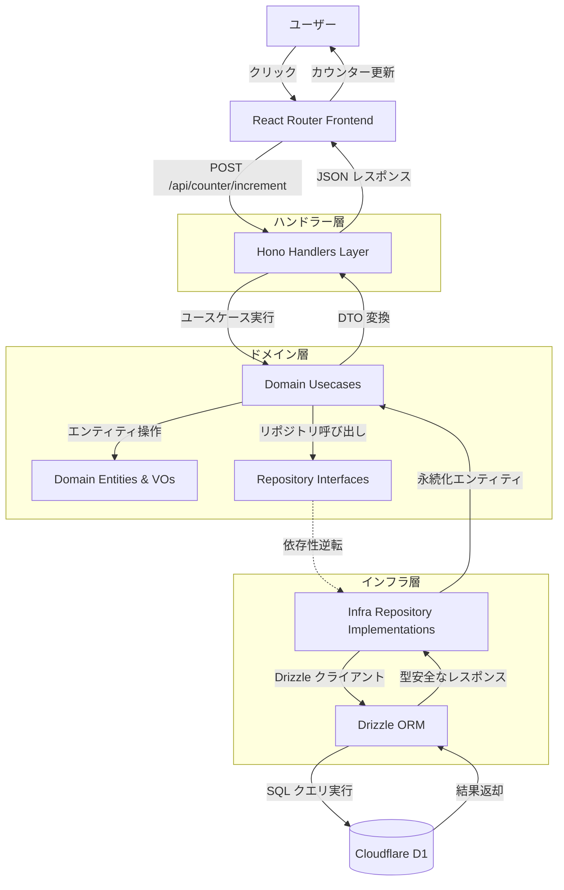
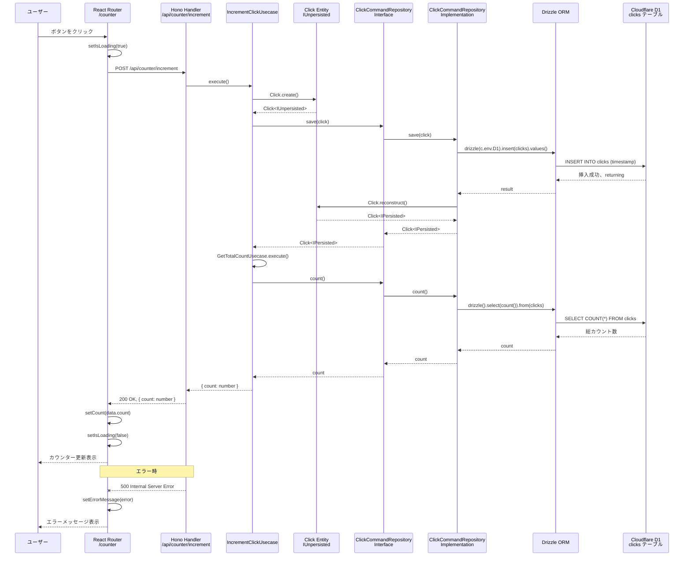
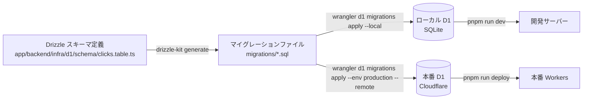
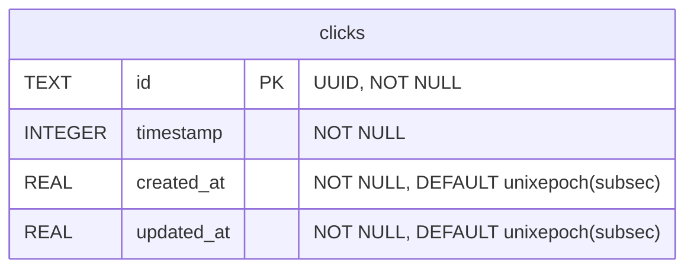
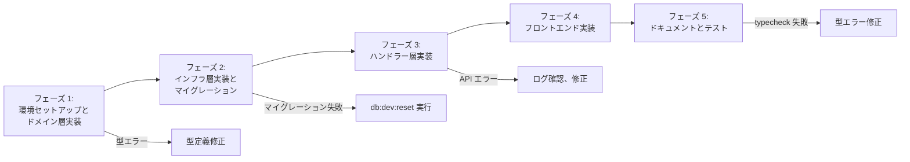

# 技術設計書

## 概要

本機能は、Cloudflare D1 データベースと Drizzle ORM を既存の React Router 7 + Hono + Cloudflare Workers アーキテクチャに統合し、クリックカウンター機能を持つデモアプリケーションを実装します。参照実装（旧 yantene.net コードベース）のクリーンアーキテクチャパターンを採用し、ドメイン駆動設計（DDD）に基づく 3 層分離（domain/infra/handlers）、CQRS パターン、リポジトリパターンを実装します。

**目的**: D1 データベースと Drizzle ORM の統合パターンをクリーンアーキテクチャで実証し、将来的なデータベース機能を実装する際の堅牢な基盤を構築する。

**ユーザー**: 開発者がローカル開発環境と本番環境の両方でデータベース操作を実行でき、エンドユーザーはクリックボタンを押してカウンターが更新される視覚的なフィードバックを得る。

**影響**: 既存のアーキテクチャに新しいデータ層を追加し、クリーンアーキテクチャパターンを導入することで、今後のデータベース機能拡張の基盤を構築する。

### ゴール

- Cloudflare D1 データベースと Drizzle ORM のセットアップを完了し、ローカル開発環境と本番環境の両方で動作可能にする
- クリーンアーキテクチャパターン（domain/infra/handlers 3 層分離、CQRS、リポジトリパターン）を実装し、将来的な拡張性を確保する
- 型安全なデータベース操作を実装し、TypeScript strict mode と ESLint ルールに準拠する
- 参照実装のパターンを活用し、プロジェクト全体の一貫性を維持する
- クリックカウンター機能を通じて、データベース連携が正しく動作することを視覚的に確認できるデモを提供する

### 非ゴール

- 複数環境（development, staging, production）の自動デプロイメント設定（環境分離は wrangler.jsonc で定義するが、自動化は本フェーズ外）
- 高度なデータベース機能（複雑なリレーション、複数集約のトランザクション、カスタム Drizzle 型定義）
- パフォーマンスベンチマークや負荷テスト
- UI コンポーネントライブラリの構築（単一のカウンターページのみ）

## アーキテクチャ

> 詳細な調査結果は `research.md` および `gap-analysis.md` に記載。本設計書は設計判断と契約を中心に記述。

### 既存アーキテクチャ分析

既存のシステムは以下のパターンを採用しており、これらを維持します。

- **Hono ファクトリパターン**: `getApp(handler)` が React Router ハンドラーをラップし、API ルートと SSR を共存させる
- **パスエイリアス**: `~/` が `./app/` にマッピングされ、フロントエンド、バックエンド、共有ユーティリティで一貫した import を実現
- **TypeScript strict mode**: 厳格な型チェックと ESLint ルールにより、ランタイムエラーを防止
- **TailwindCSS v4**: 既存のスタイリング設定をそのまま使用

**参照実装からの発見**（詳細は gap-analysis.md 参照）:

- 旧 yantene.net はクリーンアーキテクチャ（ドメイン駆動設計 + CQRS パターン）を採用
- ドメイン層でエンティティと Value Object、リポジトリインターフェース、ユースケースを定義
- インフラ層で Drizzle ORM を使った D1 リポジトリ実装を提供
- ハンドラー層で Hono API ルートを実装し、ユースケースと連携
- ジェネリクスで永続化状態を表現（`Entity<IPersisted>` vs `Entity<IUnpersisted>`）

### アーキテクチャパターンと境界マップ



**アーキテクチャ統合**:

- **選択したパターン**: クリーンアーキテクチャ（Option B: Clean Architecture Approach）
  - **理由**: 参照実装との一貫性、将来的な拡張性、テスト容易性を優先
  - **トレードオフ**: カウンターデモとしては過剰な抽象化だが、プロジェクト全体のパターン統一を重視
- **ドメイン/機能境界**:
  - **ドメイン層** (`app/backend/domain/click/`): Click エンティティ、リポジトリインターフェース、ユースケースを定義（インフラ層に依存しない）
  - **インフラ層** (`app/backend/infra/d1/click/`): D1 + Drizzle ORM による Click リポジトリ実装を提供
  - **ハンドラー層** (`app/backend/handlers/api/counter/`): Hono API エンドポイントを実装し、ユースケースと連携
  - **フロントエンド層** (`app/frontend/routes/counter.tsx`): UI とユーザーインタラクション
- **既存パターンの維持**:
  - Hono ファクトリパターン: `getApp(handler)` を拡張して新しい API エンドポイントをマウント
  - React Router ルートパターン: 既存の `app/frontend/routes/` に新しいルートを追加
  - 共有型定義: `app/lib/types/` に DTO 型を配置
- **新規コンポーネントの根拠**:
  - **ドメインエンティティ (Click)**: クリックの概念をドメインモデルとして表現し、ビジネスロジックをカプセル化
  - **リポジトリインターフェース**: ドメイン層がインフラ層に依存しないように依存性逆転の原則を適用
  - **CQRS パターン**: Command（書き込み）と Query（読み込み）を分離し、将来的な最適化を可能にする
  - **ユースケース**: ビジネスロジックをオーケストレートし、複数のリポジトリやエンティティを組み合わせた処理を実現
- **ステアリング準拠**: TypeScript strict mode、ESLint ルール、パスエイリアス、ファクトリパターン、ドメイン駆動設計を維持

### テクノロジースタック

| レイヤー                       | 選択 / バージョン                | 機能での役割                                                             | 備考                                                 |
| ------------------------------ | -------------------------------- | ------------------------------------------------------------------------ | ---------------------------------------------------- |
| フロントエンド                 | React 19.1.1, React Router 7.9.2 | カウンター UI、API 通信、状態管理                                        | 既存スタック維持                                     |
| バックエンド                   | Hono 4.10.7                      | API ハンドラー層、ユースケースとの連携                                   | 既存スタック維持、ファクトリパターン拡張             |
| ドメイン層                     | TypeScript strict mode           | エンティティ、Value Object、リポジトリインターフェース、ユースケース定義 | クリーンアーキテクチャの核心、インフラ層に依存しない |
| データ / ストレージ            | **Drizzle ORM 0.45.1** (新規)    | 型安全な D1 データベース操作、スキーマ定義                               | プロダクション対応、D1 完全サポート                  |
| データ / ストレージ            | **Cloudflare D1** (新規)         | SQLite ベースのエッジデータベース、clicks テーブル保存                   | Cloudflare Workers エッジ環境で動作                  |
| インフラ / ランタイム          | Cloudflare Workers               | エッジデプロイメント、D1 バインディング提供                              | 既存スタック維持                                     |
| ビルドツール / マイグレーション | **Drizzle Kit 0.31.8** (新規)    | マイグレーション生成、スキーマ管理                                       | 開発時のみ使用                                       |
| ビルドツール / マイグレーション | **Wrangler 4.51.0**              | D1 マイグレーション適用、ローカルエミュレーション                        | 既存バージョン維持、D1 コマンドを追加               |
| スタイリング                   | TailwindCSS 4.1.13               | カウンター UI のスタイリング                                             | 既存スタック維持                                     |

**新規依存関係の追加**:
- `drizzle-orm@0.45.1`: D1 データベース操作用 ORM
- `drizzle-kit@0.31.8`: マイグレーション生成とスキーマ管理（devDependencies）

**設定変更**:
- `wrangler.jsonc`: D1 バインディング設定と `nodejs_compat` フラグ追加
- `drizzle.config.ts`: Drizzle Kit 設定ファイル新規作成
- `package.json`: npm scripts 追加（`db:generate`, `db:dev:migrate`, `db:dev:reset`, `db:prod:migrate`, `db:prod:reset`）

## システムフロー

### クリックカウンター操作フロー（CQRS パターン）



**主要な判断**:
- **CQRS パターン採用**: Command（書き込み）と Query（読み込み）を分離し、将来的な最適化を可能にする
- **エンティティの永続化状態管理**: ジェネリクス `<IPersisted | IUnpersisted>` で永続化前後の状態を型レベルで表現
- **依存性逆転の原則**: ドメイン層がリポジトリインターフェースを定義し、インフラ層が実装を提供
- **ユースケースによるオーケストレーション**: ビジネスロジックをユースケースに集約し、ハンドラー層は薄く保つ
- **エラーハンドリング**: API でエラーをキャッチし、500 レスポンスを返す。UI 側でエラーメッセージを表示
- **ローディング状態**: ボタンを無効化し、視覚的なフィードバックを提供

### マイグレーション管理フロー



**主要な判断**:
- **マイグレーション生成**: Drizzle Kit を使用してスキーマから SQL を自動生成
- **マイグレーション適用**: Wrangler CLI を使用してローカル（`--local`）または本番（`--env production --remote`）に適用
- **リセット機能**: `db:dev:reset` / `db:prod:reset` で全テーブル削除 + マイグレーション再適用（開発時のみ推奨）
- **環境分離**: wrangler.jsonc で development / production 環境を分離し、データベース ID を管理

## 要件トレーサビリティ

以下の表は、各要件が設計要素（コンポーネント、インターフェース、フロー）によって実現されることを示します。

| 要件 | 概要                                      | コンポーネント                                      | インターフェース                                   | フロー                                 |
| ---- | ----------------------------------------- | --------------------------------------------------- | -------------------------------------------------- | -------------------------------------- |
| 1.1  | clicks テーブルスキーマ定義               | Database Schema (app/backend/infra/d1/schema/clicks.table.ts) | Drizzle スキーマ定義                               | マイグレーション管理フロー             |
| 1.2  | Drizzle スキーマ定義ファイル              | Database Schema (app/backend/infra/d1/schema/clicks.table.ts) | clicks テーブル型定義                              | —                                      |
| 1.3  | マイグレーション生成仕組み                | Drizzle Kit 設定 (drizzle.config.ts)                | npm scripts (db:generate)                          | マイグレーション管理フロー             |
| 1.4  | Wrangler D1 バインディング設定            | Wrangler 設定 (wrangler.jsonc)                      | D1 バインディング (D1)                             | —                                      |
| 1.5  | ローカル開発環境初期化ドキュメント        | README.md 更新                                      | npm scripts (db:dev:migrate)                       | マイグレーション管理フロー             |
| 1.6  | 本番 D1 バインディング検証                | Wrangler 設定 (wrangler.jsonc)                      | D1 バインディング (D1)                             | —                                      |
| 2.1  | Drizzle ORM クライアント初期化            | ClickCommandRepository Implementation               | drizzle(c.env.D1)                                  | クリックカウンター操作フロー           |
| 2.2  | Hono コンテキストから D1 アクセス         | Counter API Handler (app/backend/handlers/api/counter/index.ts) | c.env.D1                                           | クリックカウンター操作フロー           |
| 2.3  | /api/counter/increment POST 処理          | Counter API Handler (app/backend/handlers/api/counter/index.ts) | POST /api/counter/increment                        | クリックカウンター操作フロー           |
| 2.4  | clicks テーブルにレコード挿入             | IncrementClickUsecase, ClickCommandRepository       | save(click: Click<IUnpersisted>)                   | クリックカウンター操作フロー           |
| 2.5  | 総クリック数取得                          | GetTotalCountUsecase, ClickCommandRepository        | count(): Promise<number>                           | クリックカウンター操作フロー           |
| 2.6  | JSON レスポンス返却                       | Counter API Handler                                 | c.json({ count: number })                          | クリックカウンター操作フロー           |
| 2.7  | エラーハンドリング                        | Counter API Handler                                 | try-catch, c.json({ error }, 500)                  | クリックカウンター操作フロー（エラー） |
| 2.8  | 明示的な戻り値型定義                      | Counter API Handler, Usecases, Repositories         | Promise<Response>, Promise<Click<IPersisted>>      | —                                      |
| 3.1  | /counter ルート提供                       | Counter Route (app/frontend/routes/counter.tsx)     | React Router ルート                                | —                                      |
| 3.2  | 総クリック数表示                          | Counter Route (app/frontend/routes/counter.tsx)     | useState<number>                                   | クリックカウンター操作フロー           |
| 3.3  | カウントアップボタン配置                  | Counter Route (app/frontend/routes/counter.tsx)     | <button onClick={handleIncrement}>                 | —                                      |
| 3.4  | POST リクエスト送信                       | Counter Route (app/frontend/routes/counter.tsx)     | fetch("/api/counter/increment", { method: "POST" }) | クリックカウンター操作フロー           |
| 3.5  | ローディング状態表示                      | Counter Route (app/frontend/routes/counter.tsx)     | useState<boolean>, disabled={isLoading}            | クリックカウンター操作フロー           |
| 3.6  | カウンター数値更新                        | Counter Route (app/frontend/routes/counter.tsx)     | setCount(data.count)                               | クリックカウンター操作フロー           |
| 3.7  | エラーメッセージ表示                      | Counter Route (app/frontend/routes/counter.tsx)     | useState<string \| null>, setErrorMessage          | クリックカウンター操作フロー（エラー） |
| 3.8  | TailwindCSS スタイリング                  | Counter Route (app/frontend/routes/counter.tsx)     | className="..."                                    | —                                      |
| 3.9  | Boolean 変数命名規則                      | Counter Route (app/frontend/routes/counter.tsx)     | isLoading, errorMessage                            | —                                      |
| 4.1  | Drizzle スキーマからの型定義              | Database Schema, Domain Entities                    | clicks テーブル型、Click エンティティ             | —                                      |
| 4.2  | API レスポンス型定義共有                  | Shared Types (app/lib/types/counter.ts)             | CounterResponse                                    | —                                      |
| 4.3  | 明示的な戻り値型アノテーション            | Counter API Handler, Usecases, Repositories         | Promise<Response>, Promise<Click<IPersisted>>      | —                                      |
| 4.4  | ESLint 厳格ルール適用                     | 既存 ESLint 設定                                    | —                                                  | —                                      |
| 4.5  | pnpm run typecheck 完了                   | TypeScript strict mode                              | —                                                  | —                                      |
| 4.6  | インライン型インポート                    | All TypeScript files                                | import { type CounterResponse }                    | —                                      |
| 4.7  | Vitest テスト環境                         | 既存 Vitest 設定                                    | —                                                  | —                                      |
| 5.1  | pnpm run dev で D1 エミュレート           | Wrangler 設定, npm scripts                          | wrangler dev                                       | —                                      |
| 5.2  | マイグレーション適用ドキュメント          | README.md 更新                                      | npm scripts (db:dev:migrate, db:prod:migrate)      | マイグレーション管理フロー             |
| 5.3  | pnpm run build                            | 既存ビルド設定                                      | —                                                  | —                                      |
| 5.4  | pnpm run deploy                           | 既存デプロイ設定                                    | —                                                  | —                                      |
| 5.5  | D1 セットアップ手順ドキュメント           | README.md 更新                                      | —                                                  | マイグレーション管理フロー             |
| 5.6  | D1 バインディング名定義                   | Wrangler 設定 (wrangler.jsonc)                      | "binding": "D1"                                    | —                                      |
| 6.1  | D1 接続エラーハンドリング                 | Counter API Handler                                 | try-catch, c.json({ error }, 500)                  | クリックカウンター操作フロー（エラー） |
| 6.2  | Drizzle クエリエラーハンドリング          | Counter API Handler, Repository Implementations     | try-catch, console.error                           | クリックカウンター操作フロー（エラー） |
| 6.3  | 不正な HTTP メソッドエラー                | Hono デフォルト動作                                 | 405 Method Not Allowed                             | —                                      |
| 6.4  | フェッチエラー検出                        | Counter Route (app/frontend/routes/counter.tsx)     | try-catch, setErrorMessage                         | クリックカウンター操作フロー（エラー） |
| 6.5  | 構造化エラーログ出力                      | Counter API Handler                                 | console.error("Counter increment error:", error)   | —                                      |
| 6.6  | マイグレーション失敗ドキュメント          | README.md 更新                                      | —                                                  | マイグレーション管理フロー             |

## コンポーネントとインターフェース

### コンポーネント概要

以下のコンポーネントが新規作成または拡張されます。

| コンポーネント                     | ドメイン / レイヤー | 意図                                                       | 要件カバレッジ                        | 主要な依存関係（P0/P1）                     | 契約                           |
| ---------------------------------- | ------------------- | ---------------------------------------------------------- | ------------------------------------- | ------------------------------------------- | ------------------------------ |
| Click Entity                       | ドメイン            | クリックの概念をドメインモデルとして表現                   | 4.1                                   | —                                           | State                          |
| IClickCommandRepository Interface  | ドメイン            | Click の書き込み操作のリポジトリ契約を定義                 | 2.4, 2.5                              | —                                           | Service                        |
| IncrementClickUsecase              | ドメイン            | クリックを記録し、総カウント数を返すビジネスロジック       | 2.3, 2.4, 2.5, 2.6                    | IClickCommandRepository (P0)                | Service                        |
| ClickCommandRepository Implementation | インフラ         | D1 + Drizzle ORM による Click リポジトリの実装             | 2.1, 2.4, 2.5                         | Drizzle ORM (P0), Database Schema (P0)      | Service                        |
| Database Schema                    | インフラ            | clicks テーブルのスキーマ定義と型安全性提供                | 1.1, 1.2, 4.1                         | Drizzle ORM (P0)                            | State                          |
| Counter API Handler                | ハンドラー          | /api/counter/increment エンドポイントの実装                | 2.2, 2.3, 2.6, 2.7, 2.8, 6.1, 6.2, 6.5 | IncrementClickUsecase (P0), ClickCommandRepository (P0) | API                            |
| Counter Route                      | フロントエンド      | カウンター UI とユーザーインタラクション                   | 3.1, 3.2, 3.3, 3.4, 3.5, 3.6, 3.7, 3.8, 3.9, 6.4 | Counter API Handler (P0)                    | State                          |
| Shared Types                       | 共有ユーティリティ  | フロントエンドとバックエンド間の型定義共有                 | 4.2, 4.6                              | —                                           | —                              |
| Drizzle Kit 設定                   | ビルドツール        | マイグレーション生成とスキーマ管理                         | 1.3                                   | Database Schema (P0)                        | —                              |
| Wrangler 設定                      | インフラ            | D1 バインディング設定とマイグレーション適用                | 1.4, 1.6, 5.6                         | —                                           | —                              |
| npm scripts                        | ビルドツール        | データベース操作の自動化                                   | 1.5, 5.2                              | Drizzle Kit (P0), Wrangler (P0)             | —                              |
| README.md 更新                     | ドキュメント        | D1 セットアップ手順とマイグレーション手順のドキュメント化  | 1.5, 5.5, 6.6                         | —                                           | —                              |

### ドメイン層

#### Click Entity

| フィールド             | 詳細                                                   |
| ---------------------- | ------------------------------------------------------ |
| 意図                   | クリックの概念をドメインモデルとして表現し、永続化状態を型レベルで管理 |
| 要件                   | 4.1                                                    |
| オーナー / レビュアー  | （省略可）                                             |

**責務と制約**:

- クリックエンティティのプロパティ（id, timestamp, createdAt, updatedAt）を保持
- ジェネリクス `<P extends IPersisted | IUnpersisted>` で永続化前後の状態を型レベルで表現
- `create()` メソッドで未永続化エンティティを生成
- `reconstruct()` メソッドでデータベースから取得したデータを永続化エンティティに変換
- `toJSON()` メソッドで API レスポンス用のプレーンオブジェクトに変換

**依存関係**:

- Outbound: IPersisted, IUnpersisted (domain/persisted.interface.ts, domain/unpersisted.interface.ts) — 永続化状態の型定義（P0）

**契約**: State [x]

##### State Management

**State モデル**:

```typescript
// app/backend/domain/click/click.entity.ts
import type { Temporal } from "@js-temporal/polyfill";
import type { IEntity } from "../entity.interface";
import type { IPersisted } from "../persisted.interface";
import type { IUnpersisted } from "../unpersisted.interface";

export class Click<P extends IPersisted | IUnpersisted>
  implements IEntity<Click<P>>
{
  private constructor(
    readonly id: P["id"],
    readonly timestamp: number,
    readonly createdAt: P["createdAt"],
    readonly updatedAt: P["updatedAt"],
  ) {}

  static create(params: {
    timestamp: number;
  }): Click<IUnpersisted> {
    return new Click(
      undefined,
      params.timestamp,
      undefined,
      undefined,
    );
  }

  static reconstruct(params: {
    id: string;
    timestamp: number;
    createdAt: Temporal.Instant;
    updatedAt: Temporal.Instant;
  }): Click<IPersisted> {
    return new Click(
      params.id,
      params.timestamp,
      params.createdAt,
      params.updatedAt,
    );
  }

  equals(other: Click<P>): boolean {
    return this.id === other.id;
  }

  toJSON() {
    return {
      id: this.id,
      timestamp: this.timestamp,
      createdAt: this.createdAt?.toString(),
      updatedAt: this.updatedAt?.toString(),
    };
  }
}
```

**永続化と整合性**:

- 未永続化エンティティ（`Click<IUnpersisted>`）: `id`, `createdAt`, `updatedAt` は `undefined`
- 永続化エンティティ（`Click<IPersisted>`）: `id` は文字列 UUID、`createdAt`, `updatedAt` は `Temporal.Instant`
- `timestamp` は UNIX タイムスタンプ（ミリ秒、number 型）で常に存在

**実装ノート**:

- **統合**: リポジトリ実装で `create()` メソッドを使用して未永続化エンティティを生成し、データベース保存後に `reconstruct()` で永続化エンティティに変換
- **検証**: TypeScript strict mode がジェネリクス制約を検証し、永続化前のエンティティで `id` にアクセスするコンパイルエラーを防止
- **リスク**: Temporal API はポリフィルが必要（`@js-temporal/polyfill` を依存関係に追加）

#### IClickCommandRepository Interface

| フィールド             | 詳細                                                   |
| ---------------------- | ------------------------------------------------------ |
| 意図                   | Click の書き込み操作のリポジトリ契約を定義し、依存性逆転の原則を適用 |
| 要件                   | 2.4, 2.5                                               |
| オーナー / レビュアー  | （省略可）                                             |

**責務と制約**:

- Click エンティティの保存操作を定義（未永続化エンティティを受け取り、永続化エンティティを返す）
- 総クリック数取得操作を定義
- CQRS パターンに従い、Command（書き込み）操作のみを担当

**依存関係**:

- Outbound: Click Entity (domain/click/click.entity.ts) — エンティティ参照（P0）

**契約**: Service [x]

##### Service Interface

```typescript
// app/backend/domain/click/click.command-repository.interface.ts
import type { IPersisted } from "../persisted.interface";
import type { IUnpersisted } from "../unpersisted.interface";
import type { Click } from "./click.entity";

export interface IClickCommandRepository {
  save(click: Click<IUnpersisted>): Promise<Click<IPersisted>>;
  count(): Promise<number>;
}
```

**事前条件**:

- `save()`: Click エンティティが未永続化状態（`Click<IUnpersisted>`）であること
- `count()`: なし（データベース接続が利用可能であること）

**事後条件**:

- `save()`: Click エンティティが永続化状態（`Click<IPersisted>`）で返却され、データベースに保存される
- `count()`: 総クリック数が正確にカウントされる

**不変条件**:

- `save()` は冪等ではない（毎回新しいレコードが追加される）
- `count()` は副作用を持たない（読み取り専用）

**実装ノート**:

- **統合**: インフラ層（`app/backend/infra/d1/click/click.command-repository.ts`）がこのインターフェースを実装
- **検証**: TypeScript strict mode がインターフェース契約を検証
- **リスク**: なし

#### IncrementClickUsecase

| フィールド             | 詳細                                                   |
| ---------------------- | ------------------------------------------------------ |
| 意図                   | クリックを記録し、総カウント数を返すビジネスロジックをオーケストレート |
| 要件                   | 2.3, 2.4, 2.5, 2.6                                     |
| オーナー / レビュアー  | （省略可）                                             |

**責務と制約**:

- 現在時刻の UNIX タイムスタンプで Click エンティティを生成
- リポジトリを使用して Click エンティティを保存
- リポジトリを使用して総クリック数を取得
- カウント数を返却

**依存関係**:

- Outbound: IClickCommandRepository Interface (domain/click/click.command-repository.interface.ts) — リポジトリ操作（P0）
- Outbound: Click Entity (domain/click/click.entity.ts) — エンティティ生成（P0）

**契約**: Service [x]

##### Service Interface

```typescript
// app/backend/domain/click/usecases/increment-click.usecase.ts
import type { IClickCommandRepository } from "../click.command-repository.interface";
import { Click } from "../click.entity";

export class IncrementClickUsecase {
  constructor(
    private readonly clickRepository: IClickCommandRepository,
  ) {}

  async execute(): Promise<{ count: number }> {
    const click = Click.create({ timestamp: Date.now() });
    await this.clickRepository.save(click);
    const count = await this.clickRepository.count();
    return { count };
  }
}
```

**事前条件**:

- リポジトリが利用可能であること
- データベース接続が確立されていること

**事後条件**:

- clicks テーブルに新しいレコードが追加される
- 総クリック数が正確にカウントされる
- `{ count: number }` 形式のオブジェクトが返却される

**不変条件**:

- `count` は常に 0 以上の整数

**実装ノート**:

- **統合**: ハンドラー層で DI パターンを使用してリポジトリ実装を注入
- **検証**: TypeScript strict mode が戻り値型を検証
- **リスク**: なし

### インフラ層

#### Database Schema

| フィールド             | 詳細                                                   |
| ---------------------- | ------------------------------------------------------ |
| 意図                   | clicks テーブルのスキーマ定義と型安全性提供            |
| 要件                   | 1.1, 1.2, 4.1                                          |
| オーナー / レビュアー  | （省略可）                                             |

**責務と制約**:

- Drizzle ORM を使用して clicks テーブルのスキーマを定義
- Temporal API カスタム型（`instant`）を使用して `createdAt`, `updatedAt` を表現
- TypeScript strict mode に準拠した型定義を提供
- マイグレーション生成の入力として機能

**依存関係**:

- External: Drizzle ORM (`drizzle-orm/sqlite-core`) — スキーマ定義（P0）
- External: Temporal Polyfill (`@js-temporal/polyfill`) — Temporal.Instant 型（P0）

**契約**: State [x]

##### State Management

**State モデル**:

```typescript
// app/backend/infra/d1/schema/custom-types/temporal.custom-type.ts
import { customType } from "drizzle-orm/sqlite-core";
import type { Temporal } from "@js-temporal/polyfill";

export const instant = customType<{
  data: Temporal.Instant;
  driverData: number;
}>({
  dataType() {
    return "real";
  },
  toDriver(value: Temporal.Instant): number {
    return value.epochMilliseconds / 1000;
  },
  fromDriver(value: number): Temporal.Instant {
    const milliseconds = Math.floor(value * 1000);
    return Temporal.Instant.fromEpochMilliseconds(milliseconds);
  },
});

// app/backend/infra/d1/schema/clicks.table.ts
import { integer, sqliteTable, text } from "drizzle-orm/sqlite-core";
import { sql } from "drizzle-orm";
import { instant } from "./custom-types/temporal.custom-type";

export const clicks = sqliteTable("clicks", {
  id: text("id").notNull().primaryKey(),
  timestamp: integer("timestamp").notNull(),
  createdAt: instant("created_at")
    .notNull()
    .default(sql`(unixepoch('subsec'))`),
  updatedAt: instant("updated_at")
    .notNull()
    .default(sql`(unixepoch('subsec'))`),
});

// app/backend/infra/d1/schema/index.ts
export { clicks } from "./clicks.table";
```

**永続化と整合性**:

- D1 データベースに SQLite テーブルとして永続化
- `id`: UUID を text で保存（`crypto.randomUUID()` で生成）
- `timestamp`: UNIX タイムスタンプ（ミリ秒、INTEGER 型）
- `createdAt`, `updatedAt`: Temporal.Instant カスタム型、SQLite の `unixepoch('subsec')` でデフォルト値

**実装ノート**:

- **統合**: Drizzle Kit が `drizzle.config.ts` の `schema` パス（`./app/backend/infra/d1/schema`）からこのファイルを読み込み、マイグレーションを生成
- **検証**: TypeScript コンパイラが型チェックを実行し、ESLint が命名規則を検証
- **リスク**: Temporal API カスタム型の定義が参照実装と同じであることを確認（`toDriver`, `fromDriver` の実装）

#### ClickCommandRepository Implementation

| フィールド             | 詳細                                                                   |
| ---------------------- | ---------------------------------------------------------------------- |
| 意図                   | IClickCommandRepository インターフェースを D1 + Drizzle ORM で実装     |
| 要件                   | 2.1, 2.4, 2.5                                                          |
| オーナー / レビュアー  | （省略可）                                                             |

**責務と制約**:

- Drizzle ORM クライアントをコンストラクタで受け取り、DI パターンを実現
- `save()` メソッドで未永続化 Click エンティティをデータベースに保存し、永続化エンティティを返す
- `count()` メソッドで総クリック数を取得
- UUID を生成し、`id` フィールドに設定
- `returning()` を使用して挿入したレコードを取得し、`reconstruct()` で永続化エンティティに変換

**依存関係**:

- Inbound: IncrementClickUsecase (domain/click/usecases/increment-click.usecase.ts) — ユースケースからの呼び出し（P0）
- Outbound: Database Schema (app/backend/infra/d1/schema/clicks.table.ts) — clicks テーブル参照（P0）
- Outbound: Click Entity (domain/click/click.entity.ts) — エンティティ変換（P0）
- External: Drizzle ORM (`drizzle-orm/d1`) — D1 クライアント初期化（P0）

**契約**: Service [x]

##### Service Interface

```typescript
// app/backend/infra/d1/click/click.command-repository.ts
import { count as drizzleCount } from "drizzle-orm";
import type { DrizzleD1Database } from "drizzle-orm/d1";
import type { IClickCommandRepository } from "../../../domain/click/click.command-repository.interface";
import { Click } from "../../../domain/click/click.entity";
import type { IPersisted } from "../../../domain/persisted.interface";
import type { IUnpersisted } from "../../../domain/unpersisted.interface";
import { clicks } from "../schema";

export class ClickCommandRepository implements IClickCommandRepository {
  constructor(private readonly db: DrizzleD1Database) {}

  async save(click: Click<IUnpersisted>): Promise<Click<IPersisted>> {
    const id = crypto.randomUUID();
    const data = {
      id,
      timestamp: click.timestamp,
    };

    const result = await this.db
      .insert(clicks)
      .values(data)
      .returning()
      .get();

    return Click.reconstruct({
      id: result.id,
      timestamp: result.timestamp,
      createdAt: result.createdAt,
      updatedAt: result.updatedAt,
    });
  }

  async count(): Promise<number> {
    const result = await this.db
      .select({ count: drizzleCount() })
      .from(clicks)
      .get();

    return result?.count ?? 0;
  }
}
```

**事前条件**:

- Drizzle D1 クライアント（`DrizzleD1Database`）が利用可能であること
- clicks テーブルがマイグレーションによって作成済みであること

**事後条件**:

- `save()`: clicks テーブルに新しいレコードが追加され、永続化エンティティが返却される
- `count()`: 総クリック数が正確にカウントされる

**不変条件**:

- `id` は常に有効な UUID 文字列
- `timestamp` は常に正の整数（UNIX タイムスタンプ）
- `count` は常に 0 以上の整数

**実装ノート**:

- **統合**: ハンドラー層で `drizzle(c.env.D1)` を使用して Drizzle クライアントを初期化し、コンストラクタに注入
- **検証**: TypeScript strict mode がインターフェース契約を検証
- **リスク**: D1 データベースが未初期化の場合、エラーが発生。マイグレーション適用を事前に実行する必要がある

### ハンドラー層

#### Counter API Handler

| フィールド             | 詳細                                                                   |
| ---------------------- | ---------------------------------------------------------------------- |
| 意図                   | /api/counter/increment エンドポイントで IncrementClickUsecase を実行し、JSON レスポンスを返す |
| 要件                   | 2.2, 2.3, 2.6, 2.7, 2.8, 6.1, 6.2, 6.5                                 |
| オーナー / レビュアー  | （省略可）                                                             |

**責務と制約**:

- Hono コンテキストから D1 バインディングを取得し、Drizzle クライアントを初期化
- ClickCommandRepository 実装をインスタンス化
- IncrementClickUsecase をインスタンス化し、リポジトリを注入
- ユースケースを実行し、結果を JSON レスポンスとして返却
- エラー発生時は 500 レスポンスを返却し、エラーログを出力

**依存関係**:

- Inbound: Counter Route (app/frontend/routes/counter.tsx) — POST リクエスト受信（P0）
- Outbound: IncrementClickUsecase (domain/click/usecases/increment-click.usecase.ts) — ユースケース実行（P0）
- Outbound: ClickCommandRepository Implementation (infra/d1/click/click.command-repository.ts) — リポジトリ DI（P0）
- Outbound: Shared Types (app/lib/types/counter.ts) — CounterResponse 型参照（P0）
- External: Drizzle ORM (`drizzle-orm/d1`) — D1 クライアント初期化（P0）
- External: Cloudflare D1 (`c.env.D1`) — データベースバインディング（P0）

**契約**: API [x]

##### API Contract

| メソッド | エンドポイント            | リクエスト | レスポンス                   | エラー |
| -------- | ------------------------- | ---------- | ---------------------------- | ------ |
| POST     | /api/counter/increment    | なし       | `{ count: number }`          | 500    |

**リクエスト**:
- メソッド: POST
- ボディ: なし
- ヘッダー: なし

**レスポンス（成功）**:
```json
{
  "count": 42
}
```

**レスポンス（エラー）**:
```json
{
  "error": "Failed to increment counter"
}
```

**エラー処理**:
- **500 Internal Server Error**: D1 接続エラー、Drizzle クエリ失敗、予期しないエラー

**実装ノート**:

```typescript
// app/backend/handlers/api/counter/index.ts
import { drizzle } from "drizzle-orm/d1";
import { Hono } from "hono";
import { IncrementClickUsecase } from "../../../domain/click/usecases/increment-click.usecase";
import { ClickCommandRepository } from "../../../infra/d1/click/click.command-repository";
import type { CounterResponse } from "~/lib/types/counter";

export const counterApp = new Hono<{ Bindings: Env }>()
  .post("/increment", async (c): Promise<Response> => {
    try {
      const db = drizzle(c.env.D1);
      const clickRepository = new ClickCommandRepository(db);
      const incrementClickUsecase = new IncrementClickUsecase(clickRepository);

      const result = await incrementClickUsecase.execute();

      const response: CounterResponse = {
        count: result.count,
      };

      return c.json(response);
    } catch (error) {
      console.error("Counter increment error:", error);
      return c.json(
        { error: "Failed to increment counter" },
        500,
      );
    }
  });
```

- **統合**: `app/backend/index.ts` の `getApp()` ファクトリ関数で `.route("/api/counter", counterApp)` を追加
- **検証**: TypeScript 戻り値型 `Promise<Response>` を明示的に指定し、ESLint ルールに準拠
- **リスク**: D1 データベースが未初期化の場合、エラーが発生。マイグレーション適用を事前に実行する必要がある

### フロントエンド層

#### Counter Route

| フィールド             | 詳細                                                   |
| ---------------------- | ------------------------------------------------------ |
| 意図                   | /counter ルートでカウンター UI を表示し、クリックイベントを処理 |
| 要件                   | 3.1, 3.2, 3.3, 3.4, 3.5, 3.6, 3.7, 3.8, 3.9, 6.4      |
| オーナー / レビュアー  | （省略可）                                             |

**責務と制約**:

- カウンター UI を表示（現在のカウント数、カウントアップボタン、エラーメッセージ）
- ボタンクリック時に `/api/counter/increment` へ POST リクエストを送信
- ローディング状態を管理し、ボタンを無効化
- API レスポンスを受け取り、カウンター数値を更新
- エラー発生時にエラーメッセージを表示

**依存関係**:

- Outbound: Counter API Handler (app/backend/handlers/api/counter/index.ts) — POST リクエスト送信（P0）
- Outbound: Shared Types (app/lib/types/counter.ts) — CounterResponse 型参照（P0）
- External: React Router 7 — ルート定義、meta 関数（P0）
- External: React 19 — useState, fetch API（P0）
- External: TailwindCSS v4 — スタイリング（P1）

**契約**: State [x]

##### State Management

**State モデル**:

```typescript
// app/frontend/routes/counter.tsx
import { useState } from "react";
import type { Route } from "./+types/counter";
import type { CounterResponse } from "~/lib/types/counter";

export function meta({}: Route.MetaArgs) {
  return [
    { title: "Counter Demo" },
    { name: "description", content: "Cloudflare D1 + Drizzle counter demo" },
  ];
}

export default function Counter(): JSX.Element {
  const [count, setCount] = useState<number>(0);
  const [isLoading, setIsLoading] = useState<boolean>(false);
  const [errorMessage, setErrorMessage] = useState<string | undefined>(undefined);

  const handleIncrement = async (): Promise<void> => {
    setIsLoading(true);
    setErrorMessage(undefined);

    try {
      const response = await fetch("/api/counter/increment", {
        method: "POST",
      });

      if (!response.ok) {
        throw new Error("Failed to increment counter");
      }

      const data: CounterResponse = await response.json();
      setCount(data.count);
    } catch (error) {
      setErrorMessage(
        error instanceof Error ? error.message : "Unknown error occurred",
      );
    } finally {
      setIsLoading(false);
    }
  };

  return (
    <div className="flex min-h-screen items-center justify-center bg-gray-100">
      <div className="rounded-lg bg-white p-8 shadow-md">
        <h1 className="mb-4 text-2xl font-bold">Click Counter</h1>
        <p className="mb-4 text-4xl font-bold text-blue-600">{count}</p>
        <button
          onClick={handleIncrement}
          disabled={isLoading}
          className="rounded bg-blue-500 px-4 py-2 font-semibold text-white hover:bg-blue-600 disabled:bg-gray-300"
        >
          {isLoading ? "Loading..." : "Increment"}
        </button>
        {errorMessage && (
          <p className="mt-4 text-red-500">{errorMessage}</p>
        )}
      </div>
    </div>
  );
}
```

**状態遷移**:

1. **初期状態**: `count=0, isLoading=false, errorMessage=undefined`
2. **ローディング状態**: `isLoading=true` → ボタン無効化
3. **成功状態**: `count` 更新、`isLoading=false`
4. **エラー状態**: `errorMessage` 設定、`isLoading=false`

**実装ノート**:

- **統合**: `app/frontend/routes/counter.tsx` を新規作成し、React Router のルートとして自動登録
- **検証**: Boolean 変数命名規則（`isLoading`, `errorMessage`）を ESLint が検証
- **リスク**: ネットワークエラー時にエラーメッセージが表示されることを確認

### 共有ユーティリティ層

#### Shared Types

| フィールド             | 詳細                                                   |
| ---------------------- | ------------------------------------------------------ |
| 意図                   | フロントエンドとバックエンド間で API レスポンス型を共有 |
| 要件                   | 4.2, 4.6                                               |
| オーナー / レビュアー  | （省略可）                                             |

**責務と制約**:

- CounterResponse 型を定義し、フロントエンドとバックエンドの両方から参照可能にする
- TypeScript strict mode に準拠した型定義を提供

**依存関係**:

- なし

**実装ノート**:

```typescript
// app/lib/types/counter.ts
export type CounterResponse = {
  count: number;
};
```

- **統合**: フロントエンド（`counter.tsx`）とバックエンド（`handlers/api/counter/index.ts`）の両方から `import { type CounterResponse } from "~/lib/types/counter"` でインポート
- **検証**: TypeScript strict mode と ESLint が型チェックを実行
- **リスク**: なし

### ビルドツール層

#### Drizzle Kit 設定

| フィールド             | 詳細                                                   |
| ---------------------- | ------------------------------------------------------ |
| 意図                   | Drizzle Kit を設定し、マイグレーション生成を自動化     |
| 要件                   | 1.3                                                    |
| オーナー / レビュアー  | （省略可）                                             |

**責務と制約**:

- Drizzle Kit の設定ファイル（`drizzle.config.ts`）を作成
- スキーマパス、マイグレーション出力パス、ドライバーを指定

**依存関係**:

- Outbound: Database Schema (app/backend/infra/d1/schema/) — スキーマ参照（P0）

**実装ノート**:

```typescript
// drizzle.config.ts
import { defineConfig } from "drizzle-kit";

export default defineConfig({
  dialect: "sqlite",
  schema: "./app/backend/infra/d1/schema",
  out: "./migrations",
  driver: "d1-http",
});
```

- **統合**: `pnpm run db:generate` で Drizzle Kit がこの設定を読み込み、マイグレーションファイルを `./migrations/` に生成
- **検証**: Drizzle Kit のバリデーション機能が設定ファイルをチェック
- **リスク**: `schema` パスが誤っていると、マイグレーション生成に失敗

#### Wrangler 設定

| フィールド             | 詳細                                                   |
| ---------------------- | ------------------------------------------------------ |
| 意図                   | D1 バインディング設定とマイグレーション適用            |
| 要件                   | 1.4, 1.6, 5.6                                          |
| オーナー / レビュアー  | （省略可）                                             |

**責務と制約**:

- D1 データベースバインディング設定を追加
- マイグレーションディレクトリを指定
- `nodejs_compat` フラグを有効化

**依存関係**:

- なし

**実装ノート**:

```jsonc
// wrangler.jsonc（拡張）
{
  "$schema": "node_modules/wrangler/config-schema.json",
  "name": "yantene",
  "compatibility_date": "2025-04-04",
  "compatibility_flags": ["nodejs_compat"],
  "main": "./workers/app.ts",
  "vars": {
    "VALUE_FROM_CLOUDFLARE": "Hello from Cloudflare"
  },
  "observability": {
    "enabled": true
  },
  "d1_databases": [
    {
      "binding": "D1",
      "database_name": "yantene-development",
      "database_id": "00000000-0000-0000-0000-000000000000",
      "migrations_dir": "./migrations"
    }
  ],
  "env": {
    "production": {
      "d1_databases": [
        {
          "binding": "D1",
          "database_name": "yantene-production",
          "database_id": "<本番環境で作成したD1データベースのID>",
          "migrations_dir": "./migrations"
        }
      ]
    }
  }
}
```

- **統合**: Wrangler が `d1_databases` セクションを読み込み、Workers 環境で `c.env.D1` として D1 バインディングを提供
- **検証**: Wrangler CLI の設定バリデーション機能が設定ファイルをチェック
- **環境分離**:
  - ローカル環境: デフォルトの `d1_databases` セクション（dummy UUID で `--local` フラグを使用）
  - 本番環境: `env.production` セクション（実際のデータベースIDで `--env production --remote` フラグを使用）
  - 将来の拡張: `env.staging` などのステージング環境を追加可能
- **リスク**: `database_id` が未設定またはダミー UUID の場合、ローカル開発では問題ないが、本番環境ではエラーが発生

#### npm scripts

| フィールド             | 詳細                                                   |
| ---------------------- | ------------------------------------------------------ |
| 意図                   | データベース操作の自動化（マイグレーション生成、適用、リセット） |
| 要件                   | 1.5, 5.2                                               |
| オーナー / レビュアー  | （省略可）                                             |

**責務と制約**:

- `db:generate`: Drizzle Kit でマイグレーション生成
- `db:dev:migrate`: Wrangler CLI でローカル環境のマイグレーション適用
- `db:dev:reset`: ローカル環境の全テーブル削除 + マイグレーション再適用
- `db:prod:migrate`: Wrangler CLI で本番環境のマイグレーション適用（--remote）
- `db:prod:reset`: 本番環境の全テーブル削除 + マイグレーション再適用（--remote、慎重に使用）

**依存関係**:

- Outbound: Drizzle Kit 設定 (drizzle.config.ts) — マイグレーション生成（P0）
- Outbound: Wrangler 設定 (wrangler.jsonc) — マイグレーション適用（P0）

**実装ノート**:

```json
// package.json（scripts セクション追加）
{
  "scripts": {
    "db:generate": "drizzle-kit generate",
    "db:dev:migrate": "wrangler d1 migrations apply yantene-development --local",
    "db:dev:reset": "wrangler d1 execute yantene-development --local --command 'DROP TABLE IF EXISTS clicks' && pnpm run db:dev:migrate",
    "db:prod:migrate": "wrangler d1 migrations apply yantene-production --env production --remote",
    "db:prod:reset": "wrangler d1 execute yantene-production --env production --remote --command 'DROP TABLE IF EXISTS clicks' && pnpm run db:prod:migrate"
  },
  "dependencies": {
    "@js-temporal/polyfill": "^0.4.4",
    "drizzle-orm": "^0.45.1"
  },
  "devDependencies": {
    "drizzle-kit": "^0.31.8"
  }
}
```

- **統合**:
  - ローカル環境: `pnpm run db:generate` → `pnpm run db:dev:migrate`
  - 本番環境: `pnpm run db:generate` → `pnpm run db:prod:migrate`
- **検証**: 各スクリプトが正常に実行されることを確認
- **リスク**: `db:prod:reset` は本番環境の全テーブル削除を実行するため、非常に慎重に使用すること（開発初期段階のみ推奨）
- **拡張性**: 将来的に `db:stg:migrate` など、ステージング環境用のスクリプトを追加可能

### ドキュメント層

#### README.md 更新

| フィールド             | 詳細                                                   |
| ---------------------- | ------------------------------------------------------ |
| 意図                   | D1 セットアップ手順とマイグレーション手順のドキュメント化 |
| 要件                   | 1.5, 5.5, 6.6                                          |
| オーナー / レビュアー  | （省略可）                                             |

**責務と制約**:

- D1 データベースのセットアップ手順を記載
- マイグレーション生成と適用の手順を記載
- マイグレーション失敗時のロールバック手順を記載

**依存関係**:

- なし

**実装ノート**:

README.md に以下のセクションを追加:

```markdown
## D1 Database Setup

### ローカル開発環境

1. 依存関係のインストール:
   ```bash
   pnpm install
   ```

2. マイグレーション生成:
   ```bash
   pnpm run db:generate
   ```

3. マイグレーション適用:
   ```bash
   pnpm run db:dev:migrate
   ```

4. 開発サーバー起動:
   ```bash
   pnpm run dev
   ```

5. カウンターデモにアクセス:
   http://localhost:5173/counter

### マイグレーション失敗時のロールバック

ローカル開発環境でマイグレーションに失敗した場合、以下のコマンドでリセット:

```bash
pnpm run db:dev:reset
```

### 本番環境へのデプロイ

1. Cloudflare ダッシュボードで D1 データベースを作成:
   - データベース名: `yantene-production`
   - 作成後、データベース ID をコピー

2. `wrangler.jsonc` の `env.production.d1_databases[0].database_id` を更新:
   ```jsonc
   {
     "env": {
       "production": {
         "d1_databases": [{
           "database_id": "<コピーしたデータベースID>"
         }]
       }
     }
   }
   ```

3. マイグレーション適用（本番環境）:
   ```bash
   pnpm run db:prod:migrate
   ```

4. デプロイ:
   ```bash
   pnpm run deploy
   ```

**注意**:
- 本番環境のマイグレーション適用は慎重に実行してください。
- `db:prod:reset` は本番データベースの全テーブルを削除します。開発初期段階でのみ使用し、本番運用開始後は使用しないでください。
```

- **統合**: README.md に上記セクションを追加
- **検証**: ドキュメントの内容が正確で、手順が実行可能であることを確認
- **リスク**: なし

## データモデル

### ドメインモデル

**集約とトランザクション境界**:

- **Click 集約**: Click エンティティが集約ルート
- トランザクション境界: 単一の INSERT 操作（D1 は SQL BEGIN/COMMIT 非対応のため、複数操作の場合は `db.batch()` を使用するが、本機能では不要）

**エンティティ、値オブジェクト、ドメインイベント**:

- **Click エンティティ**: `Click<IPersisted | IUnpersisted>`
  - プロパティ: `id: string | undefined`, `timestamp: number`, `createdAt: Temporal.Instant | undefined`, `updatedAt: Temporal.Instant | undefined`
  - メソッド: `create()`, `reconstruct()`, `equals()`, `toJSON()`
- 値オブジェクト: なし（timestamp は number 型のプリミティブ値）
- ドメインイベント: なし（イベント駆動アーキテクチャは非採用）

**ビジネスルールと不変条件**:

- `timestamp` は常に正の整数（UNIX タイムスタンプ、ミリ秒）
- `id` は永続化後に UUID 文字列が設定される（未永続化時は `undefined`）
- クリックカウンターは常に 0 以上

### 論理データモデル

**構造定義**:



**エンティティ関係とカーディナリティ**:

- clicks テーブルは単一テーブルのみ（リレーションなし）

**属性と型**:

- `id`: TEXT, PRIMARY KEY, NOT NULL（UUID 文字列）
- `timestamp`: INTEGER, NOT NULL（UNIX タイムスタンプ、ミリ秒）
- `created_at`: REAL, NOT NULL, DEFAULT `unixepoch('subsec')`（Temporal.Instant カスタム型）
- `updated_at`: REAL, NOT NULL, DEFAULT `unixepoch('subsec')`（Temporal.Instant カスタム型）

**自然キーと識別子**:

- 主キー: `id`（UUID）
- 自然キー: なし

**参照整合性ルール**:

- 外部キー制約なし（単一テーブル）

**整合性と整合性**:

- **トランザクション境界**: 単一 INSERT 操作（トランザクション不要）
- **カスケードルール**: なし
- **時間的側面**: `created_at`, `updated_at` で監査ログを記録（更新や削除は不要）

### 物理データモデル

**SQLite テーブル定義**:

```sql
CREATE TABLE clicks (
  id TEXT PRIMARY KEY NOT NULL,
  timestamp INTEGER NOT NULL,
  created_at REAL DEFAULT (unixepoch('subsec')) NOT NULL,
  updated_at REAL DEFAULT (unixepoch('subsec')) NOT NULL
);
```

**主キー/外部キーと制約**:

- 主キー: `id` (TEXT, UUID)
- 外部キー: なし
- NOT NULL 制約: `id`, `timestamp`, `created_at`, `updated_at`

**インデックスとパフォーマンス最適化**:

- デフォルト: 主キー（`id`）に自動インデックス
- 追加インデックス: なし（カウンターデモでは不要）
- 将来的な最適化: `timestamp` に索引を追加することで、時間範囲クエリを高速化可能

**パーティショニング戦略**:

- なし（D1 は SQLite ベースで、パーティショニング非対応）

### データ契約と統合

**API データ転送**:

**リクエストスキーマ**:
- `/api/counter/increment` はリクエストボディなし

**レスポンススキーマ**:
```typescript
// app/lib/types/counter.ts
export type CounterResponse = {
  count: number;
};
```

**バリデーションルール**:
- `count` は 0 以上の整数
- レスポンスは常に JSON 形式

**シリアライゼーションフォーマット**:
- JSON (Content-Type: application/json)

**イベントスキーマ**:

- なし（イベント駆動アーキテクチャは非採用）

**クロスサービスデータ管理**:

- なし（単一サービス内で完結）

## エラーハンドリング

### エラー戦略

カウンターデモでは、クリーンアーキテクチャに準じたエラーハンドリングパターンを採用します。

**エラーカテゴリと対応**:

1. **ユーザーエラー（4xx）**:
   - **405 Method Not Allowed**: POST 以外のメソッドで `/api/counter/increment` を呼び出した場合
   - **対応**: Hono がデフォルトで 405 を返却

2. **システムエラー（5xx）**:
   - **500 Internal Server Error**: D1 接続エラー、Drizzle クエリ失敗、予期しないエラー
   - **対応**: ハンドラー層で try-catch でエラーをキャッチし、`c.json({ error: "Failed to increment counter" }, 500)` を返却
   - **ログ出力**: `console.error("Counter increment error:", error)` で構造化ログを出力

3. **ビジネスロジックエラー（422）**:
   - なし（カウンターデモにビジネスルールは存在しない）

**リカバリーメカニズム**:

- **バックエンド**: エラー発生時は 500 レスポンスを返却（リトライなし）
- **フロントエンド**: エラーメッセージを表示し、ユーザーに再試行を促す

### 監視

**エラー追跡**:

- バックエンド: `console.error()` で構造化ログを出力（Cloudflare Workers のログストリームに記録）
- フロントエンド: `setErrorMessage()` でエラーメッセージを UI に表示

**ログ**:

- エラーメッセージ、スタックトレース、コンテキスト情報（エンドポイント、リクエスト情報）を記録
- Cloudflare Workers の Observability 機能を活用（`observability.enabled: true` in wrangler.jsonc）

**ヘルスモニタリング**:

- なし（カウンターデモでは不要）
- 将来的には `/health` エンドポイントを追加可能

## テスト戦略

### ユニットテスト

**テスト対象**:

1. **Click Entity (app/backend/domain/click/click.entity.ts)**:
   - `create()` メソッドが未永続化エンティティを正しく生成することを確認
   - `reconstruct()` メソッドが永続化エンティティを正しく生成することを確認
   - `equals()` メソッドが ID 比較を正しく実行することを確認
   - `toJSON()` メソッドが正しいプレーンオブジェクトを返すことを確認

2. **IncrementClickUsecase (app/backend/domain/click/usecases/increment-click.usecase.ts)**:
   - モックリポジトリを使用して、ユースケースが正しくエンティティを生成し、リポジトリを呼び出すことを確認
   - `execute()` メソッドが `{ count: number }` 形式のオブジェクトを返すことを確認

3. **ClickCommandRepository Implementation (app/backend/infra/d1/click/click.command-repository.ts)**:
   - モック D1 バインディングを使用して、`save()` メソッドが clicks テーブルへの挿入と `reconstruct()` を正しく実行することを確認
   - `count()` メソッドが正しい総カウント数を返すことを確認
   - エラー発生時に例外をスローすることを確認

**テストツール**: Vitest, happy-dom（モック D1 バインディングは手動で作成）

### 統合テスト

**テスト対象**:

1. **API エンドポイント統合**:
   - `/api/counter/increment` に POST リクエストを送信し、正常なレスポンスが返却されることを確認
   - 複数回リクエストを送信し、カウンターが正しくインクリメントされることを確認

2. **マイグレーション適用**:
   - `pnpm run db:dev:migrate` でマイグレーションが正常に適用されることを確認
   - clicks テーブルが作成されることを確認

**テストツール**: Vitest, Wrangler CLI（ローカル D1 データベース）

### E2E/UI テスト

**テスト対象**:

1. **/counter ルート**:
   - カウンターページにアクセスし、UI が正しく表示されることを確認
   - カウントアップボタンをクリックし、カウンターが更新されることを確認
   - ローディング状態が正しく表示されることを確認

2. **エラーハンドリング**:
   - API がエラーを返した場合、エラーメッセージが表示されることを確認

**テストツール**: Vitest, React Testing Library, happy-dom

### パフォーマンス/ロード（該当する場合）

**テスト対象**:

1. **同時リクエスト処理**:
   - 複数のクライアントから同時に `/api/counter/increment` にリクエストを送信し、正しくカウントされることを確認

2. **D1 クエリパフォーマンス**:
   - clicks テーブルに 1000 件以上のレコードがある状態で COUNT クエリが高速に実行されることを確認

**テストツール**: 手動テスト（カウンターデモでは自動化不要）

## オプションセクション

### セキュリティ考慮事項

_このセクションは、カウンターデモではセキュリティ要件が最小限であるため、簡略化されています。ベースラインのセキュリティ対策はステアリングドキュメントに従います。_

**認証と認可**:

- なし（カウンターデモは公開機能）

**データ保護**:

- clicks テーブルは個人情報を含まないため、データ保護要件は最小限
- UNIX タイムスタンプのみを記録

**脅威モデリング**:

- **SQL インジェクション**: Drizzle ORM を使用してパラメータ化クエリを実行するため、リスクは低い
- **DoS 攻撃**: カウンターデモは無制限にクリックを受け付けるため、将来的にレート制限を実装する必要がある可能性

### パフォーマンスとスケーラビリティ

_このセクションは、カウンターデモではパフォーマンス要件が最小限であるため、簡略化されています。一般的なパフォーマンス基準はステアリングドキュメントに従います。_

**ターゲットメトリクスと測定戦略**:

- API レスポンス時間: 200ms 以下（D1 エッジデータベースの低レイテンシーを活用）
- スループット: 10 リクエスト/秒（カウンターデモでは十分）

**スケーリングアプローチ**:

- **水平スケーリング**: Cloudflare Workers はエッジで自動スケーリング
- **垂直スケーリング**: 不要（D1 は Cloudflare が管理）

**キャッシング戦略と最適化**:

- なし（カウンターデモではキャッシング不要）
- 将来的には、Redis や Cloudflare KV でカウンター値をキャッシュ可能

### マイグレーション戦略

**フェーズ分解**:

1. **フェーズ 1: 環境セットアップとドメイン層実装**:
   - Drizzle ORM、Drizzle Kit、Temporal Polyfill を依存関係に追加
   - `wrangler.jsonc` に D1 バインディング設定を追加
   - `drizzle.config.ts` を作成
   - ドメイン層（Click エンティティ、リポジトリインターフェース、ユースケース）を実装

2. **フェーズ 2: インフラ層実装とマイグレーション**:
   - `app/backend/infra/d1/schema/` に clicks テーブルを定義
   - Temporal カスタム型を定義
   - `pnpm run db:generate` でマイグレーション生成
   - `pnpm run db:dev:migrate` でローカル D1 にマイグレーション適用
   - ClickCommandRepository 実装を作成

3. **フェーズ 3: ハンドラー層実装**:
   - `app/backend/handlers/api/counter/index.ts` に `/api/counter/increment` エンドポイントを実装
   - エラーハンドリングを追加
   - `app/backend/index.ts` で counterApp をマウント

4. **フェーズ 4: フロントエンド実装**:
   - `app/frontend/routes/counter.tsx` を作成
   - UI とステート管理を実装
   - 共有型定義（CounterResponse）を作成

5. **フェーズ 5: ドキュメントとテスト**:
   - README.md を更新
   - ユニットテスト、統合テスト、E2E テストを実装

**ロールバックトリガー**:

- マイグレーション適用に失敗した場合: `pnpm run db:dev:reset` でテーブルを削除し、マイグレーションを再適用
- API エンドポイントがエラーを返す場合: バックエンドのログを確認し、D1 接続やクエリを修正

**検証チェックポイント**:

- フェーズ 1: TypeScript strict mode が型エラーなくコンパイルできること
- フェーズ 2: `pnpm run db:dev:migrate` が正常に完了し、clicks テーブルが作成されること
- フェーズ 3: `/api/counter/increment` に POST リクエストを送信し、200 レスポンスが返却されること
- フェーズ 4: `/counter` にアクセスし、UI が正しく表示されること
- フェーズ 5: `pnpm run typecheck` がエラーなく完了すること


