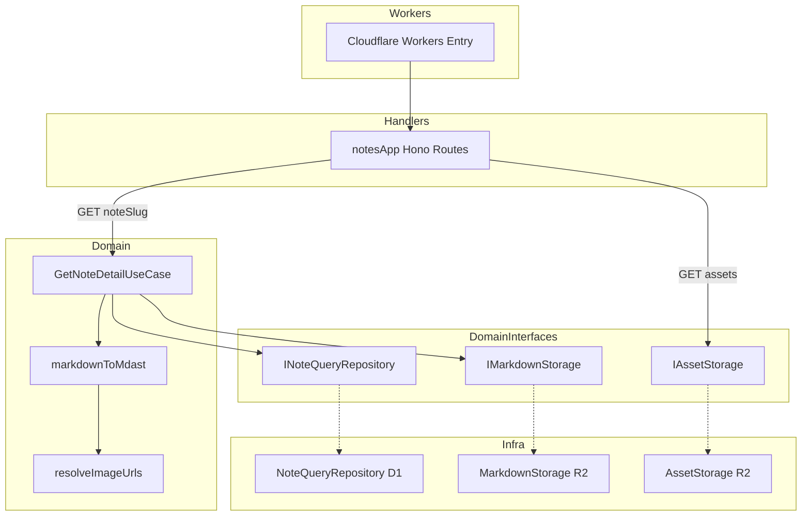
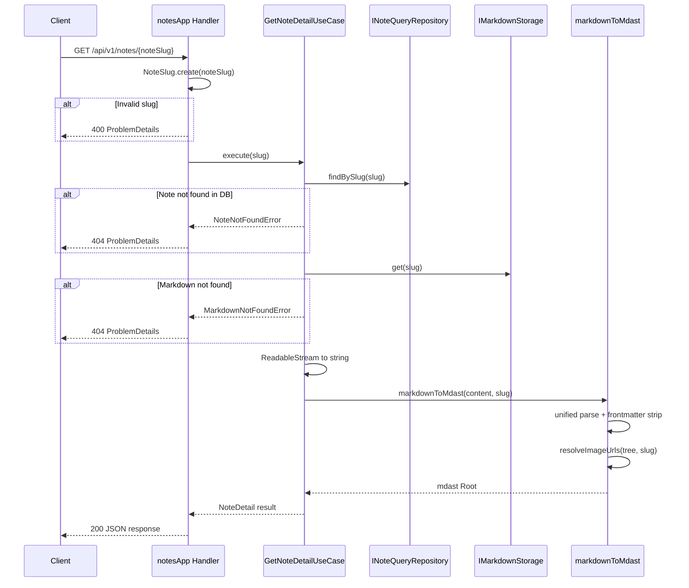
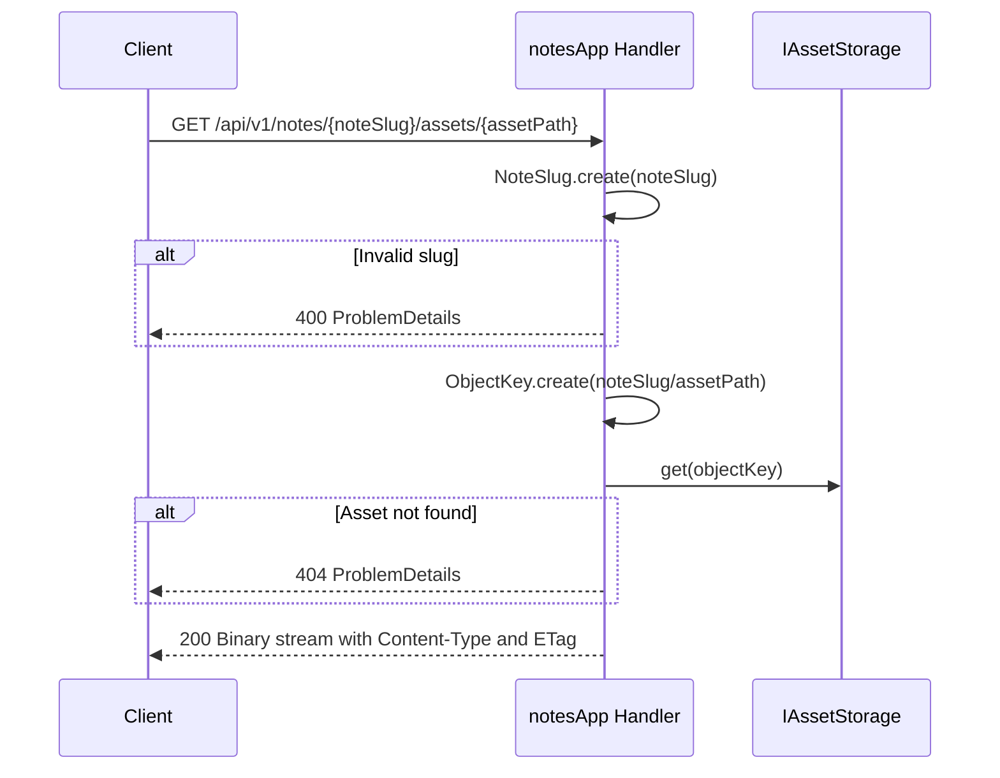

# Design Document

## Overview

**Purpose**: 本機能は、フロントエンド開発者がスラッグを指定して記事のメタデータと Markdown 本文 (mdast 形式) を取得し、記事詳細ページをレンダリングするための 2 つの API エンドポイントを提供する。

**Users**: フロントエンド開発者が記事詳細ページの構築と記事内画像の表示に利用する。

**Impact**: 既存の `notesApp` Hono ルートグループに 2 つのエンドポイント (`GET /:noteSlug`、`GET /:noteSlug/assets/*`) を追加する。既存の一覧 API・再構築 API には影響を与えない。

### Goals

- スラッグ指定で記事のメタデータと mdast 形式の本文を単一 API で取得可能にする
- mdast 内の相対画像パスをアセット配信 API の URL に自動解決する
- 記事に紐づくアセットファイルをバイナリストリームで配信する
- 既存のドメインモデル・インターフェースを活用し、コードベースの一貫性を維持する

### Non-Goals

- mdast から HTML への変換 (フロントエンド側の責務)
- 画像のリサイズ・最適化処理
- 記事のキャッシュ制御 (CDN キャッシュヘッダーの設計)
- 認証・認可の追加

## Architecture

### Existing Architecture Analysis

既存システムは以下のパターンに従っている。

- **レイヤードアーキテクチャ**: Domain (エンティティ、VO、ユースケース、インターフェース) → Infra (D1/R2 実装) → Handlers (Hono ルート) → Workers (エントリポイント)
- **CQRS**: リポジトリが Command/Query に分離されている
- **ファクトリパターン**: `getApp(handler)` で React Router ハンドラをラップ
- **RFC 9457 準拠エラー**: `ProblemDetails` 型による一貫したエラーレスポンス
- **既存エンドポイント**: `GET /api/v1/notes` (一覧)、`POST /api/v1/notes/refresh` (再構築) が `notesApp` ルートグループに存在

本機能はこれらのパターンを踏襲し、既存インターフェース (`INoteQueryRepository`、`IMarkdownStorage`、`IAssetStorage`) を活用して新しいエンドポイントを追加する。

### Architecture Pattern & Boundary Map



**Architecture Integration**:

- **Selected pattern**: 既存のレイヤードアーキテクチャ + UseCase パターンを踏襲
- **Domain/feature boundaries**: mdast 変換ロジックはドメイン層に配置 (既存の `parseNoteContent` と同様)。ハンドラ層は HTTP 関心事のみ
- **Existing patterns preserved**: CQRS、RFC 9457 エラーハンドリング、VO パターン、DIP
- **New components rationale**: `GetNoteDetailUseCase` はメタデータ取得 + Markdown 取得 + mdast 変換の一連の処理をオーケストレーションするために必要。`markdownToMdast` と `resolveImageUrls` は独立した純粋関数として設計
- **Steering compliance**: ドメイン層にインフラ固有名称なし、型安全、関数型プログラミング原則準拠

### Technology Stack

| Layer              | Choice / Version               | Role in Feature        | Notes                        |
| ------------------ | ------------------------------ | ---------------------- | ---------------------------- |
| Backend / Services | Hono v4                        | ルートハンドラ定義     | 既存                         |
| Backend / Domain   | unified v11 + remark-parse v11 | Markdown to mdast 変換 | 既存依存                     |
| Backend / Domain   | remark-frontmatter v5          | frontmatter 除去       | 既存依存                     |
| Backend / Domain   | unist-util-visit v5            | mdast ツリー走査       | **新規追加**                 |
| Backend / Domain   | @types/mdast v4                | mdast 型定義           | **新規追加 (devDependency)** |
| Data / Storage     | Cloudflare D1                  | 記事メタデータ取得     | 既存                         |
| Data / Storage     | Cloudflare R2                  | Markdown・アセット取得 | 既存                         |

## System Flows

### 記事詳細取得フロー



### アセット配信フロー



**Key Decisions**: アセット配信はユースケースを経由せず、ハンドラ層から `IAssetStorage` を直接呼び出す。単純なプロキシ動作でありドメインロジックが不要なため。

## Requirements Traceability

| Requirement | Summary                                         | Components                             | Interfaces                                            | Flows        |
| ----------- | ----------------------------------------------- | -------------------------------------- | ----------------------------------------------------- | ------------ |
| 1.1         | slug 指定でメタデータ + Markdown 取得           | GetNoteDetailUseCase, notesApp Handler | INoteQueryRepository.findBySlug, IMarkdownStorage.get | 記事詳細取得 |
| 1.2         | メタデータフィールドの定義                      | GetNoteDetailUseCase                   | NoteDetailResponse 型                                 | 記事詳細取得 |
| 1.3         | HTTP 200 レスポンス                             | notesApp Handler                       | --                                                    | 記事詳細取得 |
| 1.4         | Content-Type: application/json                  | notesApp Handler                       | --                                                    | 記事詳細取得 |
| 2.1         | frontmatter 除去 + mdast 変換                   | markdownToMdast                        | unified + remark-parse + remark-frontmatter           | 記事詳細取得 |
| 2.2         | content フィールドに mdast を含める             | GetNoteDetailUseCase                   | NoteDetailResponse 型                                 | 記事詳細取得 |
| 2.3         | unist/mdast 準拠パーサー使用                    | markdownToMdast                        | unified, remark-parse                                 | 記事詳細取得 |
| 3.1         | 相対画像パスをアセット配信 URL に解決           | resolveImageUrls                       | --                                                    | 記事詳細取得 |
| 3.2         | 絶対 URL はそのまま保持                         | resolveImageUrls                       | --                                                    | 記事詳細取得 |
| 3.3         | 全 image ノードを走査                           | resolveImageUrls                       | unist-util-visit                                      | 記事詳細取得 |
| 4.1         | アセットバイナリデータ返却                      | notesApp Handler                       | IAssetStorage.get                                     | アセット配信 |
| 4.2         | Content-Type にメディアタイプ設定               | notesApp Handler                       | AssetContent.contentType                              | アセット配信 |
| 4.3         | HTTP 200 レスポンス                             | notesApp Handler                       | --                                                    | アセット配信 |
| 4.4         | ETag ヘッダー付与                               | notesApp Handler                       | AssetContent.etag                                     | アセット配信 |
| 5.1         | DB に記事が存在しない場合 404                   | GetNoteDetailUseCase, notesApp Handler | NoteNotFoundError                                     | 記事詳細取得 |
| 5.2         | Markdown ファイルが存在しない場合 404           | GetNoteDetailUseCase, notesApp Handler | MarkdownNotFoundError                                 | 記事詳細取得 |
| 5.3         | 不正な slug 形式の場合 400                      | notesApp Handler                       | InvalidNoteSlugError                                  | 記事詳細取得 |
| 6.1         | アセットが存在しない場合 404                    | notesApp Handler                       | --                                                    | アセット配信 |
| 6.2         | 不正な slug 形式の場合 400                      | notesApp Handler                       | InvalidNoteSlugError                                  | アセット配信 |
| 7.1         | 内部エラー時 500                                | notesApp Handler                       | ProblemDetails                                        | 両フロー     |
| 7.2         | 内部エラーのログ出力                            | notesApp Handler                       | console.error                                         | 両フロー     |
| 7.3         | エラーの Content-Type: application/problem+json | notesApp Handler                       | --                                                    | 両フロー     |
| 7.4         | アセット配信の内部エラー時 500                  | notesApp Handler                       | ProblemDetails                                        | アセット配信 |
| 7.5         | アセット配信エラーの Content-Type               | notesApp Handler                       | --                                                    | アセット配信 |
| 8.1         | レスポンス構造定義                              | GetNoteDetailUseCase                   | NoteDetailResponse 型                                 | 記事詳細取得 |
| 8.2         | content に mdast Root ノード                    | markdownToMdast                        | Root (mdast)                                          | 記事詳細取得 |
| 8.3         | 日付フィールド ISO 8601 形式                    | GetNoteDetailUseCase                   | --                                                    | 記事詳細取得 |
| 9.1         | notesApp に GET /:noteSlug 追加                 | notesApp Handler                       | --                                                    | 記事詳細取得 |
| 9.2         | notesApp に GET /:noteSlug/assets/\* 追加       | notesApp Handler                       | --                                                    | アセット配信 |
| 9.3         | 既存エンドポイントへの非影響                    | notesApp Handler                       | --                                                    | --           |
| 9.4         | 既存インターフェースの活用                      | GetNoteDetailUseCase, notesApp Handler | INoteQueryRepository, IMarkdownStorage, IAssetStorage | 両フロー     |

## Components and Interfaces

| Component                 | Domain/Layer     | Intent                                          | Req Coverage                                          | Key Dependencies (P0/P1)                                               | Contracts |
| ------------------------- | ---------------- | ----------------------------------------------- | ----------------------------------------------------- | ---------------------------------------------------------------------- | --------- |
| GetNoteDetailUseCase      | Domain / UseCase | slug からメタデータ + mdast を取得              | 1.1, 1.2, 2.1, 2.2, 5.1, 5.2, 8.1, 8.3, 9.4           | INoteQueryRepository (P0), IMarkdownStorage (P0), markdownToMdast (P0) | Service   |
| markdownToMdast           | Domain / Parser  | Markdown を mdast に変換し画像パスを解決        | 2.1, 2.2, 2.3, 3.1, 3.2, 3.3, 8.2                     | unified (P0), remark-parse (P0), unist-util-visit (P0)                 | Service   |
| resolveImageUrls          | Domain / Parser  | mdast 内の相対画像パスをアセット API URL に変換 | 3.1, 3.2, 3.3                                         | unist-util-visit (P0)                                                  | Service   |
| notesApp Handler (detail) | Handler          | 記事詳細 API エンドポイント                     | 1.1, 1.3, 1.4, 5.1, 5.2, 5.3, 7.1, 7.2, 7.3, 9.1, 9.3 | GetNoteDetailUseCase (P0)                                              | API       |
| notesApp Handler (asset)  | Handler          | アセット配信 API エンドポイント                 | 4.1, 4.2, 4.3, 4.4, 6.1, 6.2, 7.4, 7.5, 9.2, 9.3      | IAssetStorage (P0)                                                     | API       |
| NoteDetailResponse        | Shared / Types   | 記事詳細 API レスポンス型定義                   | 1.2, 8.1, 8.2, 8.3                                    | @types/mdast (P1)                                                      | --        |

### Domain / UseCase

#### GetNoteDetailUseCase

| Field        | Detail                                                       |
| ------------ | ------------------------------------------------------------ |
| Intent       | slug を指定して記事のメタデータと mdast 形式の本文を取得する |
| Requirements | 1.1, 1.2, 2.1, 2.2, 5.1, 5.2, 8.1, 8.3, 9.4                  |

**Responsibilities & Constraints**

- `INoteQueryRepository` からメタデータを取得し、`IMarkdownStorage` から Markdown 本文を取得する
- `ReadableStream` を文字列に変換し、`markdownToMdast` で mdast に変換する
- 記事が DB に存在しない場合は `NoteNotFoundError` をスロー
- Markdown がストレージに存在しない場合は `MarkdownNotFoundError` をスロー
- ドメイン層に属し、HTTP やインフラの関心事を持たない

**Dependencies**

- Inbound: notesApp Handler -- 記事詳細リクエストの処理 (P0)
- Outbound: INoteQueryRepository -- 記事メタデータ取得 (P0)
- Outbound: IMarkdownStorage -- Markdown 本文取得 (P0)
- Outbound: markdownToMdast -- mdast 変換 (P0)

**Contracts**: Service [x] / API [ ] / Event [ ] / Batch [ ] / State [ ]

##### Service Interface

```typescript
interface NoteDetailResult {
  readonly id: string;
  readonly title: string;
  readonly slug: string;
  readonly imageUrl: string;
  readonly publishedOn: string;
  readonly lastModifiedOn: string;
  readonly content: Root;
}

class GetNoteDetailUseCase {
  constructor(
    private readonly queryRepository: INoteQueryRepository,
    private readonly markdownStorage: IMarkdownStorage,
  );

  execute(slug: NoteSlug): Promise<NoteDetailResult>;
}
```

- Preconditions: `slug` は有効な `NoteSlug` インスタンス
- Postconditions: `NoteDetailResult` を返却、または `NoteNotFoundError` / `MarkdownNotFoundError` をスロー
- Invariants: メタデータの日付フィールドは ISO 8601 形式 (`YYYY-MM-DD`) の文字列

**Implementation Notes**

- Integration: `ReadableStream` を `new Response(stream).text()` で文字列に変換
- Validation: slug の検証はハンドラ層で `NoteSlug.create()` を呼び出す時点で行われる
- Risks: 大きな Markdown ファイルでメモリ消費が増加するリスク (実用上は問題にならない規模)

### Domain / Parser

#### markdownToMdast

| Field        | Detail                                                               |
| ------------ | -------------------------------------------------------------------- |
| Intent       | Markdown 文字列を frontmatter 除去済みの mdast Root ノードに変換する |
| Requirements | 2.1, 2.2, 2.3, 3.1, 3.2, 3.3, 8.2                                    |

**Responsibilities & Constraints**

- `unified` + `remark-parse` + `remark-frontmatter` で Markdown を mdast にパース
- パース後のツリーから frontmatter (YAML ノード) を除外
- `resolveImageUrls` を呼び出して相対画像パスを解決
- 純粋関数として設計し、副作用を持たない

**Dependencies**

- Inbound: GetNoteDetailUseCase -- mdast 変換の呼び出し (P0)
- External: unified v11 -- パイプラインフレームワーク (P0)
- External: remark-parse v11 -- Markdown パーサー (P0)
- External: remark-frontmatter v5 -- frontmatter 処理 (P0)

**Contracts**: Service [x] / API [ ] / Event [ ] / Batch [ ] / State [ ]

##### Service Interface

```typescript
function markdownToMdast(content: string, slug: NoteSlug): Root;
```

- Preconditions: `content` は有効な Markdown 文字列
- Postconditions: frontmatter が除去され、相対画像パスが解決された mdast `Root` ノードを返却
- Invariants: 返却される `Root` ノードに type `"yaml"` の子ノードは含まれない

#### resolveImageUrls

| Field        | Detail                                                           |
| ------------ | ---------------------------------------------------------------- |
| Intent       | mdast ツリー内の相対画像パスをアセット配信 API の URL に変換する |
| Requirements | 3.1, 3.2, 3.3                                                    |

**Responsibilities & Constraints**

- `unist-util-visit` で mdast ツリー全体を走査し、`image` ノードを検出
- 相対パス (`http://` / `https://` で始まらない URL) をアセット配信 API パス (`/api/v1/notes/{slug}/assets/{path}`) に変換
- 絶対 URL はそのまま保持
- 純粋関数として設計 (新しいツリーを返却、元のツリーを変更しない)

**Dependencies**

- Inbound: markdownToMdast -- 画像パス解決の呼び出し (P0)
- External: unist-util-visit v5 -- ツリー走査 (P0)

**Contracts**: Service [x] / API [ ] / Event [ ] / Batch [ ] / State [ ]

##### Service Interface

```typescript
function resolveImageUrls(tree: Root, slug: NoteSlug): Root;
```

- Preconditions: `tree` は有効な mdast `Root` ノード
- Postconditions: 全 image ノードの相対 URL がアセット配信 API パスに変換された新しい `Root` ノードを返却
- Invariants: 絶対 URL (`http://`, `https://`) は変更されない

### Handler

#### notesApp Handler (detail)

| Field        | Detail                                                     |
| ------------ | ---------------------------------------------------------- |
| Intent       | GET /api/v1/notes/:noteSlug エンドポイントのリクエスト処理 |
| Requirements | 1.1, 1.3, 1.4, 5.1, 5.2, 5.3, 7.1, 7.2, 7.3, 9.1, 9.3      |

**Responsibilities & Constraints**

- パスパラメータ `noteSlug` を `NoteSlug.create()` で検証
- `GetNoteDetailUseCase` を呼び出して結果を JSON レスポンスとして返却
- ドメイン例外を RFC 9457 ProblemDetails に変換
- 既存の `/` (一覧) と `/refresh` (再構築) エンドポイントに影響しない配置

**Dependencies**

- Inbound: Cloudflare Workers -- HTTP リクエスト (P0)
- Outbound: GetNoteDetailUseCase -- 記事詳細取得 (P0)
- Outbound: NoteQueryRepository (D1) -- DI 構築 (P0)
- Outbound: MarkdownStorage (R2) -- DI 構築 (P0)

**Contracts**: Service [ ] / API [x] / Event [ ] / Batch [ ] / State [ ]

##### API Contract

| Method | Endpoint                | Request                 | Response                 | Errors        |
| ------ | ----------------------- | ----------------------- | ------------------------ | ------------- |
| GET    | /api/v1/notes/:noteSlug | Path: noteSlug (string) | NoteDetailResponse (200) | 400, 404, 500 |

**Implementation Notes**

- Integration: 既存の `notesApp` チェインに `.get("/:noteSlug", handler)` を追加。ルート定義順序に注意 (一覧 `/` と再構築 `/refresh` の後に配置)
- Validation: `NoteSlug.create()` が `InvalidNoteSlugError` をスローした場合に 400 を返却
- Risks: `/:noteSlug` が `/refresh` と競合しないよう、ルート定義順序を既存エンドポイントの後にする

#### notesApp Handler (asset)

| Field        | Detail                                                               |
| ------------ | -------------------------------------------------------------------- |
| Intent       | GET /api/v1/notes/:noteSlug/assets/\* エンドポイントのリクエスト処理 |
| Requirements | 4.1, 4.2, 4.3, 4.4, 6.1, 6.2, 7.4, 7.5, 9.2, 9.3                     |

**Responsibilities & Constraints**

- パスパラメータ `noteSlug` を `NoteSlug.create()` で検証
- ワイルドカードパラメータからアセットパスを取得
- `noteSlug/assetPath` を連結して `ObjectKey.create()` で R2 キーを構築
- `IAssetStorage.get()` でアセットを取得し、バイナリストリームとして返却
- Content-Type と ETag をレスポンスヘッダーに設定

**Dependencies**

- Inbound: Cloudflare Workers -- HTTP リクエスト (P0)
- Outbound: AssetStorage (R2) -- アセット取得 (P0)

**Contracts**: Service [ ] / API [x] / Event [ ] / Batch [ ] / State [ ]

##### API Contract

| Method | Endpoint                          | Request                                     | Response            | Errors        |
| ------ | --------------------------------- | ------------------------------------------- | ------------------- | ------------- |
| GET    | /api/v1/notes/:noteSlug/assets/\* | Path: noteSlug (string), assetPath (string) | Binary stream (200) | 400, 404, 500 |

**Implementation Notes**

- Integration: 既存の `notesApp` チェインに `.get("/:noteSlug/assets/*", handler)` を追加
- Validation: `NoteSlug.create()` で slug 検証。assetPath が空の場合の処理を考慮
- Risks: Hono のワイルドカードパラメータでスラッシュを含むパスが取得できることを検証する必要がある

### Shared / Types

#### NoteDetailResponse

| Field        | Detail                                |
| ------------ | ------------------------------------- |
| Intent       | 記事詳細 API のレスポンス型を定義する |
| Requirements | 1.2, 8.1, 8.2, 8.3                    |

**Implementation Notes**

- `app/lib/types/notes.ts` に追加
- `Root` 型は `mdast` パッケージからインポート

### Domain / Errors

#### MarkdownNotFoundError (新規)

| Field        | Detail                                                                   |
| ------------ | ------------------------------------------------------------------------ |
| Intent       | 指定された slug の Markdown ファイルがストレージに存在しない場合のエラー |
| Requirements | 5.2                                                                      |

**Implementation Notes**

- 既存の `app/backend/domain/note/errors.ts` に追加
- 既存の `NoteNotFoundError` は DB レベルの不存在を示すため、ストレージ不存在用に分離

#### NoteNotFoundError (新規)

| Field        | Detail                                               |
| ------------ | ---------------------------------------------------- |
| Intent       | 指定された slug の記事が DB に存在しない場合のエラー |
| Requirements | 5.1                                                  |

**Implementation Notes**

- 既存の `app/backend/domain/note/errors.ts` に追加
- `findBySlug` が `undefined` を返した場合に `GetNoteDetailUseCase` がスローする

## Data Models

### Domain Model

本機能は新しいエンティティや VO を追加しない。既存の以下のモデルを活用する。

- **Note エンティティ**: `id`, `title`, `slug`, `etag`, `imageUrl`, `publishedOn`, `lastModifiedOn`
- **NoteSlug VO**: slug バリデーションと生成
- **ObjectKey VO**: R2 オブジェクトキーの表現
- **ETag VO**: ETag の表現
- **ContentType VO**: メディアタイプの表現

### Data Contracts & Integration

#### 記事詳細 API レスポンス

```typescript
import type { Root } from "mdast";

type NoteDetailResponse = {
  readonly id: string;
  readonly title: string;
  readonly slug: string;
  readonly imageUrl: string;
  readonly publishedOn: string;
  readonly lastModifiedOn: string;
  readonly content: Root;
};
```

レスポンス例:

```json
{
  "id": "abc-123",
  "title": "My Article",
  "slug": "my-article",
  "imageUrl": "https://example.com/cover.png",
  "publishedOn": "2026-02-15",
  "lastModifiedOn": "2026-02-18",
  "content": {
    "type": "root",
    "children": [
      {
        "type": "heading",
        "depth": 1,
        "children": [{ "type": "text", "value": "Introduction" }]
      },
      {
        "type": "paragraph",
        "children": [
          {
            "type": "image",
            "url": "/api/v1/notes/my-article/assets/images/diagram.png",
            "alt": "Diagram"
          }
        ]
      }
    ]
  }
}
```

#### アセット配信 API レスポンス

- **Body**: バイナリストリーム (ReadableStream)
- **Headers**:
  - `Content-Type`: アセットの実際のメディアタイプ (例: `image/png`)
  - `ETag`: アセットの ETag 値

## Error Handling

### Error Strategy

既存の RFC 9457 ProblemDetails パターンに従い、ドメイン例外をハンドラ層で HTTP レスポンスに変換する。

### Error Categories and Responses

| Error                   | HTTP Status | ProblemDetails title  | Trigger                     |
| ----------------------- | ----------- | --------------------- | --------------------------- |
| `InvalidNoteSlugError`  | 400         | Bad Request           | slug 形式が不正             |
| `NoteNotFoundError`     | 404         | Not Found             | DB に記事が存在しない       |
| `MarkdownNotFoundError` | 404         | Not Found             | R2 に Markdown が存在しない |
| Asset not found         | 404         | Not Found             | R2 にアセットが存在しない   |
| その他の Error          | 500         | Internal Server Error | DB/R2 アクセスエラー等      |

### Monitoring

- 500 エラー発生時に `console.error` でエラー詳細をログ出力 (既存パターン踏襲)
- Cloudflare Workers の Observability 機能 (`observability.enabled: true`) でメトリクス収集

## Testing Strategy

### Unit Tests

- `markdownToMdast`: frontmatter 除去、mdast Root ノード生成、空の Markdown 処理
- `resolveImageUrls`: 相対パスの解決、絶対 URL の保持、image ノードがない場合のパススルー、ネストされた image ノードの走査
- `GetNoteDetailUseCase`: 正常系レスポンス構造の検証、NoteNotFoundError/MarkdownNotFoundError のスロー

### Integration Tests

- `GET /api/v1/notes/:noteSlug`: 正常レスポンス構造、404 (記事なし)、400 (不正 slug)、500 (内部エラー)
- `GET /api/v1/notes/:noteSlug/assets/*`: バイナリストリーム返却、Content-Type 設定、ETag ヘッダー、404 (アセットなし)
- 既存エンドポイントへの非影響: `GET /api/v1/notes` と `POST /api/v1/notes/refresh` が引き続き正常動作
