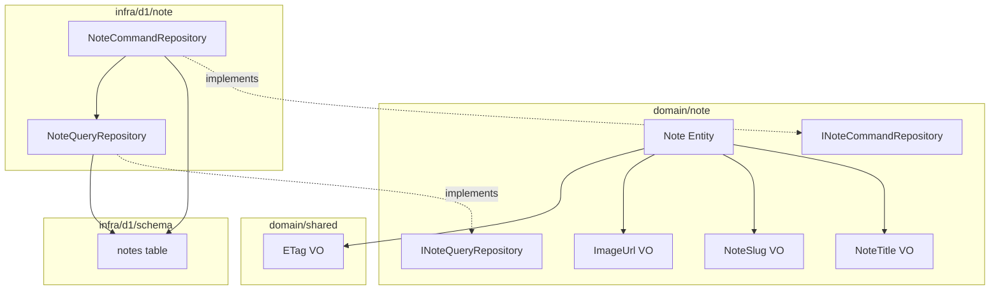
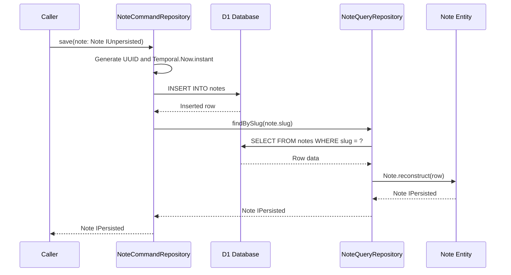
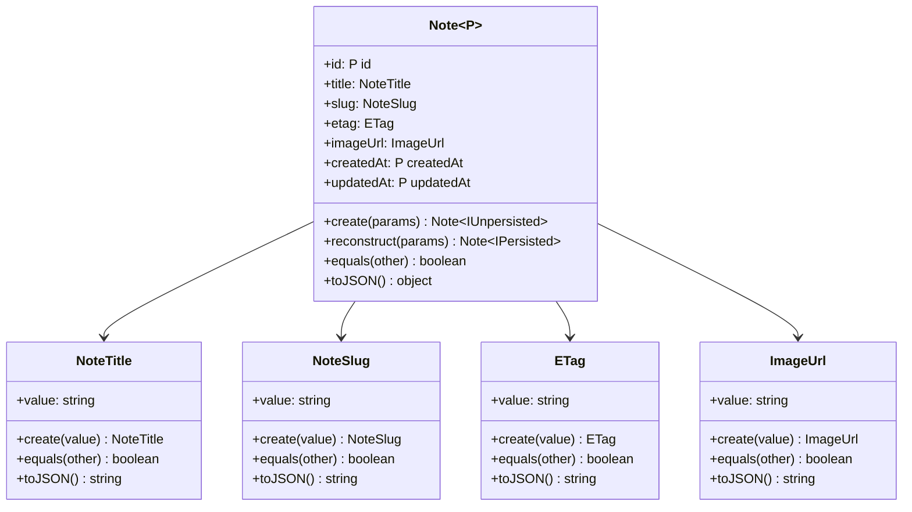

# Technical Design Document: Note Domain Model

## Overview

**Purpose**: 本フィーチャーは、記事（Note）ドメインモデルを構築し、ブログ記事の管理基盤を提供する。

**Users**: 開発者がドメイン駆動設計に基づく型安全な記事エンティティと CQRS リポジトリを利用し、記事の作成・取得・削除を実装する。

**Impact**: 新規ドメイン集約（Note）の追加により、既存の StoredObjectMetadata パターンと一貫したドメインモデル層が拡張される。

### Goals

- Note エンティティと関連する値オブジェクト（NoteTitle, NoteSlug, ImageUrl）を型安全に定義する
- IPersisted / IUnpersisted ジェネリクスによるコンパイル時永続化状態チェックを実現する
- CQRS パターンに基づくリポジトリインターフェースとその D1 実装を提供する
- ETag 値オブジェクトを共有カーネル（`domain/shared/`）に移動し、集約境界を適切に維持する

### Non-Goals

- 記事の公開・非公開ステータス管理（将来フィーチャー）
- 記事本文（Markdown コンテンツ）の管理（R2 ストレージ連携として別途設計）
- API エンドポイント・ハンドラの実装
- フロントエンド UI コンポーネントの実装
- D1 マイグレーションの実行（スキーマ定義のみスコープ）

## Architecture

### Existing Architecture Analysis

本プロジェクトは以下のドメインモデルパターンを確立している。

- **Entity パターン**: `IEntity<T>` 実装、private コンストラクタ、`create` / `reconstruct` ファクトリメソッド、`P extends IPersisted | IUnpersisted` ジェネリクス
- **Value Object パターン**: `IValueObject<T>` 実装、private コンストラクタ、`create` ファクトリメソッド、バリデーション、`equals` / `toJSON`
- **CQRS Repository パターン**: ドメイン層にインターフェース定義（Command / Query 分離）、インフラ層（`infra/d1/`）に D1 具象実装
- **D1 スキーマパターン**: Drizzle ORM の `sqliteTable`、`instant` カスタム型、`index.ts` からのエクスポート

Note ドメインモデルはこれらの確立済みパターンに完全に準拠する。

### Architecture Pattern & Boundary Map



**Architecture Integration**:

- **Selected pattern**: 既存の Entity + VO + CQRS Repository パターンを踏襲。新規パターン導入なし
- **Domain/feature boundaries**: Note ドメインは `domain/note/` ディレクトリに独立配置。ETag は `domain/shared/` の共有カーネルから参照
- **Existing patterns preserved**: IPersisted/IUnpersisted ジェネリクス、private コンストラクタ + ファクトリメソッド、CQRS 分離
- **New components rationale**: Note 集約に必要な最小限のコンポーネント群（エンティティ1、値オブジェクト3、インターフェース2、実装2、テーブル1）
- **Steering compliance**: DIP（依存性逆転）、インフラ非依存のドメイン層、関数型プログラミング原則、イミュータビリティ

### Technology Stack

| Layer | Choice / Version | Role in Feature | Notes |
| --- | --- | --- | --- |
| Backend / Services | TypeScript (strict mode) | エンティティ・VO・リポジトリの型安全な定義 | 既存設定を使用 |
| Data / Storage | Drizzle ORM + Cloudflare D1 | notes テーブル定義とリポジトリ実装 | `instant` カスタム型を再利用 |
| Infrastructure / Runtime | Cloudflare Workers | D1 データベースアクセス | 既存の D1 バインディングを使用 |

## Requirements Traceability

| Requirement | Summary | Components | Interfaces | Flows |
| --- | --- | --- | --- | --- |
| 1.1 | IEntity 実装、private コンストラクタ、create / reconstruct | Note Entity | IEntity | - |
| 1.2 | create で IUnpersisted 状態を返す | Note Entity | - | - |
| 1.3 | reconstruct で IPersisted 状態を返す | Note Entity | - | - |
| 1.4 | NoteTitle, NoteSlug, ETag, ImageUrl をプロパティ保持 | Note Entity | - | - |
| 1.5 | 全プロパティ readonly | Note Entity | - | - |
| 1.6 | equals メソッド（id 比較 / 参照一致） | Note Entity | IEntity | - |
| 1.7 | toJSON メソッド | Note Entity | - | - |
| 2.1 | IValueObject 実装、private コンストラクタ、create | NoteTitle VO | IValueObject | - |
| 2.2 | 空文字列でエラー | NoteTitle VO | - | - |
| 2.3 | equals メソッド | NoteTitle VO | IValueObject | - |
| 2.4 | toJSON メソッド | NoteTitle VO | IValueObject | - |
| 3.1 | IValueObject 実装、private コンストラクタ、create | NoteSlug VO | IValueObject | - |
| 3.2 | 空文字列でエラー | NoteSlug VO | - | - |
| 3.3 | 不正な文字列でエラー | NoteSlug VO | - | - |
| 3.4 | equals メソッド | NoteSlug VO | IValueObject | - |
| 3.5 | toJSON メソッド | NoteSlug VO | IValueObject | - |
| 4.1 | IValueObject 実装、private コンストラクタ、create | ImageUrl VO | IValueObject | - |
| 4.2 | 空文字列でエラー | ImageUrl VO | - | - |
| 4.3 | 不正な URL 形式でエラー | ImageUrl VO | - | - |
| 4.4 | equals メソッド | ImageUrl VO | IValueObject | - |
| 4.5 | toJSON メソッド | ImageUrl VO | IValueObject | - |
| 5.1 | ETag VO を domain/shared/ に移動 | ETag VO | - | - |
| 5.2 | ETag テストファイルも domain/shared/ に移動 | ETag VO Test | - | - |
| 5.3 | StoredObjectMetadata のインポートパス更新 | StoredObjectMetadata Entity | - | - |
| 5.4 | Note エンティティが shared/etag.vo からインポート | Note Entity | - | - |
| 5.5 | ETag VO を新規定義しない | - | - | - |
| 5.6 | インフラ層の ETag インポートパス更新 | D1 Repositories | - | - |
| 6.1 | notes テーブルカラム定義 | notes table schema | - | - |
| 6.2 | instant カスタム型を使用 | notes table schema | - | - |
| 6.3 | index.ts からエクスポート | notes table schema | - | - |
| 7.1 | save メソッド（IUnpersisted → IPersisted） | INoteCommandRepository | INoteCommandRepository | Save Flow |
| 7.2 | delete メソッド | INoteCommandRepository | INoteCommandRepository | - |
| 7.3 | ドメイン層に配置 | INoteCommandRepository | - | - |
| 8.1 | findAll メソッド | INoteQueryRepository | INoteQueryRepository | - |
| 8.2 | findBySlug メソッド | INoteQueryRepository | INoteQueryRepository | - |
| 8.3 | ドメイン層に配置 | INoteQueryRepository | - | - |
| 9.1 | INoteCommandRepository を実装 | D1 NoteCommandRepository | INoteCommandRepository | - |
| 9.2 | infra/d1/note/ に配置 | D1 NoteCommandRepository | - | - |
| 9.3 | save で insert + IPersisted 返却 | D1 NoteCommandRepository | INoteCommandRepository | Save Flow |
| 9.4 | delete で notes レコード削除 | D1 NoteCommandRepository | INoteCommandRepository | - |
| 10.1 | INoteQueryRepository を実装 | D1 NoteQueryRepository | INoteQueryRepository | - |
| 10.2 | infra/d1/note/ に配置 | D1 NoteQueryRepository | - | - |
| 10.3 | findAll で全レコード取得 | D1 NoteQueryRepository | INoteQueryRepository | - |
| 10.4 | findBySlug で該当レコード取得 | D1 NoteQueryRepository | INoteQueryRepository | - |
| 11.1 | クラス名・型名にインフラ技術名を含まない | 全ドメインコンポーネント | - | - |
| 11.2 | HTTP プリミティブをインポートしない | 全ドメインコンポーネント | - | - |
| 11.3 | Drizzle ORM をインポートしない | 全ドメインコンポーネント | - | - |

## System Flows

### Save Flow（Note の保存）



## Components and Interfaces

| Component | Domain/Layer | Intent | Req Coverage | Key Dependencies | Contracts |
| --- | --- | --- | --- | --- | --- |
| Note Entity | domain/note | 記事エンティティの定義と永続化状態管理 | 1.1-1.7, 5.1, 5.2, 11.1-11.3 | NoteTitle, NoteSlug, ImageUrl, ETag (P0) | - |
| NoteTitle VO | domain/note | 記事タイトルのバリデーションとカプセル化 | 2.1-2.4 | - | - |
| NoteSlug VO | domain/note | URL スラッグのバリデーションとカプセル化 | 3.1-3.5 | - | - |
| ImageUrl VO | domain/note | 画像 URL のバリデーションとカプセル化 | 4.1-4.5 | - | - |
| INoteCommandRepository | domain/note | 書き込み専用リポジトリインターフェース | 7.1-7.3, 11.1-11.3 | Note Entity (P0) | Service |
| INoteQueryRepository | domain/note | 読み取り専用リポジトリインターフェース | 8.1-8.3, 11.1-11.3 | Note Entity, NoteSlug (P0) | Service |
| notes table schema | infra/d1/schema | D1 上の notes テーブル定義 | 6.1-6.3 | instant custom type (P0) | - |
| D1 NoteCommandRepository | infra/d1/note | INoteCommandRepository の D1 実装 | 9.1-9.4 | INoteCommandRepository (P0), D1 NoteQueryRepository (P1) | Service |
| D1 NoteQueryRepository | infra/d1/note | INoteQueryRepository の D1 実装 | 10.1-10.4 | INoteQueryRepository (P0) | Service |

### Domain Layer

#### Note Entity

| Field | Detail |
| --- | --- |
| Intent | 記事を表すドメインエンティティ。IPersisted / IUnpersisted ジェネリクスで永続化状態を型レベルで管理する |
| Requirements | 1.1, 1.2, 1.3, 1.4, 1.5, 1.6, 1.7, 5.1, 5.2, 11.1, 11.2, 11.3 |

**Responsibilities & Constraints**

- Note 集約のルートエンティティとして、記事の不変条件を保証する
- 全プロパティを `readonly` として公開し、イミュータビリティを維持する
- `create` は IUnpersisted 状態、`reconstruct` は IPersisted 状態のインスタンスを返す
- ドメイン層に閉じ、インフラ依存を持たない

**Dependencies**

- Inbound: なし
- Outbound: NoteTitle VO, NoteSlug VO, ImageUrl VO, ETag VO（`domain/shared/etag.vo`）(P0)
- External: `@js-temporal/polyfill` — Temporal.Instant 型 (P0)

**Contracts**: Service [x]

##### Service Interface

```typescript
class Note<P extends IPersisted | IUnpersisted> implements IEntity<Note<P>> {
  readonly id: P["id"];
  readonly title: NoteTitle;
  readonly slug: NoteSlug;
  readonly etag: ETag;
  readonly imageUrl: ImageUrl;
  readonly createdAt: P["createdAt"];
  readonly updatedAt: P["updatedAt"];

  static create(params: {
    title: NoteTitle;
    slug: NoteSlug;
    etag: ETag;
    imageUrl: ImageUrl;
  }): Note<IUnpersisted>;

  static reconstruct(params: {
    id: string;
    title: NoteTitle;
    slug: NoteSlug;
    etag: ETag;
    imageUrl: ImageUrl;
    createdAt: Temporal.Instant;
    updatedAt: Temporal.Instant;
  }): Note<IPersisted>;

  equals(other: Note<P>): boolean;

  toJSON(): {
    id: P["id"];
    title: string;
    slug: string;
    etag: string;
    imageUrl: string;
    createdAt: string | undefined;
    updatedAt: string | undefined;
  };
}
```

- Preconditions: `create` に渡す値オブジェクトは全て有効な状態であること
- Postconditions: `create` は id, createdAt, updatedAt が undefined の Note を返す。`reconstruct` はすべてのフィールドが設定された Note を返す
- Invariants: 全プロパティは readonly。値オブジェクトのバリデーションはファクトリメソッド呼び出し前に完了している

**Implementation Notes**

- Integration: ETag は `~/backend/domain/shared/etag.vo` からインポート
- Validation: 値オブジェクトのバリデーションは各 VO の `create` メソッドに委譲
- Risks: なし。ETag を共有カーネルに配置することで cross-aggregate 依存を解消

#### NoteTitle Value Object

| Field | Detail |
| --- | --- |
| Intent | 記事タイトルをカプセル化し、空文字列バリデーションを行う値オブジェクト |
| Requirements | 2.1, 2.2, 2.3, 2.4 |

**Responsibilities & Constraints**

- 空文字列を拒否するバリデーション
- private コンストラクタにより不正なインスタンス生成を防止
- イミュータブルな値として振る舞う

**Dependencies**

- Outbound: IValueObject インターフェース (P0)

**Contracts**: Service [x]

##### Service Interface

```typescript
class NoteTitle implements IValueObject<NoteTitle> {
  readonly value: string;

  static create(value: string): NoteTitle;
  equals(other: NoteTitle): boolean;
  toJSON(): string;
}
```

- Preconditions: `create` の引数は非空文字列
- Postconditions: 有効な NoteTitle インスタンスを返す。空文字列の場合は Error をスローする
- Invariants: `value` は常に非空文字列

#### NoteSlug Value Object

| Field | Detail |
| --- | --- |
| Intent | URL スラッグをカプセル化し、URL 安全性のバリデーションを行う値オブジェクト |
| Requirements | 3.1, 3.2, 3.3, 3.4, 3.5 |

**Responsibilities & Constraints**

- 空文字列を拒否するバリデーション
- URL に安全な文字列のみ許可（英小文字・数字・ハイフン、`/^[a-z0-9]+(?:-[a-z0-9]+)*$/`）
- private コンストラクタにより不正なインスタンス生成を防止

**Dependencies**

- Outbound: IValueObject インターフェース (P0)

**Contracts**: Service [x]

##### Service Interface

```typescript
class NoteSlug implements IValueObject<NoteSlug> {
  readonly value: string;

  static create(value: string): NoteSlug;
  equals(other: NoteSlug): boolean;
  toJSON(): string;
}
```

- Preconditions: `create` の引数は非空文字列かつ `/^[a-z0-9]+(?:-[a-z0-9]+)*$/` にマッチする文字列
- Postconditions: 有効な NoteSlug インスタンスを返す。バリデーション不合格の場合は Error をスローする
- Invariants: `value` は常に URL 安全なスラッグ文字列

#### ImageUrl Value Object

| Field | Detail |
| --- | --- |
| Intent | 画像 URL をカプセル化し、URL 形式のバリデーションを行う値オブジェクト |
| Requirements | 4.1, 4.2, 4.3, 4.4, 4.5 |

**Responsibilities & Constraints**

- 空文字列を拒否するバリデーション
- URL 形式（`new URL()` によるパース可能性）のバリデーション
- private コンストラクタにより不正なインスタンス生成を防止

**Dependencies**

- Outbound: IValueObject インターフェース (P0)

**Contracts**: Service [x]

##### Service Interface

```typescript
class ImageUrl implements IValueObject<ImageUrl> {
  readonly value: string;

  static create(value: string): ImageUrl;
  equals(other: ImageUrl): boolean;
  toJSON(): string;
}
```

- Preconditions: `create` の引数は非空文字列かつ有効な URL 形式
- Postconditions: 有効な ImageUrl インスタンスを返す。バリデーション不合格の場合は Error をスローする
- Invariants: `value` は常に有効な URL 文字列

#### INoteCommandRepository Interface

| Field | Detail |
| --- | --- |
| Intent | Note の書き込み操作（保存・削除）を定義する CQRS コマンドリポジトリインターフェース |
| Requirements | 7.1, 7.2, 7.3, 11.1, 11.2, 11.3 |

**Responsibilities & Constraints**

- 書き込み操作のみ定義（CQRS の Command 側）
- ドメイン層に配置し、インフラ技術名を含まない
- save メソッドは IUnpersisted 状態の Note を受け取り IPersisted 状態を返す

**Dependencies**

- Outbound: Note Entity, IPersisted, IUnpersisted (P0)

**Contracts**: Service [x]

##### Service Interface

```typescript
interface INoteCommandRepository {
  save(note: Note<IUnpersisted>): Promise<Note<IPersisted>>;
  delete(id: string): Promise<void>;
}
```

- Preconditions: `save` は有効な IUnpersisted 状態の Note を受け取る。`delete` は有効な id 文字列を受け取る
- Postconditions: `save` は永続化された IPersisted 状態の Note を返す。`delete` は指定 id のレコードを削除する
- Invariants: インターフェース内にインフラ固有の型は含まない

#### INoteQueryRepository Interface

| Field | Detail |
| --- | --- |
| Intent | Note の読み取り操作（全件取得・スラッグ検索）を定義する CQRS クエリリポジトリインターフェース |
| Requirements | 8.1, 8.2, 8.3, 11.1, 11.2, 11.3 |

**Responsibilities & Constraints**

- 読み取り操作のみ定義（CQRS の Query 側）
- ドメイン層に配置し、インフラ技術名を含まない
- findAll は readonly 配列を返す

**Dependencies**

- Outbound: Note Entity, NoteSlug VO, IPersisted (P0)

**Contracts**: Service [x]

##### Service Interface

```typescript
interface INoteQueryRepository {
  findAll(): Promise<readonly Note<IPersisted>[]>;
  findBySlug(slug: NoteSlug): Promise<Note<IPersisted> | undefined>;
}
```

- Preconditions: `findBySlug` は有効な NoteSlug インスタンスを受け取る
- Postconditions: `findAll` は IPersisted 状態の Note の readonly 配列を返す。`findBySlug` は該当レコードが存在すれば IPersisted 状態の Note、存在しなければ undefined を返す
- Invariants: 返却値は常に IPersisted 状態

### Infrastructure Layer

#### notes Table Schema

| Field | Detail |
| --- | --- |
| Intent | D1 上の notes テーブルを Drizzle ORM スキーマとして定義する |
| Requirements | 6.1, 6.2, 6.3 |

**Responsibilities & Constraints**

- `sqliteTable` を使用した notes テーブル定義
- `instant` カスタム型を createdAt / updatedAt に適用
- `index.ts` から re-export

**Dependencies**

- Outbound: `instant` カスタム型（`custom-types/temporal.custom-type`）(P0)
- External: `drizzle-orm`, `drizzle-orm/sqlite-core` (P0)

**Implementation Notes**

- Integration: 既存の `infra/d1/schema/index.ts` に notes テーブルのエクスポートを追加
- Validation: slug カラムにユニーク制約を設定し、データベースレベルでの重複防止を担保
- Risks: なし。既存テーブル定義パターンに完全準拠

#### D1 NoteCommandRepository

| Field | Detail |
| --- | --- |
| Intent | INoteCommandRepository の D1 具象実装。Note の保存・削除を D1 データベースに対して実行する |
| Requirements | 9.1, 9.2, 9.3, 9.4 |

**Responsibilities & Constraints**

- INoteCommandRepository を実装する
- `infra/d1/note/` ディレクトリに配置
- save メソッドで UUID 生成・タイムスタンプ設定・INSERT 実行・結果取得を行う
- delete メソッドで指定 id のレコードを削除する

**Dependencies**

- Inbound: INoteCommandRepository インターフェース (P0)
- Outbound: D1 NoteQueryRepository — save 後の結果取得 (P1)、notes テーブルスキーマ (P0)
- External: `drizzle-orm/d1` — DrizzleD1Database (P0)

**Contracts**: Service [x]

##### Service Interface

```typescript
class NoteCommandRepository implements INoteCommandRepository {
  constructor(
    db: DrizzleD1Database,
    queryRepository: INoteQueryRepository,
  );

  save(note: Note<IUnpersisted>): Promise<Note<IPersisted>>;
  delete(id: string): Promise<void>;
}
```

- Preconditions: `db` は有効な DrizzleD1Database インスタンス。`queryRepository` は有効な INoteQueryRepository 実装
- Postconditions: `save` は notes テーブルにレコードを挿入し、IPersisted 状態の Note を返す。`delete` は指定 id のレコードを削除する
- Invariants: slug のユニーク制約違反時はデータベースエラーが発生する

**Implementation Notes**

- Integration: `crypto.randomUUID()` で id 生成、`Temporal.Now.instant()` でタイムスタンプ生成
- Validation: ドメイン層のバリデーションに委譲。DB レベルでは slug ユニーク制約のみ
- Risks: save 後の findBySlug 呼び出しが失敗する可能性がある（理論上はないが、整合性エラー発生時）

#### D1 NoteQueryRepository

| Field | Detail |
| --- | --- |
| Intent | INoteQueryRepository の D1 具象実装。D1 データベースから Note を取得する |
| Requirements | 10.1, 10.2, 10.3, 10.4 |

**Responsibilities & Constraints**

- INoteQueryRepository を実装する
- `infra/d1/note/` ディレクトリに配置
- DB 行からドメインエンティティへの変換（`toEntity` プライベートメソッド）を担当
- findAll は全レコードを取得し Note 配列として返す
- findBySlug は slug 一致レコードを取得する

**Dependencies**

- Inbound: INoteQueryRepository インターフェース (P0)
- Outbound: notes テーブルスキーマ (P0)、Note Entity, NoteTitle, NoteSlug, ImageUrl, ETag — reconstruct 用 (P0)
- External: `drizzle-orm/d1` — DrizzleD1Database (P0)

**Contracts**: Service [x]

##### Service Interface

```typescript
class NoteQueryRepository implements INoteQueryRepository {
  constructor(db: DrizzleD1Database);

  findAll(): Promise<readonly Note<IPersisted>[]>;
  findBySlug(slug: NoteSlug): Promise<Note<IPersisted> | undefined>;
}
```

- Preconditions: `db` は有効な DrizzleD1Database インスタンス
- Postconditions: `findAll` は notes テーブルの全レコードを Note の readonly 配列として返す。`findBySlug` は slug 一致レコードを Note として返すか、undefined を返す
- Invariants: 返却される Note は常に IPersisted 状態（`reconstruct` 経由）

**Implementation Notes**

- Integration: `toEntity` メソッドで各値オブジェクトの `create` を呼び出し、`Note.reconstruct` でエンティティ生成
- Validation: DB からの値は値オブジェクトの `create` で再バリデーションされる
- Risks: DB 上に不正な値が存在する場合、`create` でエラーが発生する可能性がある

## Data Models

### Domain Model



**Business Rules & Invariants**:

- Note は NoteTitle, NoteSlug, ETag, ImageUrl の4つの値オブジェクトを必須プロパティとして持つ
- NoteSlug はシステム全体で一意であること（DB ユニーク制約で担保）
- NoteTitle は空文字列不可
- NoteSlug は英小文字・数字・ハイフンのみ（`/^[a-z0-9]+(?:-[a-z0-9]+)*$/`）
- ImageUrl は有効な URL 形式のみ
- ETag は空文字列不可（既存バリデーション）

### Physical Data Model

**notes テーブル定義**:

| Column | Type | Constraints | Description |
| --- | --- | --- | --- |
| id | TEXT | PRIMARY KEY, NOT NULL | UUID 形式の一意識別子 |
| title | TEXT | NOT NULL | 記事タイトル |
| slug | TEXT | NOT NULL, UNIQUE | URL スラッグ |
| etag | TEXT | NOT NULL | ETag 値 |
| image_url | TEXT | NOT NULL | 画像 URL |
| created_at | REAL | NOT NULL, DEFAULT | 作成日時（epoch 秒、`instant` カスタム型） |
| updated_at | REAL | NOT NULL, DEFAULT | 更新日時（epoch 秒、`instant` カスタム型） |

## Error Handling

### Error Strategy

ドメイン層のエラーは値オブジェクトのバリデーションエラーとして発生する。全てのバリデーションは `create` ファクトリメソッド内で実行され、不正な値は即座に `Error` をスローする。

### Error Categories and Responses

**Validation Errors（ドメイン層）**:

| Error | Trigger | Message Format |
| --- | --- | --- |
| Invalid NoteTitle | 空文字列 | `Invalid note title: {value}` |
| Invalid NoteSlug | 空文字列 or 不正フォーマット | `Invalid note slug: {value}` |
| Invalid ImageUrl | 空文字列 or 不正 URL | `Invalid image url: {value}` |
| Invalid ETag | 空文字列（既存） | `Invalid etag: {value}` |

**Infrastructure Errors（インフラ層）**:

| Error | Trigger | Handling |
| --- | --- | --- |
| Slug 重複 | UNIQUE 制約違反 | D1 データベースエラーとして伝播 |
| Save 失敗 | INSERT 後の取得失敗 | `Error("Failed to save note")` をスロー |

## Testing Strategy

### Unit Tests

- **Note Entity**: `create` で IUnpersisted 状態のインスタンス生成、`reconstruct` で IPersisted 状態のインスタンス生成、`equals` の id 比較 / 参照一致、`toJSON` のシリアライズ出力
- **NoteTitle VO**: 正常値での生成、空文字列でのエラースロー、`equals` / `toJSON`
- **NoteSlug VO**: 正常値での生成、空文字列でのエラースロー、不正文字列でのエラースロー、有効なスラッグパターンの受理、`equals` / `toJSON`
- **ImageUrl VO**: 正常 URL での生成、空文字列でのエラースロー、不正 URL でのエラースロー、`equals` / `toJSON`

### Integration Tests

- **D1 NoteCommandRepository**: save による notes テーブルへの INSERT と IPersisted 状態の Note 返却、delete によるレコード削除、slug 重複時のエラー挙動
- **D1 NoteQueryRepository**: findAll による全レコード取得、findBySlug による slug 一致レコード取得、存在しない slug での undefined 返却

### File Structure

```
app/backend/domain/shared/
  etag.vo.ts (moved from domain/stored-object/)
  etag.vo.test.ts (moved from domain/stored-object/)

app/backend/domain/note/
  note.entity.ts
  note.entity.test.ts
  note-title.vo.ts
  note-title.vo.test.ts
  note-slug.vo.ts
  note-slug.vo.test.ts
  image-url.vo.ts
  image-url.vo.test.ts
  note.command-repository.interface.ts
  note.query-repository.interface.ts

app/backend/infra/d1/schema/
  notes.table.ts
  index.ts (updated)

app/backend/infra/d1/note/
  note.command-repository.ts
  note.command-repository.test.ts
  note.query-repository.ts
  note.query-repository.test.ts
```
