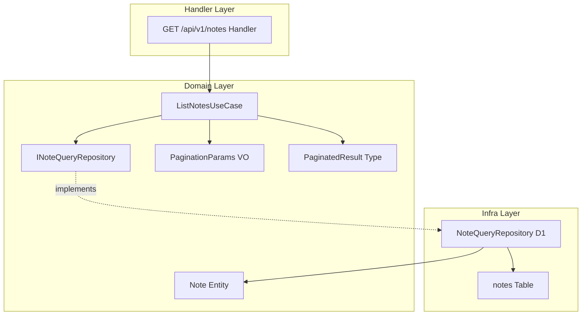
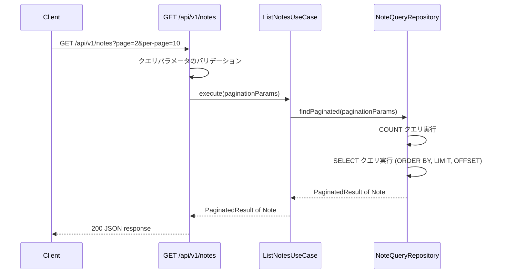
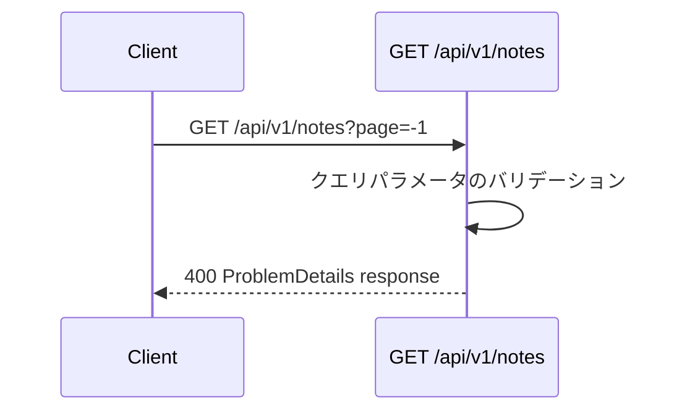

# Technical Design: 記事一覧 API (notes-list-api)

## Overview

**目的**: 本機能は、D1 データベースに保存された記事データをページネーション付きで一覧取得する REST API エンドポイント (`GET /api/v1/notes`) を提供する。フロントエンド開発者が記事一覧ページを構築するためのデータソースとして利用される。

**ユーザー**: フロントエンド開発者が記事一覧ページの表示、ページ遷移、および記事データの効率的な取得ワークフローで利用する。

**影響**: 既存の `notesApp` Hono ルートグループに GET ハンドラを追加し、`INoteQueryRepository` インターフェースにページネーション対応のクエリメソッドを拡張する。

### Goals

- 公開日降順でソートされた記事一覧を JSON で返却する API エンドポイントを提供する
- オフセットベースのページネーションによる効率的なデータ取得を実現する
- RFC 9457 準拠のエラーレスポンスによる一貫したエラーハンドリングを提供する
- 既存の CQRS パターンおよびドメインモデルを活用した拡張性の高い設計を維持する

### Non-Goals

- 記事の全文検索やフィルタリング機能
- カーソルベースのページネーション
- レスポンスのキャッシュ戦略
- 記事詳細 API の提供
- 認証・認可の実装

## Architecture

### 既存アーキテクチャ分析

本機能は既存の notes ドメインを拡張する。以下のパターンと制約を維持する:

- **CQRS パターン**: Command/Query リポジトリの分離。本機能は Query 側のみを拡張する
- **DIP (依存性逆転)**: ドメイン層がインターフェースを定義し、インフラ層が実装する
- **Entity 永続化状態パターン**: `IPersisted`/`IUnpersisted` ジェネリクスによるコンパイル時の状態区別
- **RFC 9457 エラーレスポンス**: 既存の `POST /api/v1/notes/refresh` と同一の ProblemDetails 形式
- **Hono ルートグループ**: `notesApp` に GET ハンドラを追加する形で統合

### アーキテクチャパターンと境界マップ



**アーキテクチャ統合**:

- 選択パターン: 既存のクリーンアーキテクチャ (DIP + CQRS) を踏襲
- ドメイン境界: Note ドメイン内にページネーション関連の型とユースケースを追加
- 既存パターンの保持: Entity 永続化状態、VO パターン、RFC 9457 エラーレスポンス
- 新規コンポーネントの根拠: ページネーション関連の VO とユースケースはドメインロジックの分離に必要
- ステアリング準拠: 関数型プログラミング、イミュータビリティ、型安全性の原則を維持

### Technology Stack

| Layer | Choice / Version | Role in Feature | Notes |
|-------|-----------------|----------------|-------|
| Backend / Services | Hono v4 | API ルーティングとリクエスト処理 | 既存の `notesApp` ルートグループを拡張 |
| Data / Storage | Drizzle ORM + Cloudflare D1 | ページネーション付きクエリ実行 | `offset()` / `limit()` / `orderBy()` / `count()` を使用 |
| Infrastructure / Runtime | Cloudflare Workers | エッジでの API 実行環境 | 変更なし |

## System Flows

### 正常系: ページネーション付き記事一覧取得



### 異常系: バリデーションエラー



## Requirements Traceability

| Requirement | Summary | Components | Interfaces | Flows |
|-------------|---------|------------|------------|-------|
| 1.1 | 公開日降順ソート | NoteQueryRepository | INoteQueryRepository.findPaginated | 正常系フロー |
| 1.2 | レスポンスフィールド | ListNotesUseCase, Handler | NoteListItem | 正常系フロー |
| 1.3 | HTTP 200 ステータス | Handler | API Contract | 正常系フロー |
| 1.4 | Content-Type application/json | Handler | API Contract | 正常系フロー |
| 2.1 | page パラメータ | PaginationParams, NoteQueryRepository | INoteQueryRepository.findPaginated | 正常系フロー |
| 2.2 | page デフォルト値 | PaginationParams | PaginationParams.create | 正常系フロー |
| 2.3 | per-page パラメータ | PaginationParams, NoteQueryRepository | INoteQueryRepository.findPaginated | 正常系フロー |
| 2.4 | per-page デフォルト値 | PaginationParams | PaginationParams.create | 正常系フロー |
| 2.5 | ページネーションメタデータ | ListNotesUseCase, Handler | PaginatedResult, API Contract | 正常系フロー |
| 3.1 | page バリデーション | PaginationParams | PaginationParams.create | 異常系フロー |
| 3.2 | per-page バリデーション | PaginationParams | PaginationParams.create | 異常系フロー |
| 3.3 | per-page 最大値制限 | PaginationParams | PaginationParams.create | 異常系フロー |
| 3.4 | 範囲外ページ指定 | ListNotesUseCase, Handler | PaginatedResult | 正常系フロー |
| 4.1 | レスポンス構造 | Handler | API Contract, NotesListResponse | 正常系フロー |
| 4.2 | notes フィールド | Handler | NoteListItem | 正常系フロー |
| 4.3 | pagination フィールド | Handler | PaginationMeta | 正常系フロー |
| 4.4 | 日付の ISO 8601 形式 | Note Entity (toJSON) | NoteListItem | 正常系フロー |
| 5.1 | DB エラー時 500 | Handler | ProblemDetails | 異常系フロー |
| 5.2 | エラーログ出力 | Handler | console.error | 異常系フロー |
| 5.3 | エラー Content-Type | Handler | API Contract | 異常系フロー |
| 6.1 | notesApp 統合 | Handler | notesApp.get | - |
| 6.2 | refresh エンドポイント非影響 | Handler | notesApp | - |
| 6.3 | 既存リポジトリ活用 | NoteQueryRepository | INoteQueryRepository | - |

## Components and Interfaces

| Component | Domain/Layer | Intent | Req Coverage | Key Dependencies | Contracts |
|-----------|-------------|--------|-------------|-----------------|-----------|
| PaginationParams | Domain/Note | ページネーションパラメータの検証と保持 | 2.1-2.4, 3.1-3.3 | なし | Service |
| PaginatedResult | Domain/Note | ページネーション結果の型定義 | 2.5, 4.1, 4.3 | Note Entity (P0) | Service |
| INoteQueryRepository (拡張) | Domain/Note | ページネーション付きクエリインターフェース | 6.3 | PaginationParams (P0), PaginatedResult (P0) | Service |
| ListNotesUseCase | Domain/Note | 記事一覧取得のユースケース | 1.1, 1.2, 3.4 | INoteQueryRepository (P0), PaginationParams (P0) | Service |
| NoteQueryRepository (拡張) | Infra/D1 | ページネーション付きクエリの D1 実装 | 1.1, 2.1-2.4 | Drizzle ORM (P0), notes Table (P0) | Service |
| Notes List Handler | Handler/API | HTTP リクエスト処理とレスポンス生成 | 1.3, 1.4, 4.1-4.4, 5.1-5.3, 6.1, 6.2 | ListNotesUseCase (P0), PaginationParams (P0) | API |

### Domain Layer

#### PaginationParams (Value Object)

| Field | Detail |
|-------|--------|
| Intent | ページネーションクエリパラメータのバリデーションと不変保持 |
| Requirements | 2.1, 2.2, 2.3, 2.4, 3.1, 3.2, 3.3 |

**Responsibilities & Constraints**

- `page` と `perPage` のバリデーションを実行し、不正値に対してバリデーションエラーを返却する
- デフォルト値の適用 (`page`: 1, `perPage`: 20)
- `perPage` の最大値制限 (100) を強制する
- `offset` の計算ロジックを提供する
- イミュータブルな値オブジェクトとして実装する

**Dependencies**

- なし (独立した値オブジェクト)

**Contracts**: Service [x]

##### Service Interface

```typescript
type PaginationValidationError = {
  readonly field: "page" | "perPage";
  readonly reason: string;
};

class PaginationParams {
  private constructor(
    readonly page: number,
    readonly perPage: number,
  ) {}

  static create(params: {
    readonly page?: string;
    readonly perPage?: string;
  }): PaginationParams;

  get offset(): number;

  static readonly DEFAULT_PAGE: 1;
  static readonly DEFAULT_PER_PAGE: 20;
  static readonly MAX_PER_PAGE: 100;
}
```

- Preconditions: `page` は正の整数文字列または未指定。`perPage` は正の整数文字列 (1-100) または未指定
- Postconditions: バリデーション成功時は有効な PaginationParams インスタンスを返却。失敗時は `PaginationValidationError` をスローする
- Invariants: `page >= 1`, `1 <= perPage <= 100`, `offset = (page - 1) * perPage`

**Implementation Notes**

- バリデーション失敗時には `PaginationValidationError` をスローし、Handler 層で ProblemDetails に変換する
- `create` ファクトリメソッドで文字列からの変換とバリデーションを一括実行する
- ファイル名: `pagination-params.vo.ts`

#### PaginatedResult (型定義)

| Field | Detail |
|-------|--------|
| Intent | ページネーション付き結果の汎用型定義 |
| Requirements | 2.5, 4.1, 4.3 |

**Responsibilities & Constraints**

- データ配列とページネーションメタデータを組み合わせた汎用的な結果型を定義する
- Note ドメインに限定せず、将来の他エンティティでも再利用可能な設計とする

**Dependencies**

- なし (独立した型定義)

**Contracts**: Service [x]

##### Service Interface

```typescript
type PaginationMeta = {
  readonly page: number;
  readonly perPage: number;
  readonly totalCount: number;
  readonly totalPages: number;
};

type PaginatedResult<T> = {
  readonly items: readonly T[];
  readonly pagination: PaginationMeta;
};
```

- Invariants: `totalPages = Math.ceil(totalCount / perPage)`, `items.length <= perPage`

**Implementation Notes**

- `PaginatedResult` はジェネリクスで汎用性を確保する。Note ドメインディレクトリ内に配置するが、将来的に共有ドメインへの移動を想定する
- ファイル名: `paginated-result.ts`

#### INoteQueryRepository (拡張)

| Field | Detail |
|-------|--------|
| Intent | 既存インターフェースにページネーション付きクエリメソッドを追加 |
| Requirements | 6.3 |

**Responsibilities & Constraints**

- 既存の `findAll()` および `findBySlug()` メソッドを維持する
- 新規に `findPaginated()` メソッドを追加する
- `count()` メソッドを追加してレコード総数を取得可能にする

**Dependencies**

- Inbound: ListNotesUseCase -- ページネーション付き記事取得 (P0)
- Outbound: PaginationParams -- ページネーション条件の受け渡し (P0)

**Contracts**: Service [x]

##### Service Interface

```typescript
interface INoteQueryRepository {
  findAll(): Promise<readonly Note<IPersisted>[]>;
  findBySlug(slug: NoteSlug): Promise<Note<IPersisted> | undefined>;
  findPaginated(params: PaginationParams): Promise<PaginatedResult<Note<IPersisted>>>;
}
```

- Preconditions: `params` は有効な PaginationParams インスタンス
- Postconditions: 公開日降順でソートされた記事一覧と正確なページネーションメタデータを返却する。範囲外ページでは空配列と正確な totalCount/totalPages を返却する
- Invariants: `findPaginated` の結果は常に `publishedOn` 降順

#### ListNotesUseCase

| Field | Detail |
|-------|--------|
| Intent | ページネーション付き記事一覧取得のビジネスロジックを実行する |
| Requirements | 1.1, 1.2, 3.4 |

**Responsibilities & Constraints**

- `INoteQueryRepository.findPaginated` を呼び出してページネーション付き記事一覧を取得する
- ドメインロジックの調整ポイントとして機能する (現時点ではリポジトリへの委譲が主)
- 将来的なフィルタリングやソート条件の追加に備えた拡張ポイントを提供する

**Dependencies**

- Inbound: Notes List Handler -- ユースケースの実行 (P0)
- Outbound: INoteQueryRepository -- ページネーション付きデータ取得 (P0)

**Contracts**: Service [x]

##### Service Interface

```typescript
class ListNotesUseCase {
  constructor(
    private readonly queryRepository: INoteQueryRepository,
  ) {}

  execute(params: PaginationParams): Promise<PaginatedResult<Note<IPersisted>>>;
}
```

- Preconditions: `params` は有効な PaginationParams インスタンス
- Postconditions: `PaginatedResult<Note<IPersisted>>` を返却する
- Invariants: リポジトリから取得したデータをそのまま返却する (データ変換なし)

**Implementation Notes**

- ファイル名: `list-notes.usecase.ts` (`app/backend/domain/note/usecases/` に配置)
- 既存の `usecases/` ディレクトリパターンに従う (Note ドメインでは初のユースケース)

### Infra Layer

#### NoteQueryRepository (拡張)

| Field | Detail |
|-------|--------|
| Intent | D1 データベースに対するページネーション付きクエリの実装 |
| Requirements | 1.1, 2.1, 2.2, 2.3, 2.4 |

**Responsibilities & Constraints**

- Drizzle ORM の `offset()`, `limit()`, `orderBy()`, `count()` を使用してページネーションクエリを実行する
- `publishedOn` の降順ソートを保証する
- 1 回のメソッド呼び出しで COUNT クエリと SELECT クエリの 2 つを実行する
- 既存の `findAll()`, `findBySlug()` メソッドへの影響なし

**Dependencies**

- External: Drizzle ORM -- SQL クエリビルダー (P0)
- External: Cloudflare D1 -- SQLite 互換データベース (P0)
- Outbound: notes Table -- データソース (P0)

**Contracts**: Service [x]

##### Service Interface

```typescript
class NoteQueryRepository implements INoteQueryRepository {
  constructor(private readonly db: DrizzleD1Database) {}

  async findAll(): Promise<readonly Note<IPersisted>[]>;
  async findBySlug(slug: NoteSlug): Promise<Note<IPersisted> | undefined>;
  async findPaginated(params: PaginationParams): Promise<PaginatedResult<Note<IPersisted>>>;
}
```

- Preconditions: D1 データベース接続が有効であること
- Postconditions: `publishedOn` 降順でソートされ、指定されたオフセットとリミットに基づく記事一覧を返却する。totalCount は notes テーブルの全レコード数を反映する
- Invariants: COUNT と SELECT の間にデータ変更が発生しうるが、D1 のシングルスレッドモデルにより一貫性は実質的に保証される

**Implementation Notes**

- Drizzle ORM の `desc()`, `offset()`, `limit()`, `count()` を使用する
- 既存の `toEntity()` プライベートメソッドを再利用する
- `totalPages` の計算は `Math.ceil(totalCount / perPage)` で実行する

### Handler Layer

#### Notes List Handler

| Field | Detail |
|-------|--------|
| Intent | HTTP リクエストの受信、パラメータバリデーション、レスポンス生成 |
| Requirements | 1.3, 1.4, 4.1, 4.2, 4.3, 4.4, 5.1, 5.2, 5.3, 6.1, 6.2 |

**Responsibilities & Constraints**

- 既存の `notesApp` Hono ルートグループに `.get("/", ...)` として追加する
- クエリパラメータ (`page`, `per-page`) のパース
- `PaginationParams.create()` によるバリデーション (失敗時は 400 ProblemDetails)
- `ListNotesUseCase.execute()` によるデータ取得
- Note エンティティの `toJSON()` を利用したレスポンスフィールドマッピング
- データベースエラー時のキャッチと 500 ProblemDetails レスポンス生成
- エラーの `console.error` によるログ出力

**Dependencies**

- Inbound: Client -- HTTP リクエスト (P0)
- Outbound: ListNotesUseCase -- 記事一覧取得 (P0)
- Outbound: PaginationParams -- パラメータバリデーション (P0)
- External: Hono -- HTTP フレームワーク (P0)

**Contracts**: API [x]

##### API Contract

| Method | Endpoint | Request | Response | Errors |
|--------|----------|---------|----------|--------|
| GET | /api/v1/notes | Query: `page?`, `per-page?` | NotesListResponse (200) | 400 (ProblemDetails), 500 (ProblemDetails) |

**成功レスポンス (200)**:

```typescript
type NoteListItem = {
  readonly id: string;
  readonly title: string;
  readonly slug: string;
  readonly imageUrl: string;
  readonly publishedOn: string;   // ISO 8601 (YYYY-MM-DD)
  readonly lastModifiedOn: string; // ISO 8601 (YYYY-MM-DD)
};

type NotesListResponse = {
  readonly notes: readonly NoteListItem[];
  readonly pagination: {
    readonly page: number;
    readonly perPage: number;
    readonly totalCount: number;
    readonly totalPages: number;
  };
};
```

**エラーレスポンス (400)**:

```typescript
// Content-Type: application/problem+json
type ProblemDetails = {
  readonly type: "about:blank";
  readonly title: "Bad Request";
  readonly status: 400;
  readonly detail: string; // e.g., "page must be a positive integer"
};
```

**エラーレスポンス (500)**:

```typescript
// Content-Type: application/problem+json
type ProblemDetails = {
  readonly type: "about:blank";
  readonly title: "Internal Server Error";
  readonly status: 500;
  readonly detail: string;
};
```

**Implementation Notes**

- Integration: 既存の `notesApp` に `.get("/", handler)` をチェーンする形で追加する。既存の `.post("/refresh", ...)` に影響しない
- Validation: `PaginationParams.create()` のエラーをキャッチして ProblemDetails に変換する。PaginationValidationError のインスタンスチェックで 400 と 500 を判別する
- Risks: Note エンティティの `toJSON()` は `etag`, `createdAt`, `updatedAt` を含むが、レスポンスには不要なフィールドがある。Handler 層で必要なフィールドのみを抽出してマッピングする

## Data Models

### Domain Model

既存の Note エンティティを変更なしで使用する。新規に追加するドメイン概念は以下の通り:

- **PaginationParams (VO)**: `page` (正の整数), `perPage` (1-100 の正の整数) を保持する値オブジェクト
- **PaginatedResult (型)**: 汎用的なページネーション結果型。`items` 配列と `PaginationMeta` を含む
- **PaginationValidationError (エラー)**: バリデーション失敗時のドメインエラー

### Data Contracts & Integration

**API レスポンススキーマ**:

- 成功時: `NotesListResponse` 型 (`notes` 配列 + `pagination` メタデータ)
- エラー時: 既存の `ProblemDetails` 型 (RFC 9457 準拠)

**Note エンティティからレスポンスへのフィールドマッピング**:

| Note Entity Field | Response Field | 変換 |
|-------------------|---------------|------|
| `id` | `id` | そのまま |
| `title.value` | `title` | VO から文字列抽出 |
| `slug.value` | `slug` | VO から文字列抽出 |
| `imageUrl.value` | `imageUrl` | VO から文字列抽出 |
| `publishedOn.toString()` | `publishedOn` | Temporal.PlainDate を ISO 8601 文字列に変換 |
| `lastModifiedOn.toString()` | `lastModifiedOn` | Temporal.PlainDate を ISO 8601 文字列に変換 |
| `etag` | (除外) | レスポンスに含めない |
| `createdAt` | (除外) | レスポンスに含めない |
| `updatedAt` | (除外) | レスポンスに含めない |

## Error Handling

### Error Strategy

エラーは発生レイヤーに応じて分類し、Handler 層で HTTP レスポンスにマッピングする。

### Error Categories and Responses

**User Errors (400)**:

- `PaginationValidationError` -- `page` または `perPage` パラメータの不正値。フィールド名と理由を含む ProblemDetails を返却する
  - `page` が正の整数でない: `"page must be a positive integer"`
  - `per-page` が正の整数でない: `"per-page must be a positive integer"`
  - `per-page` が 100 を超過: `"per-page must not exceed 100"`

**System Errors (500)**:

- データベースクエリエラー -- D1 への接続障害やクエリ実行エラー。エラー詳細を `console.error` でログ出力し、ProblemDetails を返却する

### Monitoring

- Handler 層で `console.error` によるエラーログ出力を実装する
- Cloudflare Workers のビルトインログ基盤を活用する

## Testing Strategy

### Unit Tests

- **PaginationParams.create**: デフォルト値適用、正常パラメータ、不正値 (非数値、負数、0、小数、最大値超過) のバリデーション
- **PaginationParams.offset**: オフセット計算の正確性 (`(page - 1) * perPage`)
- **ListNotesUseCase.execute**: リポジトリへの委譲、PaginatedResult の正確な返却
- **PaginationValidationError**: エラーメッセージのフォーマット

### Integration Tests

- **NoteQueryRepository.findPaginated**: D1 に対する実際のページネーションクエリ (ソート順、オフセット、リミット、総件数)
- **Notes List Handler**: Hono アプリ経由のエンドツーエンドリクエスト処理 (正常系、バリデーションエラー、DB エラー)
- **既存エンドポイント非影響確認**: `POST /api/v1/notes/refresh` が引き続き正常動作すること

### E2E Tests

- 本機能では E2E テストは対象外とする (Handler 層の統合テストでカバー)
