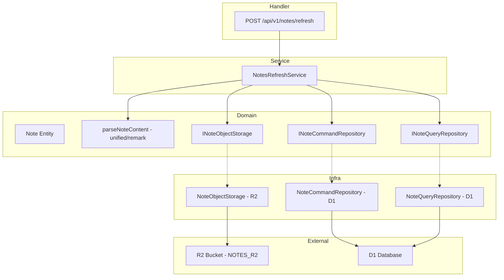
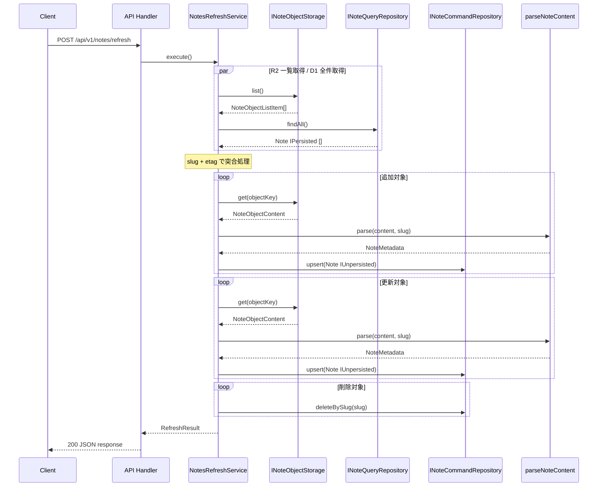

# Technical Design: 記事再構築 API

## Overview

**Purpose**: 本機能は、R2 バケット (notes) に保存された Markdown ファイル群を正として、D1 データベース (notes テーブル) との同期を行う API エンドポイント (`POST /api/v1/notes/refresh`) を提供する。システム管理者が任意のタイミングで記事データの整合性を確保できる。

**Users**: システム管理者が API 呼び出しを通じて記事同期を実行する。

**Impact**: 既存の Note ドメインモデルのリポジトリインタフェースを拡張し (upsert, deleteBySlug の追加)、新規の NotesRefreshService および API ハンドラを追加する。既存の SyncService (stored-object 用) には影響しない。

### Goals

- R2 バケット (notes) と D1 データベース (notes テーブル) の完全同期を実現する
- Markdown ファイルの YAML frontmatter から記事メタデータを正確にパースする
- 既存 SyncService と一貫した突合パターンを適用する
- 追加・更新・削除の件数を含む同期結果レポートを返却する

### Non-Goals

- 認証・認可機構 (将来的に管理者認証を追加予定だが本スコープ外)
- R2 バケットへの書き込み (R2 は読み取り専用として扱う)
- Markdown 本文の D1 への保存 (メタデータのみ同期)
- R2 の list() ページネーション対応 (記事数 1000 件未満を前提)
- フロントエンド側の記事表示機能

## Architecture

### Existing Architecture Analysis

本機能は既存の SyncService パターンを Note ドメインに拡張する。

- **既存パターン**: SyncService が IStoredObjectStorage + QueryRepository + CommandRepository の 3 依存で R2/D1 同期を実行
- **既存ドメイン境界**: Note エンティティ、NoteSlug/NoteTitle/ImageUrl/ETag VO、INoteCommandRepository/INoteQueryRepository が定義済み
- **維持すべき統合ポイント**: Hono ハンドラでの DI パターン、drizzle(c.env.D1) による DB 接続
- **対処すべき技術的制約**: INoteCommandRepository に upsert/deleteBySlug が未定義。Notes 用 R2 バケットバインディングが未設定

### Architecture Pattern & Boundary Map



**Architecture Integration**:

- **Selected pattern**: 既存 SyncService と同構造の Service + DIP パターン。ドメイン層にインタフェース定義、インフラ層で実装
- **Domain/feature boundaries**: Note ドメイン内で完結。stored-object ドメインへの依存なし
- **Existing patterns preserved**: CQRS (Command/Query 分離)、Entity Persistence State (IPersisted/IUnpersisted)、Value Object パターン、Hono ハンドラでの DI
- **New components rationale**: NotesRefreshService (突合ロジック)、parseNoteContent (ドメイン層の frontmatter パース関数。unified/remark は純粋データ変換ライブラリのため Temporal と同様にドメイン層で直接使用)、INoteObjectStorage (Notes 用 R2 アクセスの DIP 境界)
- **Steering compliance**: DIP 準拠 (I/O を伴うインフラ技術のみ隔離)、CQRS パターン維持、関数型スタイル (非破壊操作)

### Technology Stack

| Layer | Choice / Version | Role in Feature | Notes |
| --- | --- | --- | --- |
| Backend / Services | Hono v4, TypeScript | API ハンドラ、サービス層 | 既存パターン準拠 |
| Data / Storage | Cloudflare D1 (Drizzle ORM) | notes テーブルの CRUD | 既存スキーマ利用 |
| Data / Storage | Cloudflare R2 | Markdown ファイルの読み取り | 新規バインディング `NOTES_R2` |
| Library | unified, remark-parse, remark-frontmatter, vfile-matter | YAML frontmatter パース | 新規依存。将来の Markdown AST 活用に対応 |
| Library | @js-temporal/polyfill | 日付処理 | 既存依存 |

## System Flows

### 記事再構築処理フロー



突合処理は既存 SyncService と同一ロジック: R2 の slug/etag マップと D1 の slug/etag マップを比較し、追加 (R2 のみ)・更新 (etag 不一致)・削除 (D1 のみ)・スキップ (etag 一致) を判定する。追加・更新時は R2 から本文を取得して frontmatter をパースする追加ステップが発生する。

## Requirements Traceability

| Requirement | Summary | Components | Interfaces | Flows |
| --- | --- | --- | --- | --- |
| 1.1 | R2 から全 Markdown ファイル一覧取得 | NoteObjectStorage | INoteObjectStorage.list() | 記事再構築処理フロー |
| 1.2 | オブジェクトキーと etag の一覧返却 | NoteObjectStorage | INoteObjectStorage.list() | 記事再構築処理フロー |
| 1.3 | R2 バケット空の場合は空一覧 | NoteObjectStorage | INoteObjectStorage.list() | 記事再構築処理フロー |
| 2.1 | YAML frontmatter からメタデータパース | parseNoteContent | parseNoteContent() | 記事再構築処理フロー |
| 2.2 | ファイル名 (拡張子除く) を slug として使用 | NotesRefreshService | INoteObjectStorage.list() | 記事再構築処理フロー |
| 2.3 | パースエラー時にエラー発生 | parseNoteContent | parseNoteContent() | 記事再構築処理フロー |
| 2.4 | 必須メタデータ欠落時にバリデーションエラー | parseNoteContent | parseNoteContent() | 記事再構築処理フロー |
| 3.1 | D1 から全レコードの slug と etag 取得 | NoteQueryRepository | INoteQueryRepository.findAll() | 記事再構築処理フロー |
| 3.2 | R2 にあり D1 にない slug を追加対象として検出 | NotesRefreshService | -- | 記事再構築処理フロー |
| 3.3 | etag 不一致の slug を更新対象として検出 | NotesRefreshService | -- | 記事再構築処理フロー |
| 3.4 | D1 にあり R2 にない slug を削除対象として検出 | NotesRefreshService | -- | 記事再構築処理フロー |
| 3.5 | etag 一致の slug をスキップ | NotesRefreshService | -- | 記事再構築処理フロー |
| 4.1 | 追加対象の R2 本文取得とパース | NotesRefreshService | INoteObjectStorage.get(), parseNoteContent() | 記事再構築処理フロー |
| 4.2 | パース成功時に Note 生成し D1 保存 | NotesRefreshService, NoteCommandRepository | INoteCommandRepository.upsert() | 記事再構築処理フロー |
| 4.3 | slug, title, imageUrl, publishedOn, lastModifiedOn, etag を含めて保存 | Note Entity | INoteCommandRepository.upsert() | 記事再構築処理フロー |
| 5.1 | 更新対象の R2 本文取得と再パース | NotesRefreshService | INoteObjectStorage.get(), parseNoteContent() | 記事再構築処理フロー |
| 5.2 | 既存レコードのメタデータと etag を更新 | NotesRefreshService, NoteCommandRepository | INoteCommandRepository.upsert() | 記事再構築処理フロー |
| 6.1 | 削除対象のレコードを D1 から削除 | NoteCommandRepository | INoteCommandRepository.deleteBySlug() | 記事再構築処理フロー |
| 7.1 | POST /api/v1/notes/refresh で処理実行 | NotesRefreshHandler | -- | 記事再構築処理フロー |
| 7.2 | 成功時に追加・更新・削除件数を返却 | NotesRefreshHandler | -- | 記事再構築処理フロー |
| 7.3 | エラー時にステータス 500 で返却 | NotesRefreshHandler | -- | 記事再構築処理フロー |
| 8.1 | 同期結果として added, updated, deleted を返却 | NotesRefreshService | RefreshResult 型 | 記事再構築処理フロー |
| 8.2 | 変更なしの場合は全件数 0 | NotesRefreshService | RefreshResult 型 | 記事再構築処理フロー |

## Components and Interfaces

| Component | Domain/Layer | Intent | Req Coverage | Key Dependencies | Contracts |
| --- | --- | --- | --- | --- | --- |
| INoteObjectStorage | Domain (note) | Notes 用 R2 バケットへのアクセスインタフェース | 1.1, 1.2, 1.3 | -- | Service |
| NoteObjectStorage | Infra (r2) | INoteObjectStorage の R2 実装 | 1.1, 1.2, 1.3 | NOTES_R2 バインディング (P0) | Service |
| parseNoteContent | Domain (note) | YAML frontmatter パース関数 (unified/remark 使用) | 2.1, 2.2, 2.3, 2.4 | unified + remark-parse + remark-frontmatter + vfile-matter | -- |
| NotesRefreshService | Service | R2/D1 突合と同期オーケストレーション | 3.1-3.5, 4.1-4.3, 5.1-5.2, 6.1, 8.1-8.2 | INoteObjectStorage (P0), INoteQueryRepository (P0), INoteCommandRepository (P0), parseNoteContent | Service |
| INoteCommandRepository (拡張) | Domain (note) | upsert, deleteBySlug メソッドの追加 | 4.2, 5.2, 6.1 | -- | Service |
| NoteCommandRepository (拡張) | Infra (d1/note) | 拡張インタフェースの D1 実装 | 4.2, 5.2, 6.1 | D1 バインディング (P0) | Service |
| NotesRefreshHandler | Handler (api) | API エンドポイント定義と DI | 7.1, 7.2, 7.3 | NotesRefreshService (P0) | API |

### Domain Layer

#### INoteObjectStorage

| Field | Detail |
| --- | --- |
| Intent | Notes 用 R2 バケットからの Markdown ファイル一覧取得・個別取得 |
| Requirements | 1.1, 1.2, 1.3, 4.1, 5.1 |

**Responsibilities & Constraints**

- Notes 用 R2 バケットへの読み取りアクセスを抽象化
- ドメイン層はインフラ技術 (R2) に依存しない
- list() は全オブジェクトのキー・etag を返却
- get() は指定キーのオブジェクト本文を返却

**Dependencies**

- External: R2 Bucket (NOTES_R2) -- Notes Markdown ファイルストレージ (P0)

**Contracts**: Service [x]

##### Service Interface

```typescript
type NoteObjectListItem = {
  readonly objectKey: string;
  readonly etag: ETag;
};

type NoteObjectContent = {
  readonly objectKey: string;
  readonly body: string;
  readonly etag: ETag;
};

interface INoteObjectStorage {
  list(): Promise<readonly NoteObjectListItem[]>;
  get(objectKey: string): Promise<NoteObjectContent | undefined>;
}
```

- Preconditions: NOTES_R2 バケットバインディングが有効
- Postconditions: list() は全 Markdown ファイルの一覧を返却。get() は指定キーの本文をテキストとして返却
- Invariants: objectKey はファイル名 (例: `my-article.md`)

**Implementation Notes**

- R2 の `list()` はデフォルトで最大 1000 件。記事数が 1000 を超える場合はページネーション対応が将来必要
- `get()` は `ReadableStream` を `text()` に変換して返却 (frontmatter パースにテキストが必要)

---

#### parseNoteContent (パース関数)

| Field | Detail |
| --- | --- |
| Intent | Markdown テキストの YAML frontmatter からメタデータをパースする |
| Requirements | 2.1, 2.2, 2.3, 2.4 |

**Responsibilities & Constraints**

- YAML frontmatter から title, imageUrl, publishedOn, lastModifiedOn を抽出
- 必須フィールドの欠落時にバリデーションエラーを発生
- パース失敗時にパースエラーを発生
- unified/remark は純粋データ変換ライブラリ (I/O なし) のため、ドメイン層で直接使用する (Temporal と同じカテゴリ)

**Dependencies**

- unified + remark-parse + remark-frontmatter + vfile-matter -- YAML frontmatter パースライブラリ (ドメイン層で直接使用)

**Contracts**: NotesRefreshService から直接呼び出し

##### Function Signature

```typescript
type NoteMetadata = {
  readonly title: NoteTitle;
  readonly imageUrl: ImageUrl;
  readonly publishedOn: Temporal.PlainDate;
  readonly lastModifiedOn: Temporal.PlainDate;
};

function parseNoteContent(content: string, slug: NoteSlug): NoteMetadata;
```

- Preconditions: content は YAML frontmatter を含む Markdown テキスト
- Postconditions: 全必須フィールドを含む NoteMetadata を返却
- Invariants: 純粋関数 (同一入力に対し同一出力、副作用なし)

**Implementation Notes**

- パースエラー: `NoteParseError` (ドメインエラークラス) をスロー
- バリデーションエラー: `NoteMetadataValidationError` (ドメインエラークラス) をスロー。欠落フィールド名とファイル情報を含む
- publishedOn, lastModifiedOn は ISO 8601 日付文字列 (`YYYY-MM-DD`) からの `Temporal.PlainDate` 変換
- ファイル配置: `domain/note/note-content.parser.ts`

---

#### INoteCommandRepository (拡張)

| Field | Detail |
| --- | --- |
| Intent | Note の永続化操作に upsert と slug ベース削除を追加 |
| Requirements | 4.2, 4.3, 5.2, 6.1 |

**Responsibilities & Constraints**

- 既存の `save` と `delete` に加え、`upsert` と `deleteBySlug` を追加
- upsert は slug をキーとして INSERT OR REPLACE を実行
- deleteBySlug は slug を指定して削除

**Dependencies**

- Outbound: D1 Database -- notes テーブル (P0)

**Contracts**: Service [x]

##### Service Interface

```typescript
interface INoteCommandRepository {
  save(note: Note<IUnpersisted>): Promise<Note<IPersisted>>;
  upsert(note: Note<IUnpersisted>): Promise<Note<IPersisted>>;
  delete(id: string): Promise<void>;
  deleteBySlug(slug: NoteSlug): Promise<void>;
}
```

- Preconditions (upsert): note は有効な NoteSlug を持つ
- Postconditions (upsert): slug が既存の場合はメタデータと etag を更新。新規の場合は INSERT
- Postconditions (deleteBySlug): 指定 slug のレコードが削除される。存在しない場合はノーオペレーション

**Implementation Notes**

- D1 実装では `INSERT ... ON CONFLICT(slug) DO UPDATE` (SQLite UPSERT) を使用
- 既存テストの更新が必要 (モックインタフェースに upsert, deleteBySlug を追加)

---

### Service Layer

#### NotesRefreshService

| Field | Detail |
| --- | --- |
| Intent | R2/D1 の突合処理と同期オーケストレーションを実行する |
| Requirements | 3.1, 3.2, 3.3, 3.4, 3.5, 4.1, 4.2, 4.3, 5.1, 5.2, 6.1, 8.1, 8.2 |

**Responsibilities & Constraints**

- INoteObjectStorage.list() と INoteQueryRepository.findAll() を並列取得
- slug + etag で突合し、追加・更新・削除・スキップを判定
- 追加/更新対象について INoteObjectStorage.get() で本文取得、parseNoteContent() でメタデータパース
- パース結果から Note エンティティを生成し INoteCommandRepository.upsert() で保存
- 削除対象について INoteCommandRepository.deleteBySlug() で削除
- RefreshResult (added, updated, deleted) を返却

**Dependencies**

- Inbound: NotesRefreshHandler -- API リクエスト処理 (P0)
- Outbound: INoteObjectStorage -- R2 アクセス (P0)
- Outbound: INoteQueryRepository -- D1 読み取り (P0)
- Outbound: INoteCommandRepository -- D1 書き込み (P0)
- Internal: parseNoteContent -- frontmatter パース (ドメイン層関数)

**Contracts**: Service [x]

##### Service Interface

```typescript
type RefreshResult = {
  readonly added: number;
  readonly updated: number;
  readonly deleted: number;
};

class NotesRefreshService {
  constructor(
    storage: INoteObjectStorage,
    queryRepository: INoteQueryRepository,
    commandRepository: INoteCommandRepository,
  );

  execute(): Promise<RefreshResult>;
}
```

- Preconditions: 全依存が有効なインスタンス
- Postconditions: D1 の notes テーブルが R2 の Markdown ファイル群と同期される
- Invariants: 同一の R2/D1 状態に対して冪等 (同じ結果を返す)

**Implementation Notes**

- slug の抽出: objectKey からファイル名を取得し、拡張子 `.md` を除去して NoteSlug.create() で生成
- 突合ロジックは既存 SyncService と同一パターン (Map ベース比較)
- 追加/更新の R2 本文取得は逐次実行 (並列化は将来の最適化候補)

---

### Handler Layer

#### NotesRefreshHandler

| Field | Detail |
| --- | --- |
| Intent | POST /api/v1/notes/refresh エンドポイントの定義と DI の実行 |
| Requirements | 7.1, 7.2, 7.3 |

**Responsibilities & Constraints**

- Hono の route として `POST /api/v1/notes/refresh` を定義
- drizzle(c.env.D1) で DB 接続、c.env.NOTES_R2 で R2 バケットを取得
- NotesRefreshService をインスタンス化して execute() を呼び出し
- 成功時: RefreshResult を JSON レスポンスとして返却 (200)
- エラー時: エラーメッセージを含む JSON レスポンスを 500 で返却

**Dependencies**

- Outbound: NotesRefreshService -- 同期処理実行 (P0)
- External: Env (D1, NOTES_R2) -- Cloudflare バインディング (P0)

**Contracts**: API [x]

##### API Contract

| Method | Endpoint | Request | Response | Errors |
| --- | --- | --- | --- | --- |
| POST | /api/v1/notes/refresh | (empty body) | NotesRefreshResponse | 500 |

**Response Schema (200)**:

```typescript
type NotesRefreshResponse = {
  readonly added: number;
  readonly updated: number;
  readonly deleted: number;
};
```

**Error Schema (500)**:

```typescript
type ErrorResponse = {
  readonly error: string;
};
```

**Implementation Notes**

- 既存の `adminFilesApp` (POST /api/admin/files/sync) と同パターン
- `app/backend/index.ts` に `.route("/api/v1/notes", notesRefreshApp)` を追加してルーティング登録
- レスポンス型は `app/lib/types/` に共有型として定義

## Data Models

### Domain Model

既存の Note エンティティとバリューオブジェクトをそのまま活用する。

**エンティティ**:

- `Note<P>`: title (NoteTitle), slug (NoteSlug), etag (ETag), imageUrl (ImageUrl), publishedOn (Temporal.PlainDate), lastModifiedOn (Temporal.PlainDate)

**バリューオブジェクト** (全て既存):

- `NoteSlug`: `^[a-z0-9]+(?:-[a-z0-9]+)*$` のバリデーション
- `NoteTitle`: 空文字でないことのバリデーション
- `ImageUrl`: 有効な URL 形式のバリデーション
- `ETag`: 空文字でないことのバリデーション

**ドメインエラー** (新規):

- `NoteParseError`: frontmatter パース失敗時のエラー。ファイル名を含む
- `NoteMetadataValidationError`: 必須メタデータ欠落時のエラー。欠落フィールド名とファイル名を含む

**ビジネスルール**:

- slug は Markdown ファイル名 (拡張子除く) から導出
- 同期処理は R2 を正として D1 を更新
- etag の一致で変更有無を判定

### Logical Data Model

既存の notes テーブルスキーマを変更なしで使用する。

**notes テーブル**:

| Column | Type | Constraints | Description |
| --- | --- | --- | --- |
| id | TEXT | PK, NOT NULL | UUID |
| title | TEXT | NOT NULL | 記事タイトル |
| slug | TEXT | NOT NULL, UNIQUE | ファイル名由来のスラグ |
| etag | TEXT | NOT NULL | R2 オブジェクトの ETag |
| image_url | TEXT | NOT NULL | 記事画像 URL |
| published_on | TEXT | NOT NULL | 公開日 (PlainDate) |
| last_modified_on | TEXT | NOT NULL | 最終更新日 (PlainDate) |
| created_at | REAL | NOT NULL, DEFAULT | 作成日時 (Instant) |
| updated_at | REAL | NOT NULL, DEFAULT | 更新日時 (Instant) |

**整合性**:

- slug の UNIQUE 制約により upsert (INSERT OR REPLACE) が安全に動作
- updated_at は upsert 時に現在時刻で更新

### Data Contracts & Integration

**API Data Transfer**:

- Request: empty body (POST)
- Response (200): `{ added: number, updated: number, deleted: number }`
- Response (500): `{ error: string }`
- Serialization: JSON

## Error Handling

### Error Strategy

ドメイン層のエラーは型付きエラークラスとして定義し、ハンドラ層で HTTP ステータスにマッピングする (既存パターン準拠)。

### Error Categories and Responses

**ドメインエラー (frontmatter)**:

- `NoteParseError`: Markdown ファイルの frontmatter パース失敗。ファイル名情報を含む
- `NoteMetadataValidationError`: 必須メタデータ (title, imageUrl, publishedOn, lastModifiedOn) の欠落。欠落フィールド名とファイル名を含む
- 上記エラーは NotesRefreshService 内でスローされ、ハンドラ層で catch して 500 レスポンスに変換

**システムエラー (5xx)**:

- R2 アクセスエラー: バケット接続失敗、タイムアウト
- D1 アクセスエラー: データベース接続失敗、クエリエラー
- 全てハンドラ層で catch し、`console.error` でログ出力後 500 レスポンスを返却

### Monitoring

- `console.error` によるエラーログ出力 (Cloudflare Workers の observability で収集)
- 既存の `adminFilesApp` と同一のログパターン

## Testing Strategy

### Unit Tests

- **NotesRefreshService.execute()**: 追加・更新・削除・スキップの突合ロジック (既存 SyncService テストと同パターン)
- **parseNoteContent()**: 正常な frontmatter パース、必須フィールド欠落時のエラー、不正 YAML のエラー
- **NoteParseError / NoteMetadataValidationError**: エラーメッセージとプロパティの検証
- **slug 抽出ロジック**: objectKey からの拡張子除去と NoteSlug 生成

### Integration Tests

- **NoteCommandRepository.upsert()**: D1 への INSERT と UPDATE の動作検証
- **NoteCommandRepository.deleteBySlug()**: slug 指定削除の動作検証
- **NoteObjectStorage.list() / get()**: R2 バケットからの一覧取得・個別取得

### E2E Tests

- **POST /api/v1/notes/refresh**: ハンドラ経由での正常系レスポンス検証 (added, updated, deleted)
- **POST /api/v1/notes/refresh (エラー時)**: 500 レスポンスの検証
