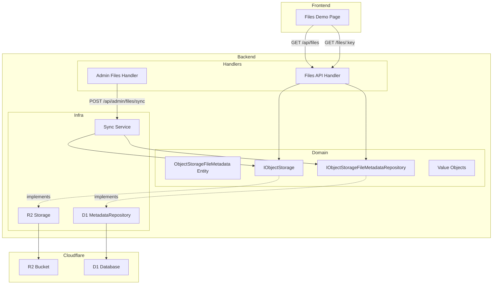
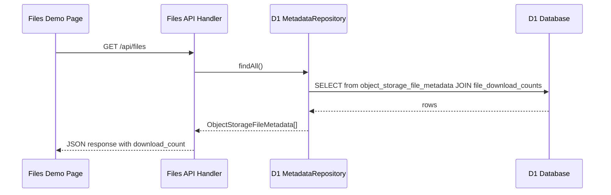
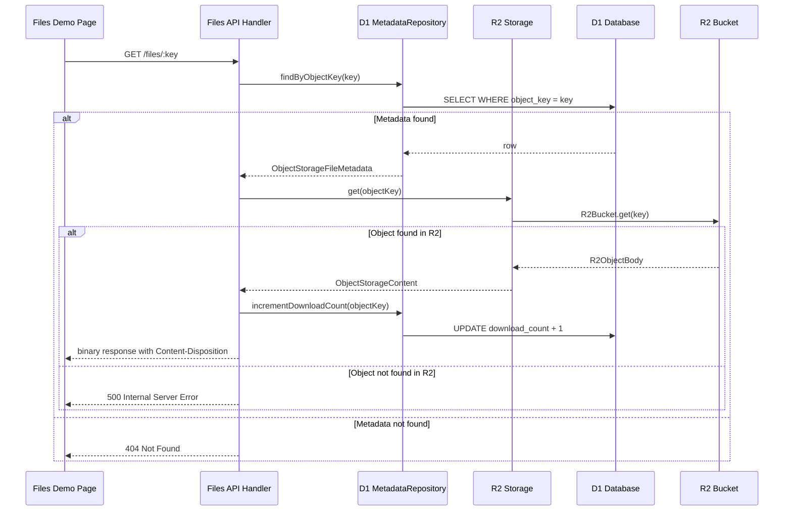
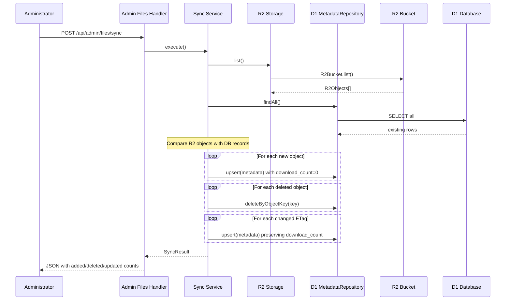
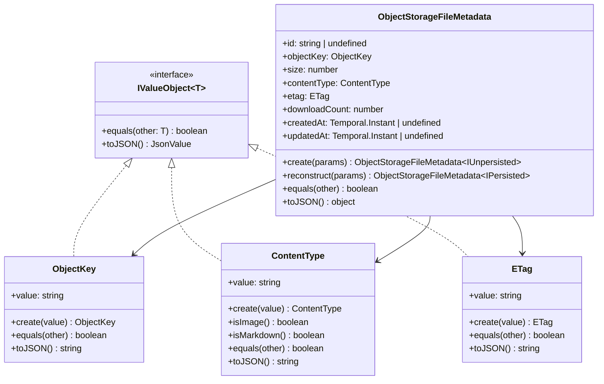

# 技術設計書: R2 Download Demo

## Overview

本機能は、オブジェクトストレージ内のファイル一覧表示とダウンロード回数カウント機能を提供するデモアプリケーションである。既存の D1 クリックカウンターデモのアーキテクチャパターンを踏襲し、ファイルダウンロード時にカウンターをインクリメントする機能を実装する。

**ユーザー**: 開発者およびエンドユーザーが、オブジェクトストレージ内のファイルを一覧表示・ダウンロードし、ダウンロード回数を確認する。

**影響**: 新規テーブル `object_storage_file_metadata`（ファイルメタデータ）と `file_download_counts`（ダウンロード回数、デモ用）を作成する。既存のドメイン層（`ObjectStorageFileMetadata` エンティティ）を活用しつつ、ダウンロード回数は別テーブルで管理する。新規のフロントエンドルート `/files` とバックエンド API を追加する。

**テーブル分離の理由**: ダウンロードカウンターはデモ機能であり、将来的に削除予定。メタデータテーブルとカウントテーブルを分離することで、デモ機能の削除時にカラム削除ではなくテーブル削除で済み、マイグレーションが容易になる。

### Goals

- オブジェクトストレージ内のファイル一覧を表示する UI を提供する
- ファイルダウンロード時にダウンロード回数をインクリメントする
- オブジェクトストレージのメタデータをデータベースに同期する API を提供する
- 既存のドメイン層（`ObjectKey`, `ContentType`, `ETag`, `ObjectStorageFileMetadata`）を活用する

### Non-Goals

- ファイルアップロード機能（読み取り専用デモ）
- 認証・認可によるアクセス制御
- キャッシュ戦略の最適化
- メタデータ同期の自動化（手動 API 呼び出しを前提）

## Architecture

### Existing Architecture Analysis

現在のアーキテクチャは以下のパターンに従っている。

- **Hono ファクトリパターン**: `getApp(handler)` が Hono アプリを作成し、API ルートと React Router SSR ハンドラーを統合
- **DDD 3 層構造**: `domain/`（エンティティ・インターフェース）、`infra/`（D1/R2 実装）、`handlers/`（API ハンドラー）
- **エンティティの永続化状態型**: `IEntity<T>` + `IPersisted` / `IUnpersisted` ジェネリクスパターン
- **値オブジェクト**: `IValueObject<T>` インターフェースが既に存在し、`ObjectKey`, `ContentType`, `ETag` が実装済み
- **ドメイン層の命名規則**: インフラ固有名（R2, D1 等）を含まず、`object-storage` のような汎用名を使用
- **Drizzle ORM**: D1 スキーマ定義とカスタム型（`instant` 等）

本機能は既存の `object-storage` ドメインを拡張し、ダウンロード回数の管理機能を追加する。

### Architecture Pattern & Boundary Map



**Architecture Integration**:

- **選択パターン**: DDD レイヤードアーキテクチャ（既存プロジェクトと同一）
- **ドメイン境界**: 既存の `object-storage` 集約を拡張し、ダウンロード回数を追加
- **既存パターン維持**: `IEntity`, `IPersisted`, `IUnpersisted`, `IValueObject` インターフェース群を再利用
- **新規コンポーネント**: リポジトリインターフェースの拡張（upsert, delete, incrementDownloadCount）、同期サービスの追加
- **Steering 準拠**: 型安全性、DDD パターン、ファクトリパターンを維持。ドメイン層にインフラ固有名を含めない

### Technology Stack

| Layer | Choice / Version | Role in Feature | Notes |
| --- | --- | --- | --- |
| Frontend | React 19 + React Router 7 | ファイル一覧画面 | クライアントサイドから API 呼び出し |
| Backend | Hono v4 | API ハンドラー | 既存パターン踏襲 |
| Data / Storage | Cloudflare R2 + D1 (Drizzle ORM) | オブジェクトストレージ + メタデータ DB | R2 はコンテンツ、D1 はメタデータ |
| Infrastructure | Cloudflare Workers | R2/D1 バインディング | 既に設定済み |

## System Flows

### ファイル一覧取得フロー



### ファイルダウンロードフロー



### メタデータ同期フロー



## Requirements Traceability

| Requirement | Summary | Components | Interfaces | Flows |
| --- | --- | --- | --- | --- |
| 1.1 - 1.4 | ファイル一覧画面 | FilesPage, FilesHandler | IObjectStorageFileMetadataRepository | ファイル一覧取得フロー |
| 2.1 - 2.6 | ファイルダウンロードエンドポイント | FilesHandler, R2Storage, D1MetadataRepository | IObjectStorage, IObjectStorageFileMetadataRepository | ファイルダウンロードフロー |
| 3.1 - 3.6 | メタデータ同期 API | AdminFilesHandler, SyncService | IObjectStorage, IObjectStorageFileMetadataRepository | メタデータ同期フロー |
| 4.1 - 4.4 | ファイル一覧取得 API | FilesHandler | IObjectStorageFileMetadataRepository | ファイル一覧取得フロー |
| 5.1 - 5.4 | メタデータスキーマ | object_storage_file_metadata, file_download_counts テーブル | - | - |
| 6.1 - 6.5 | DDD アーキテクチャの維持 | 全ドメインコンポーネント | IObjectStorage, IObjectStorageFileMetadataRepository | - |

## Components and Interfaces

| Component | Domain/Layer | Intent | Req Coverage | Key Dependencies | Contracts |
| --- | --- | --- | --- | --- | --- |
| ObjectStorageFileMetadata | Domain/Entity | メタデータエンティティ（download_count 追加） | 5.1, 6.1, 6.2 | ValueObjects (P0) | Service |
| IObjectStorage | Domain/Interface | ストレージアクセス契約 | 6.1 | - | Service |
| IObjectStorageFileMetadataRepository | Domain/Interface | メタデータリポジトリ契約 | 6.1 | - | Service |
| R2Storage | Infra/R2 | R2 ストレージ実装 | 6.4 | R2Bucket (P0, External) | Service |
| D1MetadataRepository | Infra/D1 | D1 メタデータリポジトリ実装 | 6.5 | Drizzle ORM (P0), D1Database (P0, External) | Service |
| SyncService | Infra/Service | メタデータ同期サービス | 3.1 - 3.6 | IObjectStorage (P0), IObjectStorageFileMetadataRepository (P0) | Service |
| FilesHandler | Handlers/API | ファイル一覧・ダウンロード API | 1.1 - 1.4, 2.1 - 2.6, 4.1 - 4.4 | Repository (P0), Storage (P0) | API |
| AdminFilesHandler | Handlers/API | 管理者向け同期 API | 3.1 - 3.6 | SyncService (P0) | API |
| FilesPage | Frontend/Route | ファイル一覧画面 | 1.1 - 1.4 | fetch API (P0) | State |
| object_storage_file_metadata, file_download_counts テーブル | Infra/D1 Schema | メタデータテーブル・ダウンロードカウントテーブル定義 | 5.1 - 5.4 | Drizzle ORM (P0) | - |

### Domain Layer

#### ObjectStorageFileMetadata (エンティティ拡張)

| Field | Detail |
| --- | --- |
| Intent | 既存の ObjectStorageFileMetadata エンティティに downloadCount プロパティを追加する |
| Requirements | 5.1, 6.1, 6.2 |

**Responsibilities & Constraints**

- 既存のエンティティ構造を維持しつつ `downloadCount: number` プロパティを追加する
- `create` メソッドは `downloadCount` を 0 で初期化する
- `reconstruct` メソッドは永続化された `downloadCount` を受け取る
- `toJSON` メソッドは `downloadCount` を含める

**Contracts**: Service [x]

##### Service Interface

```typescript
class ObjectStorageFileMetadata<P extends IPersisted | IUnpersisted>
  implements IEntity<ObjectStorageFileMetadata<P>> {
  private constructor(
    readonly id: P["id"],
    readonly objectKey: ObjectKey,
    readonly size: number,
    readonly contentType: ContentType,
    readonly etag: ETag,
    readonly downloadCount: number,
    readonly createdAt: P["createdAt"],
    readonly updatedAt: P["updatedAt"],
  );

  static create(params: {
    objectKey: ObjectKey;
    size: number;
    contentType: ContentType;
    etag: ETag;
  }): ObjectStorageFileMetadata<IUnpersisted>;

  static reconstruct(params: {
    id: string;
    objectKey: ObjectKey;
    size: number;
    contentType: ContentType;
    etag: ETag;
    downloadCount: number;
    createdAt: Temporal.Instant;
    updatedAt: Temporal.Instant;
  }): ObjectStorageFileMetadata<IPersisted>;

  equals(other: ObjectStorageFileMetadata<P>): boolean;
  toJSON(): {
    id: P["id"];
    objectKey: string;
    size: number;
    contentType: string;
    etag: string;
    downloadCount: number;
    createdAt: string | undefined;
    updatedAt: string | undefined;
  };
}
```

- Preconditions: `size >= 0`, `downloadCount >= 0`
- Postconditions: `create` は `downloadCount: 0` で初期化する
- Invariants: 値オブジェクトは有効であること

#### IObjectStorage (インターフェース)

| Field | Detail |
| --- | --- |
| Intent | オブジェクトストレージへのアクセス契約を定義する |
| Requirements | 6.1 |

**Responsibilities & Constraints**

- オブジェクトストレージからのオブジェクト取得・一覧取得操作を抽象化する
- インフラ固有名（R2）を含まない
- 読み取り専用操作のみを提供する

**Dependencies**

- Outbound: R2Bucket (External) -- オブジェクトストレージ (P0)

**Contracts**: Service [x]

##### Service Interface

```typescript
interface IObjectStorage {
  get(objectKey: ObjectKey): Promise<ObjectStorageContent | undefined>;
  list(): Promise<readonly ObjectStorageListItem[]>;
}

type ObjectStorageContent = {
  body: ReadableStream;
  contentType: ContentType;
  size: number;
  etag: ETag;
};

type ObjectStorageListItem = {
  objectKey: ObjectKey;
  size: number;
  etag: ETag;
};
```

- Preconditions: `objectKey` は有効な `ObjectKey` であること
- Postconditions: `get` はオブジェクトが存在すれば `ObjectStorageContent` を返却、存在しなければ `undefined`。`list` は全オブジェクトのリストを返却
- Invariants: 読み取り専用操作のみ

#### IObjectStorageFileMetadataRepository (インターフェース)

| Field | Detail |
| --- | --- |
| Intent | メタデータリポジトリへのアクセス契約を定義する |
| Requirements | 6.1 |

**Responsibilities & Constraints**

- メタデータの CRUD 操作とダウンロード回数のインクリメント操作を抽象化する
- インフラ固有名（D1）を含まない

**Dependencies**

- Outbound: D1Database (External) -- データベース (P0)

**Contracts**: Service [x]

##### Service Interface

```typescript
interface IObjectStorageFileMetadataRepository {
  findAll(): Promise<readonly ObjectStorageFileMetadata<IPersisted>[]>;
  findByObjectKey(objectKey: ObjectKey): Promise<ObjectStorageFileMetadata<IPersisted> | undefined>;
  upsert(metadata: ObjectStorageFileMetadata<IUnpersisted>, preserveDownloadCount?: boolean): Promise<ObjectStorageFileMetadata<IPersisted>>;
  deleteByObjectKey(objectKey: ObjectKey): Promise<void>;
  incrementDownloadCount(objectKey: ObjectKey): Promise<void>;
}
```

- Preconditions: 引数は有効な値であること
- Postconditions: `upsert` は INSERT または UPDATE を実行し、永続化されたエンティティを返却。`preserveDownloadCount: true` の場合、既存の `download_count` を維持する
- Invariants: `incrementDownloadCount` はアトミックに実行される

### Infra Layer

#### R2Storage (R2 実装)

| Field | Detail |
| --- | --- |
| Intent | `IObjectStorage` の R2 バケット実装 |
| Requirements | 6.4 |

**Responsibilities & Constraints**

- `R2Bucket` バインディングを受け取り、オブジェクトの取得・一覧操作を提供する
- `R2ObjectBody` から `ObjectStorageContent` へのマッピングを行う
- Content-Type が未設定の場合、キーの拡張子から推定する

**Dependencies**

- Inbound: FilesHandler, SyncService -- 呼び出し元 (P0)
- External: R2Bucket (Cloudflare Workers Runtime API) -- R2 バケットアクセス (P0)

**Contracts**: Service [x]

##### Service Interface

```typescript
class R2Storage implements IObjectStorage {
  constructor(private readonly r2: R2Bucket);
  async get(objectKey: ObjectKey): Promise<ObjectStorageContent | undefined>;
  async list(): Promise<readonly ObjectStorageListItem[]>;
}
```

**Implementation Notes**

- `R2Bucket.get()` の戻り値が `null` の場合は `undefined` を返却する
- `R2ObjectBody.httpMetadata.contentType` が未設定の場合、`ObjectKey` の拡張子から推定する（例: `.png` -> `image/png`）
- `list()` は `R2Bucket.list()` を使用し、`R2Objects.objects` から `ObjectStorageListItem` に変換する

#### D1MetadataRepository (D1 実装)

| Field | Detail |
| --- | --- |
| Intent | `IObjectStorageFileMetadataRepository` の D1 / Drizzle 実装 |
| Requirements | 6.5 |

**Responsibilities & Constraints**

- Drizzle ORM を使用して D1 からメタデータを取得・更新する
- 既存の `ClickCommandRepository` パターンに準拠する
- `incrementDownloadCount` は SQL の `UPDATE ... SET download_count = download_count + 1` でアトミックに実行する

**Dependencies**

- Inbound: FilesHandler, SyncService -- 呼び出し元 (P0)
- External: DrizzleD1Database (Drizzle ORM) -- D1 アクセス (P0)

**Contracts**: Service [x]

##### Service Interface

```typescript
class D1MetadataRepository implements IObjectStorageFileMetadataRepository {
  constructor(private readonly db: DrizzleD1Database);
  async findAll(): Promise<readonly ObjectStorageFileMetadata<IPersisted>[]>;
  async findByObjectKey(objectKey: ObjectKey): Promise<ObjectStorageFileMetadata<IPersisted> | undefined>;
  async upsert(metadata: ObjectStorageFileMetadata<IUnpersisted>, preserveDownloadCount?: boolean): Promise<ObjectStorageFileMetadata<IPersisted>>;
  async deleteByObjectKey(objectKey: ObjectKey): Promise<void>;
  async incrementDownloadCount(objectKey: ObjectKey): Promise<void>;
}
```

**Implementation Notes**

- `upsert` は Drizzle の `onConflictDoUpdate` を使用する
- `preserveDownloadCount: true` の場合、既存の `download_count` を維持するため `COALESCE` を使用する
- `incrementDownloadCount` は `sql\`download_count + 1\`` で直接インクリメントする

#### SyncService (同期サービス)

| Field | Detail |
| --- | --- |
| Intent | オブジェクトストレージのメタデータをデータベースに同期する |
| Requirements | 3.1 - 3.6 |

**Responsibilities & Constraints**

- オブジェクトストレージ内の全オブジェクト一覧を取得し、データベースと比較する
- 新規オブジェクトは INSERT（`download_count: 0`）
- 削除されたオブジェクトは DELETE
- ETag が変更されたオブジェクトは UPDATE（`download_count` を維持）

**Dependencies**

- Inbound: AdminFilesHandler -- 呼び出し元 (P0)
- Outbound: IObjectStorage -- オブジェクト一覧取得 (P0)
- Outbound: IObjectStorageFileMetadataRepository -- メタデータ操作 (P0)

**Contracts**: Service [x]

##### Service Interface

```typescript
type SyncResult = {
  added: number;
  deleted: number;
  updated: number;
};

class SyncService {
  constructor(
    private readonly storage: IObjectStorage,
    private readonly repository: IObjectStorageFileMetadataRepository,
  );
  async execute(): Promise<SyncResult>;
}
```

**Implementation Notes**

- R2 の `list()` と DB の `findAll()` を比較して差分を検出する
- 新規オブジェクトの Content-Type は R2 から取得するか、拡張子から推定する
- ETag の比較で変更を検出する

#### object_storage_file_metadata テーブル (D1 スキーマ)

| Field | Detail |
| --- | --- |
| Intent | オブジェクトストレージのファイルメタデータを格納するテーブル |
| Requirements | 5.1 - 5.4 |

**Implementation Notes**

- `app/backend/infra/d1/schema/object-storage-file-metadata.table.ts` に配置する
- 既存の `stored_object_metadata` テーブルからリネーム（マイグレーションで対応）

#### file_download_counts テーブル (D1 スキーマ、デモ用)

| Field | Detail |
| --- | --- |
| Intent | ファイルダウンロード回数を格納するテーブル（デモ用、将来削除予定） |
| Requirements | 5.1 - 5.4 |

**Implementation Notes**

- `app/backend/infra/d1/schema/file-download-counts.table.ts` に配置する
- `object_key` を主キーとし、`object_storage_file_metadata` との外部キー関係を持つ
- デモ機能削除時はこのテーブルを DROP するだけで済む

### Handlers Layer

#### FilesHandler (API ハンドラー)

| Field | Detail |
| --- | --- |
| Intent | ファイル一覧取得・ダウンロードの API エンドポイントを提供する |
| Requirements | 1.1 - 1.4, 2.1 - 2.6, 4.1 - 4.4 |

**Responsibilities & Constraints**

- `/api/files` (GET): D1 メタデータから一覧を取得し JSON で返却する
- `/files/:key` (GET): メタデータを確認し、存在すれば R2 からコンテンツを取得してダウンロード回数をインクリメントする
- ハンドラー内で `R2Storage` と `D1MetadataRepository` をインスタンス化する（既存 Counter パターン準拠）

**Dependencies**

- Inbound: Hono Router (backend/index.ts) -- API ルーティング (P0)
- Outbound: IObjectStorage -- R2 コンテンツ取得 (P0)
- Outbound: IObjectStorageFileMetadataRepository -- D1 メタデータ取得・更新 (P0)

**Contracts**: API [x]

##### API Contract

| Method | Endpoint | Request | Response | Errors |
| --- | --- | --- | --- | --- |
| GET | `/api/files` | - | `FileListResponse` (JSON) | 500 |
| GET | `/files/:key` | path param: `key` | binary with Content-Type, Content-Disposition | 404, 500 |

**API レスポンス型**:

```typescript
type FileListItem = {
  key: string;
  size: number;
  contentType: string;
  downloadCount: number;
};

type FileListResponse = {
  files: FileListItem[];
};

type ErrorResponse = {
  error: string;
};
```

**Implementation Notes**

- `app/backend/handlers/api/files/index.ts` に配置する
- `/files/:key` のパスパラメータはネストされたパスを含む可能性があるため、ワイルドカードパス `/files/*` を使用する
- `Content-Disposition: attachment; filename="<filename>"` ヘッダーを設定してダウンロードを促す
- エラーハンドリングは既存 Counter パターン（try-catch + console.error + JSON error response）に準拠する

#### AdminFilesHandler (管理者 API ハンドラー)

| Field | Detail |
| --- | --- |
| Intent | メタデータ同期 API エンドポイントを提供する |
| Requirements | 3.1 - 3.6 |

**Responsibilities & Constraints**

- `/api/admin/files/sync` (POST): SyncService を実行し、同期結果を返却する
- ハンドラー内で `SyncService` をインスタンス化する

**Dependencies**

- Inbound: Hono Router (backend/index.ts) -- API ルーティング (P0)
- Outbound: SyncService -- 同期処理 (P0)

**Contracts**: API [x]

##### API Contract

| Method | Endpoint | Request | Response | Errors |
| --- | --- | --- | --- | --- |
| POST | `/api/admin/files/sync` | - | `SyncResponse` (JSON) | 500 |

**API レスポンス型**:

```typescript
type SyncResponse = {
  added: number;
  deleted: number;
  updated: number;
};
```

**Implementation Notes**

- `app/backend/handlers/api/admin/files/index.ts` に配置する
- 将来的に認証を追加する場合のために `/api/admin/` パスプレフィックスを使用する

### Frontend Layer

#### FilesPage (ルートコンポーネント)

| Field | Detail |
| --- | --- |
| Intent | オブジェクトストレージ内のファイル一覧を表示するデモページ |
| Requirements | 1.1 - 1.4 |

**Responsibilities & Constraints**

- `/files` パスで表示される React Router ルートコンポーネント
- React Router の `loader` を使用しない -- クライアントサイドから API を呼び出す
- ファイル一覧取得: `fetch("/api/files")` で API 呼び出し
- ファイルダウンロード: `<a href="/files/{key}" download>` でダウンロードリンクを提供
- ローディング・エラー状態の管理

**Dependencies**

- External: fetch API -- API 呼び出し (P0)

**Contracts**: State [x]

##### State Management

```typescript
type FilesPageState = {
  files: FileListItem[];
  isLoading: boolean;
  errorMessage: string | null;
};
```

- State model: `useState` フックで管理（Counter Demo パターン準拠）
- Persistence: なし（クライアントサイドのみ）
- Concurrency: 単一ユーザーのブラウザ操作のため不要

**Implementation Notes**

- `app/frontend/routes/files.tsx` に配置する
- `meta` 関数で title と description を設定する（Counter Demo パターン準拠）
- ファイル一覧は `useEffect` でマウント時に取得する
- 各ファイル行にはキー名、サイズ、Content-Type、ダウンロード回数、ダウンロードリンクを表示する
- ファイルが存在しない場合は「ファイルがありません」メッセージを表示する

### Configuration Updates

#### routes.ts 更新

```typescript
// app/frontend/routes.ts に追加
route("files", "routes/files.tsx"),
```

#### backend/index.ts 更新

```typescript
// app/backend/index.ts
import { Hono } from "hono";
import { counterApp } from "./handlers/api/counter";
import { filesApp } from "./handlers/api/files";
import { adminFilesApp } from "./handlers/api/admin/files";

export const getApp = (
  handler: (
    request: Request,
    env: Env,
    ctx: ExecutionContext,
  ) => Promise<Response>,
): Hono<{ Bindings: Env }> => {
  const app = new Hono<{ Bindings: Env }>()
    .get("/hello", (c) => c.text("Hello, World!"))
    .route("/api/counter", counterApp)
    .route("/api/files", filesApp)
    .route("/api/admin/files", adminFilesApp)
    .route("/files", filesApp)  // /files/:key for downloads
    .all("*", async (context) => {
      return handler(
        context.req.raw,
        context.env,
        context.executionCtx as ExecutionContext,
      );
    });

  return app;
};
```

## Data Models

### Domain Model



**ビジネスルール & 不変条件**:

- `ObjectKey.value` は空文字列でないこと
- `ContentType.value` は空文字列でないこと
- `ETag.value` は空文字列でないこと
- `ObjectStorageFileMetadata.size` は 0 以上であること
- `ObjectStorageFileMetadata.downloadCount` は 0 以上であること

### Logical Data Model

**object_storage_file_metadata テーブル**:

| Column | Type | Constraints | Description |
| --- | --- | --- | --- |
| id | TEXT | PRIMARY KEY, NOT NULL | UUID v4 |
| object_key | TEXT | NOT NULL, UNIQUE | オブジェクトキー |
| size | INTEGER | NOT NULL | ファイルサイズ（バイト） |
| content_type | TEXT | NOT NULL | MIME タイプ |
| etag | TEXT | NOT NULL | httpEtag |
| created_at | REAL | NOT NULL, DEFAULT unixepoch('subsec') | 作成日時 |
| updated_at | REAL | NOT NULL, DEFAULT unixepoch('subsec') | 更新日時 |

**file_download_counts テーブル（デモ用）**:

| Column | Type | Constraints | Description |
| --- | --- | --- | --- |
| object_key | TEXT | PRIMARY KEY, NOT NULL, FK | オブジェクトキー（外部キー） |
| count | INTEGER | NOT NULL, DEFAULT 0 | ダウンロード回数 |

**インデックス**: `object_storage_file_metadata.object_key` に UNIQUE 制約（一意インデックスとして機能）

### Physical Data Model

```typescript
// app/backend/infra/d1/schema/object-storage-file-metadata.table.ts
import { sql } from "drizzle-orm";
import { integer, sqliteTable, text } from "drizzle-orm/sqlite-core";
import { instant } from "./custom-types/temporal.custom-type";

export const objectStorageFileMetadata = sqliteTable("object_storage_file_metadata", {
  id: text("id").notNull().primaryKey(),
  objectKey: text("object_key").notNull().unique(),
  size: integer("size").notNull(),
  contentType: text("content_type").notNull(),
  etag: text("etag").notNull(),
  createdAt: instant("created_at")
    .notNull()
    .default(sql`(unixepoch('subsec'))`),
  updatedAt: instant("updated_at")
    .notNull()
    .default(sql`(unixepoch('subsec'))`),
});
```

```typescript
// app/backend/infra/d1/schema/file-download-counts.table.ts（デモ用）
import { integer, sqliteTable, text } from "drizzle-orm/sqlite-core";
import { objectStorageFileMetadata } from "./object-storage-file-metadata.table";

export const fileDownloadCounts = sqliteTable("file_download_counts", {
  objectKey: text("object_key")
    .notNull()
    .primaryKey()
    .references(() => objectStorageFileMetadata.objectKey),
  count: integer("count").notNull().default(0),
});
```

**マイグレーション**:

既存の `stored_object_metadata` テーブルをリネームし、新規テーブルを作成する。

```sql
-- migrations/XXXX_rename_to_object_storage_file_metadata.sql
ALTER TABLE `stored_object_metadata` RENAME TO `object_storage_file_metadata`;

-- migrations/XXXX_create_file_download_counts.sql
CREATE TABLE `file_download_counts` (
  `object_key` text PRIMARY KEY NOT NULL REFERENCES `object_storage_file_metadata`(`object_key`),
  `count` integer NOT NULL DEFAULT 0
);
```

### Data Contracts & Integration

**API レスポンススキーマ**:

ファイル一覧レスポンスは D1 メタデータから生成する。`downloadCount` を含む全フィールドを JSON で返却する。

**フロントエンド・バックエンド型共有**:

ファイル一覧 API のレスポンス型は `app/lib/types/object-storage.ts` に配置し、バックエンドとフロントエンドで共有する。

```typescript
// app/lib/types/object-storage.ts
export type FileListItem = {
  key: string;
  size: number;
  contentType: string;
  downloadCount: number;
};

export type FileListResponse = {
  files: FileListItem[];
};

export type SyncResponse = {
  added: number;
  deleted: number;
  updated: number;
};
```

## Error Handling

### Error Strategy

既存の Counter Demo パターンに準拠し、try-catch + console.error + JSON エラーレスポンスを使用する。

### Error Categories and Responses

**User Errors (4xx)**:

- `404 Not Found`: 指定されたキーのファイルがメタデータに存在しない場合。`{ error: "File not found: {key}" }` を返却する。

**System Errors (5xx)**:

- `500 Internal Server Error`:
  - R2 バケットからのファイル取得に失敗した場合: `{ error: "Failed to fetch file content" }`
  - D1 データベースへのアクセスに失敗した場合: `{ error: "Failed to fetch files" }` または `{ error: "Failed to sync files" }`

**フロントエンドエラー表示**:

- API エラーはファイル一覧画面上にエラーメッセージとして表示する
- Counter Demo と同様の `errorMessage` state パターンを使用する

### Monitoring

- `console.error` でエラーログを出力する（Cloudflare Workers Observability で収集）
- 既存の Observability 設定（`wrangler.jsonc` の `observability.enabled: true`）を活用する

## Testing Strategy

### Unit Tests

- **ObjectStorageFileMetadata エンティティ**: `create`, `reconstruct`, `equals`, `toJSON` メソッド（`downloadCount` 含む）
- **SyncService**: 新規追加、削除、更新の各ケースのロジック検証

### Integration Tests

- **FilesHandler**: `/api/files` エンドポイントの正常系・エラー系レスポンス検証
- **FilesHandler**: `/files/:key` エンドポイントの正常系・404・500 レスポンス検証
- **AdminFilesHandler**: `/api/admin/files/sync` エンドポイントの正常系・エラー系レスポンス検証
- **D1MetadataRepository**: `incrementDownloadCount` のアトミック性検証

### E2E/UI Tests

- **FilesPage**: ファイル一覧の表示確認（キー名、サイズ、Content-Type、ダウンロード回数）
- **FilesPage**: ダウンロードリンクの動作確認
- **FilesPage**: ローディング状態・エラー状態の表示確認
- **FilesPage**: ファイルが存在しない場合のメッセージ表示確認

## File Structure Summary

```
app/
├── backend/
│   ├── domain/
│   │   └── object-storage/
│   │       ├── object-key.vo.ts (既存)
│   │       ├── content-type.vo.ts (既存)
│   │       ├── etag.vo.ts (既存)
│   │       ├── object-storage-file-metadata.entity.ts (拡張: downloadCount 追加)
│   │       ├── object-storage.interface.ts (新規)
│   │       └── object-storage-file-metadata-repository.interface.ts (新規)
│   ├── handlers/
│   │   └── api/
│   │       ├── files/
│   │       │   └── index.ts (新規)
│   │       └── admin/
│   │           └── files/
│   │               └── index.ts (新規)
│   ├── infra/
│   │   ├── d1/
│   │   │   ├── object-storage/
│   │   │   │   └── object-storage-file-metadata.repository.ts (新規)
│   │   │   └── schema/
│   │   │       ├── object-storage-file-metadata.table.ts (新規)
│   │   │       ├── file-download-counts.table.ts (新規、デモ用)
│   │   │       └── index.ts (更新)
│   │   └── r2/
│   │       └── object-storage.storage.ts (新規)
│   ├── services/
│   │   └── sync.service.ts (新規)
│   └── index.ts (更新: files, admin/files ルート追加)
├── frontend/
│   ├── routes/
│   │   └── files.tsx (新規)
│   └── routes.ts (更新)
└── lib/
    └── types/
        └── object-storage.ts (新規)

migrations/
├── XXXX_rename_to_object_storage_file_metadata.sql (新規)
└── XXXX_create_file_download_counts.sql (新規)
```
