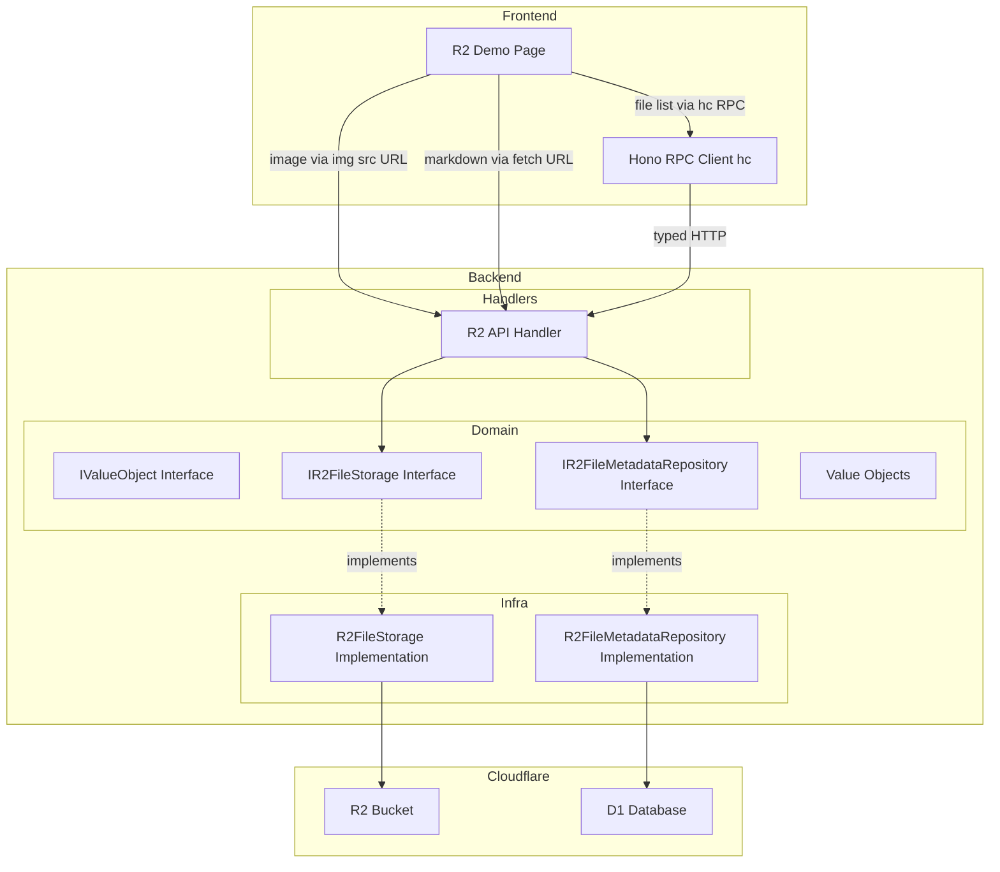
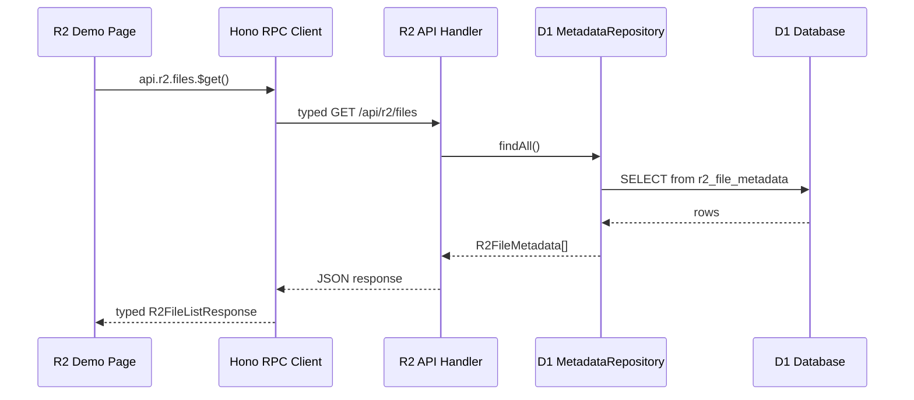
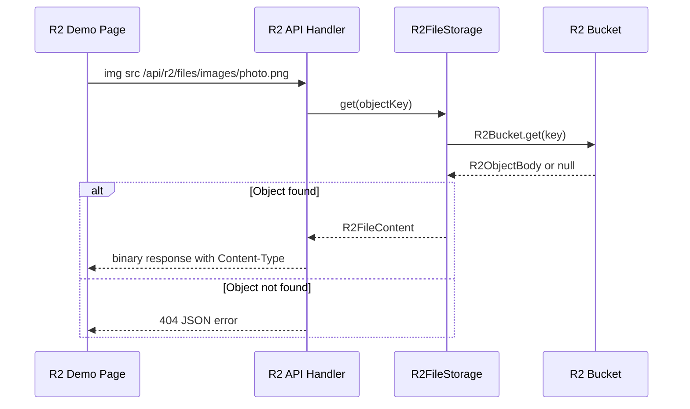
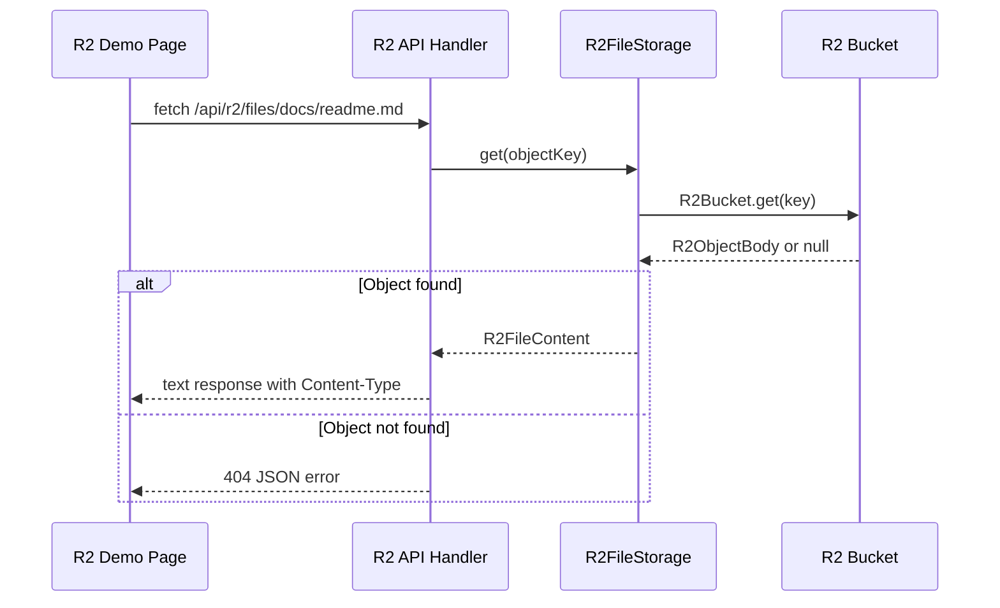
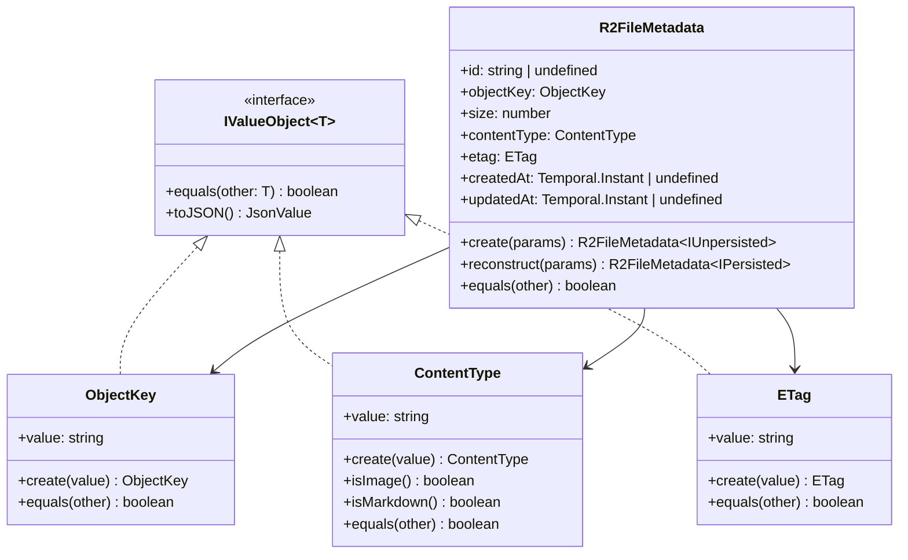

# 技術設計書: R2 Download Demo

## Overview

本機能は、Cloudflare R2 オブジェクトストレージをプロジェクトに統合し、R2 バケットに配置された画像ファイルおよび Markdown ファイルをアプリケーションから取得・表示するデモアプリケーションを構築する。既存の D1 Counter Demo と同様のアーキテクチャパターン（Hono バックエンド API + React Router フロントエンド）に従い、参考プロジェクト（`tmp/yantene.net.old`）の DDD パターンを踏襲する。

**ユーザー**: 開発者およびエンドユーザーが、R2 統合の動作確認とファイルブラウジングを行う。

**影響**: 既存の Hono バックエンドに R2 API ルートを追加し、D1 スキーマにメタデータテーブルを追加する。フロントエンドに新規デモページを追加する。`getApp` 関数の戻り値型アノテーションを削除して Hono RPC 型推論チェーンを有効化する。

### Goals

- R2 バケットバインディングを設定し、アプリケーションから R2 にアクセス可能にする
- DDD アーキテクチャに従った R2 ストレージ層と D1 メタデータ管理層を構築する
- Hono RPC クライアントを使用した型安全なクライアントサイド API 呼び出しを実現する
- ファイル一覧表示・プレビュー機能を備えたデモページを提供する

### Non-Goals

- ファイルアップロード機能（読み取り専用デモ）
- Markdown のリッチレンダリング（テキスト表示のみ）
- 認証・認可によるアクセス制御
- R2 オブジェクトのキャッシュ戦略の最適化（ETag 保持のみ、キャッシュ制御は将来スコープ）
- メタデータ同期の自動化（手動 or スクリプトでの同期を前提）

## Architecture

### Existing Architecture Analysis

現在のアーキテクチャは以下のパターンに従っている。

- **Hono ファクトリパターン**: `getApp(handler)` が Hono アプリを作成し、API ルートと React Router SSR ハンドラーを統合
- **DDD 3 層構造**: `domain/`（エンティティ・インターフェース）、`infra/`（D1 リポジトリ実装）、`handlers/`（API ハンドラー）
- **エンティティの永続化状態型**: `IEntity<T>` + `IPersisted` / `IUnpersisted` ジェネリクスパターン
- **値オブジェクト**: `IValueObject<T>` インターフェースは現在のコードベースに存在しない。参考プロジェクト（`tmp/yantene.net.old/app/backend/domain/value-object.interface.ts`）から移植して新規作成する
- **Drizzle ORM**: D1 スキーマ定義とカスタム型（`instant` 等）
- **Env 型**: `worker-configuration.d.ts` で `Cloudflare.Env` として定義、`wrangler types` で自動生成
- **`getApp` 戻り値型**: 現在 `getApp` は明示的な戻り値型 `: Hono<{ Bindings: Env }>` を持つ。Hono RPC 型推論チェーンを有効化するためにこのアノテーションを削除する必要がある

本機能は既存パターンを拡張し、R2 ストレージ層と D1 メタデータ層を追加する。

### Architecture Pattern & Boundary Map



**Architecture Integration**:

- **選択パターン**: DDD レイヤードアーキテクチャ（既存プロジェクトと同一）
- **ドメイン境界**: `r2-file` 集約を新設し、R2 オブジェクトのメタデータとコンテンツアクセスを管轄する
- **既存パターン維持**: `IEntity`, `IPersisted`, `IUnpersisted` インターフェース群を再利用
- **新規コンポーネント**: `IValueObject<T>` インターフェースを `app/backend/domain/value-object.interface.ts` に新規作成（参考プロジェクトから移植）。R2 ストレージアクセスは D1 とは異なるインフラ層を必要とし、メタデータ管理は D1 側に配置することでクエリ性能を確保する
- **Hono RPC 型推論**: `getApp` の明示的な戻り値型アノテーションを削除し、TypeScript の型推論に依存することで `hc` クライアントのルート型推論チェーンを維持する
- **API アクセス戦略**: ファイル一覧 API（`/api/r2/files`）のみ Hono RPC (`hc`) 経由で型安全に呼び出す。ファイルコンテンツ API（`/api/r2/files/:key`）はバイナリ/テキスト混合レスポンスのため `hc` の型推論と相性が悪く、画像は `` の URL 直接指定、Markdown は素の `fetch` で取得する
- **Steering 準拠**: 型安全性、DDD パターン、ファクトリパターンを維持

### Technology Stack

| Layer | Choice / Version | Role in Feature | Notes |
| --- | --- | --- | --- |
| Frontend | React 19 + React Router 7 | デモページ UI、クライアントサイドレンダリング | loader 不使用、クライアントサイドのみ |
| Backend | Hono v4 | API ハンドラー、RPC 型エクスポート | `hc` クライアント用型推論 |
| Data / Storage | Cloudflare R2 + D1 (Drizzle ORM) | オブジェクトストレージ + メタデータ DB | R2 はコンテンツ、D1 はメタデータ |
| Infrastructure | Cloudflare Workers + Wrangler | R2 バケットバインディング | `r2_buckets` 設定追加 |

## System Flows

### ファイル一覧取得フロー



### ファイルコンテンツ取得フロー（画像）

画像コンテンツの取得は Hono RPC クライアントを経由せず、直接 URL を `` タグの `src` 属性に指定する。



### ファイルコンテンツ取得フロー（Markdown）

Markdown コンテンツの取得は素の `fetch` API で直接 URL にアクセスし、テキストとして取得する。



## Requirements Traceability

| Requirement | Summary | Components | Interfaces | Flows |
| --- | --- | --- | --- | --- |
| 1.1 - 1.4 | R2 バケットバインディング設定 | wrangler.jsonc, Env 型 | - | - |
| 2.1 - 2.4 | ファイル一覧取得 API | R2FilesHandler, D1 R2FileMetadataRepository | IR2FileMetadataRepository | ファイル一覧取得フロー |
| 3.1 - 3.5 | ファイルコンテンツ取得 API | R2FilesHandler, R2FileStorage | IR2FileStorage | ファイルコンテンツ取得フロー |
| 4.1 - 4.8 | R2 デモページ | R2DemoPage | Hono RPC Client (一覧のみ), fetch/img src (コンテンツ) | 全フロー |
| 5.1 - 5.5 | DDD アーキテクチャ | IValueObject, Domain interfaces, Value Objects, Infra implementations | IValueObject, IR2FileStorage, IR2FileMetadataRepository | - |
| 6.1 - 6.5 | D1 メタデータ管理 | r2FileMetadata テーブル, D1 R2FileMetadataRepository | IR2FileMetadataRepository | ファイル一覧取得フロー |
| 7.1 - 7.3 | Hono RPC クライアント統合 | app 変数エクスポート, getApp 戻り値型削除, Hono Client | typeof app | ファイル一覧取得フロー |
| 8.1 - 8.3 | ルーティング統合 | routes.ts, backend/index.ts, R2DemoPage meta | - | - |

## Components and Interfaces

| Component | Domain/Layer | Intent | Req Coverage | Key Dependencies | Contracts |
| --- | --- | --- | --- | --- | --- |
| wrangler.jsonc R2 設定 | Infra/Config | R2 バケットバインディング定義 | 1.1 - 1.4 | Cloudflare Wrangler (P0) | - |
| IValueObject | Domain/Interface | 値オブジェクトの共通インターフェース（新規作成） | 5.2 | - | Service |
| ObjectKey | Domain/VO | R2 オブジェクトキーの値オブジェクト | 5.2 | IValueObject (P0) | Service |
| ContentType | Domain/VO | Content-Type の値オブジェクト | 5.2 | IValueObject (P0) | Service |
| ETag | Domain/VO | ETag の値オブジェクト | 5.2, 6.5 | IValueObject (P0) | Service |
| R2FileMetadata | Domain/Entity | R2 ファイルメタデータエンティティ | 5.1, 6.1 | IEntity, ValueObjects (P0) | Service |
| IR2FileStorage | Domain/Interface | R2 ストレージアクセス契約 | 5.1, 5.4 | - | Service |
| IR2FileMetadataRepository | Domain/Interface | D1 メタデータリポジトリ契約 | 5.1, 6.2 | - | Service |
| R2FileStorage | Infra/R2 | R2 ストレージ実装 | 5.3, 5.4 | R2Bucket (P0, External) | Service |
| R2FileMetadataRepository | Infra/D1 | D1 メタデータリポジトリ実装 | 6.3 | Drizzle ORM (P0), D1Database (P0, External) | Service |
| r2FileMetadata テーブル | Infra/D1 Schema | D1 メタデータテーブル定義 | 6.1 | Drizzle ORM (P0) | - |
| R2FilesHandler | Handlers/API | R2 API エンドポイント | 2.1 - 2.4, 3.1 - 3.5, 7.1 | IR2FileStorage (P0), IR2FileMetadataRepository (P0) | API |
| R2DemoPage | Frontend/Route | R2 デモページ UI | 4.1 - 4.8, 8.1, 8.3 | Hono RPC Client (P0), fetch API (P0) | State |
| routes.ts 更新 | Frontend/Config | R2 ルート追加 | 8.1 | React Router (P0) | - |
| backend/index.ts 更新 | Backend/Config | R2 API ルート統合、app 変数エクスポート、getApp 戻り値型アノテーション削除 | 7.1 - 7.3, 8.2 | Hono (P0) | - |

### Domain Layer

#### IValueObject（新規作成）

| Field | Detail |
| --- | --- |
| Intent | 値オブジェクトの共通インターフェースを定義する |
| Requirements | 5.2 |

**Responsibilities & Constraints**

- 現在のコードベースには存在しないインターフェースであり、`app/backend/domain/value-object.interface.ts` に新規作成する
- 参考プロジェクト（`tmp/yantene.net.old/app/backend/domain/value-object.interface.ts`）から移植する
- `equals` メソッドによる値の等価比較と `toJSON` メソッドによる JSON シリアライズを契約する
- 関連する JSON ユーティリティ型（`JsonPrimitive`, `JsonValue`, `IJsonObject`, `IJsonArray`）も同ファイルに定義する

**Contracts**: Service [x]

##### Service Interface

```typescript
type JsonPrimitive = string | number | boolean | null;
type JsonValue = JsonPrimitive | IJsonObject | IJsonArray;
interface IJsonObject {
  [key: string]: JsonValue;
}
interface IJsonArray extends Array<JsonValue> {}

interface IValueObject<T> {
  equals(other: T): boolean;
  toJSON(): JsonValue;
}
```

- Preconditions: 型パラメータ `T` は実装クラス自身を指定する
- Postconditions: `equals` は値ベースの等価比較を返却する。`toJSON` は JSON シリアライズ可能な値を返却する
- Invariants: 値オブジェクトは不変である

#### ObjectKey (値オブジェクト)

| Field | Detail |
| --- | --- |
| Intent | R2 オブジェクトのキー名を表現する値オブジェクト |
| Requirements | 5.2 |

**Responsibilities & Constraints**

- R2 バケット内のオブジェクトキー（パス）を不変に表現する
- 空文字列を許容しない
- 参考プロジェクトの `Slug` パターンに準拠する

**Contracts**: Service [x]

##### Service Interface

```typescript
class ObjectKey implements IValueObject<ObjectKey> {
  private constructor(readonly value: string);
  static create(value: string): ObjectKey;
  equals(other: ObjectKey): boolean;
  toJSON(): string;
}
```

- Preconditions: `value` は空文字列でないこと
- Postconditions: 不変のキー値を保持する
- Invariants: `value.length > 0`

#### ContentType (値オブジェクト)

| Field | Detail |
| --- | --- |
| Intent | MIME タイプを表現する値オブジェクト |
| Requirements | 5.2 |

**Responsibilities & Constraints**

- `image/png`, `text/markdown` 等の MIME タイプを不変に表現する
- 空文字列を許容しない

**Contracts**: Service [x]

##### Service Interface

```typescript
class ContentType implements IValueObject<ContentType> {
  private constructor(readonly value: string);
  static create(value: string): ContentType;
  equals(other: ContentType): boolean;
  toJSON(): string;
  isImage(): boolean;
  isMarkdown(): boolean;
}
```

- Preconditions: `value` は空文字列でないこと
- Postconditions: MIME タイプ文字列を保持する
- Invariants: `value.length > 0`

#### ETag (値オブジェクト)

| Field | Detail |
| --- | --- |
| Intent | R2 オブジェクトの ETag を表現する値オブジェクト |
| Requirements | 5.2, 6.5 |

**Responsibilities & Constraints**

- R2 オブジェクトの ETag（httpEtag）を不変に表現する
- 参考プロジェクトの `ETag` パターンに準拠する
- キャッシュ検証用途に利用可能

**Contracts**: Service [x]

##### Service Interface

```typescript
class ETag implements IValueObject<ETag> {
  private constructor(readonly value: string);
  static create(value: string): ETag;
  equals(other: ETag): boolean;
  toJSON(): string;
}
```

- Preconditions: `value` は空文字列でないこと
- Invariants: `value.length > 0`

#### R2FileMetadata (エンティティ)

| Field | Detail |
| --- | --- |
| Intent | R2 ファイルのメタデータを表現する DDD エンティティ |
| Requirements | 5.1, 6.1 |

**Responsibilities & Constraints**

- D1 に永続化される R2 オブジェクトメタデータのドメイン表現
- `IEntity<T>` + `IPersisted` / `IUnpersisted` ジェネリクスパターンに準拠する
- 値オブジェクト（`ObjectKey`, `ContentType`, `ETag`）を内包する

**Contracts**: Service [x]

##### Service Interface

```typescript
class R2FileMetadata<P extends IPersisted | IUnpersisted>
  implements IEntity<R2FileMetadata<P>> {
  private constructor(
    readonly id: P["id"],
    readonly objectKey: ObjectKey,
    readonly size: number,
    readonly contentType: ContentType,
    readonly etag: ETag,
    readonly createdAt: P["createdAt"],
    readonly updatedAt: P["updatedAt"],
  );

  static create(params: {
    objectKey: ObjectKey;
    size: number;
    contentType: ContentType;
    etag: ETag;
  }): R2FileMetadata<IUnpersisted>;

  static reconstruct(params: {
    id: string;
    objectKey: ObjectKey;
    size: number;
    contentType: ContentType;
    etag: ETag;
    createdAt: Temporal.Instant;
    updatedAt: Temporal.Instant;
  }): R2FileMetadata<IPersisted>;

  equals(other: R2FileMetadata<P>): boolean;
  toJSON(): { ... };
}
```

- Preconditions: `size >= 0`
- Invariants: `objectKey`, `contentType`, `etag` は有効な値オブジェクトであること

#### IR2FileStorage (インターフェース)

| Field | Detail |
| --- | --- |
| Intent | R2 バケットへのアクセス契約を定義する |
| Requirements | 5.1, 5.4 |

**Responsibilities & Constraints**

- R2 バケットからのオブジェクト取得操作を抽象化する
- 参考プロジェクトの `IEntryStorage` パターンに準拠する
- ファイルコンテンツ取得 API（3.1 - 3.5）が依存する

**Dependencies**

- Outbound: R2Bucket -- R2 オブジェクトストレージ (P0, External)

**Contracts**: Service [x]

##### Service Interface

```typescript
interface IR2FileStorage {
  get(objectKey: ObjectKey): Promise<R2FileContent | undefined>;
}

type R2FileContent = {
  body: ReadableStream;
  contentType: ContentType;
  size: number;
  etag: ETag;
};
```

- Preconditions: `objectKey` は有効な `ObjectKey` であること
- Postconditions: オブジェクトが存在すれば `R2FileContent` を返却、存在しなければ `undefined`
- Invariants: 読み取り専用操作のみ

#### IR2FileMetadataRepository (インターフェース)

| Field | Detail |
| --- | --- |
| Intent | D1 に永続化された R2 ファイルメタデータへのアクセス契約を定義する |
| Requirements | 5.1, 6.2 |

**Responsibilities & Constraints**

- D1 からメタデータの一覧取得を抽象化する
- 参考プロジェクトの `IClickCommandRepository` パターンに準拠する
- ファイル一覧 API（2.1 - 2.4）が依存する

**Dependencies**

- Outbound: D1Database -- D1 データベース (P0, External)

**Contracts**: Service [x]

##### Service Interface

```typescript
interface IR2FileMetadataRepository {
  findAll(): Promise<readonly R2FileMetadata<IPersisted>[]>;
  findByObjectKey(objectKey: ObjectKey): Promise<R2FileMetadata<IPersisted> | undefined>;
}
```

- Preconditions: D1 データベースが利用可能であること
- Postconditions: `findAll` は全メタデータレコードを返却、`findByObjectKey` は一致するレコードまたは `undefined` を返却
- Invariants: 読み取り専用操作のみ

### Infra Layer

#### R2FileStorage (R2 実装)

| Field | Detail |
| --- | --- |
| Intent | `IR2FileStorage` の R2 バケット実装 |
| Requirements | 5.3, 5.4 |

**Responsibilities & Constraints**

- `R2Bucket` バインディングを受け取り、オブジェクトの取得操作を提供する
- 参考プロジェクトの `EntryStorage` パターンに準拠する
- `R2ObjectBody` から `R2FileContent` へのマッピングを行う

**Dependencies**

- Inbound: R2FilesHandler -- API ハンドラーから呼び出される (P0)
- External: R2Bucket (Cloudflare Workers Runtime API) -- R2 バケットアクセス (P0)

**Contracts**: Service [x]

##### Service Interface

```typescript
class R2FileStorage implements IR2FileStorage {
  constructor(private readonly r2: R2Bucket);
  async get(objectKey: ObjectKey): Promise<R2FileContent | undefined>;
}
```

**Implementation Notes**

- `R2Bucket.get()` の戻り値が `null` の場合は `undefined` を返却する
- `R2ObjectBody` の `httpMetadata.contentType` が未設定の場合、キーの拡張子から推定する
- `R2ObjectBody.body` を `ReadableStream` として `R2FileContent` に格納する

#### R2FileMetadataRepository (D1 実装)

| Field | Detail |
| --- | --- |
| Intent | `IR2FileMetadataRepository` の D1 / Drizzle 実装 |
| Requirements | 6.3 |

**Responsibilities & Constraints**

- Drizzle ORM を使用して D1 からメタデータを取得する
- 既存の `ClickCommandRepository` パターンに準拠する
- カスタム型（`objectKey`, `contentType`, `etag`, `instant`）を使用する

**Dependencies**

- Inbound: R2FilesHandler -- API ハンドラーから呼び出される (P0)
- External: DrizzleD1Database (Drizzle ORM) -- D1 アクセス (P0)

**Contracts**: Service [x]

##### Service Interface

```typescript
class R2FileMetadataRepository implements IR2FileMetadataRepository {
  constructor(private readonly db: DrizzleD1Database);
  async findAll(): Promise<readonly R2FileMetadata<IPersisted>[]>;
  async findByObjectKey(objectKey: ObjectKey): Promise<R2FileMetadata<IPersisted> | undefined>;
}
```

**Implementation Notes**

- `findAll` は `r2FileMetadata` テーブルから全レコードを取得し、`R2FileMetadata.reconstruct` でエンティティに変換する
- カスタム型定義は `app/backend/infra/d1/schema/custom-types/r2-file.custom-type.ts` に配置する

#### r2FileMetadata テーブル (D1 スキーマ)

| Field | Detail |
| --- | --- |
| Intent | R2 ファイルメタデータの D1 テーブル定義 |
| Requirements | 6.1 |

**Implementation Notes**

- `app/backend/infra/d1/schema/r2-file-metadata.table.ts` に配置する
- マイグレーションファイル `migrations/0001_create_r2_file_metadata.sql` を生成する

### Handlers Layer

#### R2FilesHandler (API ハンドラー)

| Field | Detail |
| --- | --- |
| Intent | R2 ファイル一覧取得・コンテンツ取得の API エンドポイントを提供する |
| Requirements | 2.1 - 2.4, 3.1 - 3.5, 7.1 |

**Responsibilities & Constraints**

- `/api/r2/files` (GET): D1 メタデータから一覧を取得し JSON で返却する。このエンドポイントのみ Hono RPC クライアント (`hc`) の型推論対象とする
- `/api/r2/files/:key` (GET): R2 バケットから個別ファイルコンテンツを取得し、適切な Content-Type で返却する。バイナリ/テキスト混合レスポンスのため `hc` クライアントの型推論対象外とし、フロントエンドからは `` URL 直接指定（画像）または素の `fetch`（Markdown）で呼び出す
- ハンドラー内で `R2FileStorage` と `R2FileMetadataRepository` をインスタンス化する（既存 Counter パターン準拠）
- Hono の型推論が有効なルート定義を提供する（7.1）

**Dependencies**

- Inbound: Hono Router (backend/index.ts) -- API ルーティング (P0)
- Outbound: IR2FileStorage -- R2 コンテンツ取得 (P0)
- Outbound: IR2FileMetadataRepository -- D1 メタデータ取得 (P0)

**Contracts**: API [x]

##### API Contract

| Method | Endpoint | Request | Response | Errors | RPC Target |
| --- | --- | --- | --- | --- | --- |
| GET | `/api/r2/files` | - | `R2FileListResponse` (JSON) | 500 | Yes (`hc` 経由) |
| GET | `/api/r2/files/:key` | path param: `key` | binary/text with Content-Type header | 404, 500 | No (URL 直接アクセス) |

**API レスポンス型**:

```typescript
type R2FileListItem = {
  key: string;
  size: number;
  contentType: string;
  etag: string;
};

type R2FileListResponse = {
  files: R2FileListItem[];
};

type R2ErrorResponse = {
  error: string;
};
```

**Implementation Notes**

- `app/backend/handlers/api/r2/index.ts` に配置する
- `:key` パラメータはネストされたパスを含む可能性があるため、ワイルドカードパス `files/*` を使用する
- 画像ファイルは `R2ObjectBody.body` を `ReadableStream` としてレスポンスに渡す
- Markdown ファイルは `text()` でテキスト化してレスポンスする
- エラーハンドリングは既存 Counter パターン（try-catch + console.error + JSON error response）に準拠する
- ファイルコンテンツエンドポイントは `hc` クライアントで使用しないため、レスポンス型の `hc` 互換性を考慮しない。Hono の `c.body()` や `c.newResponse()` でバイナリ/テキストを直接返却する

### Frontend Layer

#### R2DemoPage (ルートコンポーネント)

| Field | Detail |
| --- | --- |
| Intent | R2 バケットのファイルをブラウザで閲覧するデモページ |
| Requirements | 4.1 - 4.8, 8.1, 8.3 |

**Responsibilities & Constraints**

- `/r2` パスで表示される React Router ルートコンポーネント
- React Router の `loader` を使用しない -- クライアントサイドから API を呼び出す
- ファイル一覧取得: Hono RPC クライアント (`hc`) 経由で `/api/r2/files` を型安全に呼び出す
- ファイルコンテンツ取得: 画像は `` で URL 直接指定、Markdown は素の `fetch("/api/r2/files/{key}")` でテキスト取得する
- ローディング・エラー状態の管理

**Dependencies**

- External: hono/client (`hc`) -- ファイル一覧の型安全な API 呼び出し (P0)
- External: fetch API -- Markdown コンテンツ取得 (P0)

**Contracts**: State [x]

##### State Management

```typescript
type R2DemoState = {
  files: R2FileListItem[];
  selectedFile: R2FileListItem | null;
  isFilesLoading: boolean;
  isContentLoading: boolean;
  filesError: string | null;
  contentError: string | null;
  previewContent: {
    type: "image";
    url: string;
  } | {
    type: "markdown";
    text: string;
  } | null;
};
```

- State model: `useState` フックで管理（Counter Demo パターン準拠）
- Persistence: なし（クライアントサイドのみ）
- Concurrency: 単一ユーザーのブラウザ操作のため不要

**Implementation Notes**

- `app/frontend/routes/r2.tsx` に配置する
- `meta` 関数で title と description を設定する（Counter Demo パターン準拠）
- ファイル一覧取得は `hc<typeof app>` を使用。`app` 変数を `~/backend` からインポートする（参考プロジェクトの `hc<typeof app>(window.location.origin)` パターンに準拠）
- 画像プレビューは `/api/r2/files/{key}` エンドポイントの URL を `` タグの `src` に直接指定する（`hc` 経由ではない）
- Markdown コンテンツは素の `fetch("/api/r2/files/{key}")` でテキスト取得し、`<pre>` タグ等で表示する（`hc` 経由ではない）

### Configuration Updates

#### wrangler.jsonc 更新 (1.1 - 1.3)

`r2_buckets` セクションを追加し、開発環境と本番環境の両方で R2 バケットバインディングを設定する。

```jsonc
{
  "r2_buckets": [
    {
      "binding": "R2",
      "bucket_name": "yantene-development"
    }
  ],
  "env": {
    "production": {
      "r2_buckets": [
        {
          "binding": "R2",
          "bucket_name": "yantene-production"
        }
      ]
    }
  }
}
```

#### Env 型更新 (1.4)

`wrangler types` の再実行により `worker-configuration.d.ts` が自動更新され、`Cloudflare.Env` に `R2: R2Bucket` が追加される。

#### routes.ts 更新 (8.1)

```typescript
// app/frontend/routes.ts に追加
route("r2", "routes/r2.tsx"),
```

#### backend/index.ts 更新 (7.1 - 7.3, 8.2)

**重要**: `getApp` 関数の明示的な戻り値型アノテーション `: Hono<{ Bindings: Env }>` を削除し、TypeScript の型推論に依存する。これにより `.route()` チェーンで構築されたルート情報が戻り値の型に保持され、`hc` クライアントが各エンドポイントのパスとレスポンス型を推論できるようになる。

現在の `getApp` は明示的な戻り値型を持つため、チェーン内の `.route("/api/r2", r2App)` 等のルート型情報が消失する。参考プロジェクトでは `getApp` に明示的な戻り値型を付けていないため、型推論チェーンが正しく動作している。

ESLint の `@typescript-eslint/explicit-function-return-type` ルールがエラーを報告する場合は、`getApp` 関数定義の直前に `// eslint-disable-next-line @typescript-eslint/explicit-function-return-type` コメントを追加する。

```typescript
// app/backend/index.ts
import { Hono } from "hono";
import { counterApp } from "./handlers/api/counter";
import { r2App } from "./handlers/api/r2";

// Hono RPC 型推論チェーンを維持するため、明示的な戻り値型を付けない。
// hc<typeof app> が各ルートのパスとレスポンス型を推論するために必要。
// eslint-disable-next-line @typescript-eslint/explicit-function-return-type
export const getApp = (
  handler: (
    request: Request,
    env: Env,
    ctx: ExecutionContext,
  ) => Promise<Response>,
) => {
  const app = new Hono<{ Bindings: Env }>()
    .get("/hello", (c) => c.text("Hello, World!"))
    .route("/api/counter", counterApp)
    .route("/api/r2", r2App)
    .all("*", async (context) => {
      return handler(
        context.req.raw,
        context.env,
        context.executionCtx as ExecutionContext,
      );
    });

  return app;
};
```

**Hono RPC 型エクスポート (7.1 - 7.3)**:

参考プロジェクトのパターンに従い、Hono アプリインスタンス（`app` 変数）を `backend/index.ts` からエクスポートする。フロントエンドでは `hc<typeof app>` を使用して型安全なクライアントを生成する。

`getApp` 内部のローカル変数 `app` を直接エクスポートすることはできないため、以下の2つのアプローチのいずれかを採用する。

**アプローチ A**: 参考プロジェクトと同様に `app` をモジュールスコープで定義し、`getApp` はその `app` に `all("*")` ハンドラーを追加する形に変更する。

```typescript
// app/backend/index.ts
export const app = new Hono<{ Bindings: Env }>()
  .get("/hello", (c) => c.text("Hello, World!"))
  .route("/api/counter", counterApp)
  .route("/api/r2", r2App);

// eslint-disable-next-line @typescript-eslint/explicit-function-return-type
export const getApp = (
  handler: (...) => Promise<Response>,
) => {
  app.all("*", async (context) => { ... });
  return app;
};
```

**アプローチ B**: `getApp` の戻り値型を `ReturnType<typeof getApp>` として `AppType` をエクスポートし、`hc<AppType>` を使用する。

```typescript
export type AppType = ReturnType<typeof getApp>;
// フロントエンド: hc<AppType>(window.location.origin)
```

いずれのアプローチでも `getApp` の明示的な戻り値型アノテーションを削除する必要がある。アプローチ A は参考プロジェクトとの一貫性が高い。アプローチ B は既存構造の変更が最小限で済む。実装時に既存テストへの影響を考慮して選択する。

フロントエンドでは以下のように使用する。

```typescript
// フロントエンド側
import { hc } from "hono/client";
import { type app } from "~/backend"; // type-only import

const client = hc<typeof app>(window.location.origin);
// ファイル一覧取得（型安全）
const response = await client.api.r2.files.$get();
const data = await response.json();
```

## Data Models

### Domain Model



**ビジネスルール & 不変条件**:

- `ObjectKey.value` は空文字列でないこと
- `ContentType.value` は空文字列でないこと（MIME タイプ形式）
- `ETag.value` は空文字列でないこと
- `R2FileMetadata.size` は 0 以上であること

### Logical Data Model

**r2_file_metadata テーブル**:

| Column | Type | Constraints | Description |
| --- | --- | --- | --- |
| id | TEXT | PRIMARY KEY, NOT NULL | UUID v4 |
| object_key | TEXT | NOT NULL, UNIQUE | R2 オブジェクトキー |
| size | INTEGER | NOT NULL | ファイルサイズ（バイト） |
| content_type | TEXT | NOT NULL | MIME タイプ |
| etag | TEXT | NOT NULL | R2 httpEtag |
| created_at | REAL | NOT NULL, DEFAULT unixepoch('subsec') | 作成日時 |
| updated_at | REAL | NOT NULL, DEFAULT unixepoch('subsec') | 更新日時 |

**インデックス**: `object_key` に UNIQUE 制約（一意インデックスとして機能）

### Physical Data Model

```typescript
// app/backend/infra/d1/schema/r2-file-metadata.table.ts
import { sql } from "drizzle-orm";
import { integer, sqliteTable, text } from "drizzle-orm/sqlite-core";
import { objectKey, contentType, etag } from "./custom-types/r2-file.custom-type";
import { instant } from "./custom-types/temporal.custom-type";

export const r2FileMetadata = sqliteTable("r2_file_metadata", {
  id: text("id").notNull().primaryKey(),
  objectKey: objectKey("object_key").notNull().unique(),
  size: integer("size").notNull(),
  contentType: contentType("content_type").notNull(),
  etag: etag("etag").notNull(),
  createdAt: instant("created_at")
    .notNull()
    .default(sql`(unixepoch('subsec'))`),
  updatedAt: instant("updated_at")
    .notNull()
    .default(sql`(unixepoch('subsec'))`),
});
```

### Data Contracts & Integration

**API レスポンススキーマ**:

ファイル一覧レスポンスは D1 メタデータから生成する。`R2FileListItem` の各フィールドは値オブジェクトの `toJSON()` で文字列化される。このレスポンスは Hono RPC クライアントの型推論対象であり、`c.json()` で返却することで `hc` クライアントがレスポンス型を自動推論する。

ファイルコンテンツレスポンスは R2 から直接取得した `ReadableStream`（画像）またはテキスト（Markdown）を返却する。Content-Type ヘッダーはメタデータの `contentType` を使用する。このレスポンスは `hc` クライアントの型推論対象外であり、フロントエンドからは URL 直接アクセスで取得する。

**フロントエンド・バックエンド型共有**:

ファイル一覧 API のレスポンス型は Hono RPC の型推論により自動的に共有される。`R2FileListItem` および `R2FileListResponse` 型は `app/lib/types/r2.ts` に配置し、バックエンドのハンドラーで明示的に使用する。フロントエンドでは `hc` の型推論経由で自動的に型が伝搬するため、直接インポートする必要はない。

## Error Handling

### Error Strategy

既存の Counter Demo パターンに準拠し、try-catch + console.error + JSON エラーレスポンスを使用する。

### Error Categories and Responses

**User Errors (4xx)**:

- `404 Not Found`: 指定されたキーのオブジェクトが R2 バケットに存在しない場合。`{ error: "File not found: {key}" }` を返却する。

**System Errors (5xx)**:

- `500 Internal Server Error`: R2 バケットまたは D1 データベースへのアクセスに失敗した場合。`{ error: "Failed to fetch files" }` または `{ error: "Failed to fetch file content" }` を返却する。

**フロントエンドエラー表示**:

- API エラーはデモページ上にエラーメッセージとして表示する
- Counter Demo と同様の `errorMessage` state パターンを使用する

### Monitoring

- `console.error` でエラーログを出力する（Cloudflare Workers Observability で収集）
- 既存の Observability 設定（`wrangler.jsonc` の `observability.enabled: true`）を活用する

## Testing Strategy

### Unit Tests

- **値オブジェクト**: `ObjectKey.create`, `ContentType.create`, `ETag.create` のバリデーション（有効値・無効値）
- **ContentType ヘルパー**: `isImage()`, `isMarkdown()` メソッドの正確性
- **R2FileMetadata エンティティ**: `create`, `reconstruct`, `equals`, `toJSON` メソッド

### Integration Tests

- **R2FilesHandler**: `/api/r2/files` エンドポイントの正常系・エラー系レスポンス検証
- **R2FilesHandler**: `/api/r2/files/:key` エンドポイントの正常系（画像・Markdown）・404・500 レスポンス検証
- **backend/index.ts**: R2 API ルートが正しく統合されていることの確認

### E2E/UI Tests

- **R2DemoPage**: ファイル一覧の表示確認
- **R2DemoPage**: 画像ファイル選択時のプレビュー表示確認
- **R2DemoPage**: Markdown ファイル選択時のテキスト表示確認
- **R2DemoPage**: ローディング状態・エラー状態の表示確認

## File Structure Summary

```
app/
├── backend/
│   ├── domain/
│   │   ├── value-object.interface.ts  ← 新規作成（IValueObject<T> + JSON ユーティリティ型）
│   │   └── r2-file/
│   │       ├── object-key.vo.ts
│   │       ├── content-type.vo.ts
│   │       ├── etag.vo.ts
│   │       ├── r2-file-metadata.entity.ts
│   │       ├── r2-file-storage.interface.ts
│   │       └── r2-file-metadata-repository.interface.ts
│   ├── handlers/
│   │   └── api/
│   │       └── r2/
│   │           └── index.ts
│   ├── infra/
│   │   ├── d1/
│   │   │   ├── r2-file/
│   │   │   │   └── r2-file-metadata.repository.ts
│   │   │   └── schema/
│   │   │       ├── custom-types/
│   │   │       │   └── r2-file.custom-type.ts
│   │   │       ├── r2-file-metadata.table.ts
│   │   │       └── index.ts (更新)
│   │   └── r2/
│   │       └── r2-file.storage.ts
│   └── index.ts (更新: getApp 戻り値型アノテーション削除、app エクスポート、r2App ルート追加)
├── frontend/
│   ├── routes/
│   │   └── r2.tsx
│   └── routes.ts (更新)
└── lib/
    └── types/
        └── r2.ts

migrations/
└── 0001_create_r2_file_metadata.sql

wrangler.jsonc (更新)
worker-configuration.d.ts (自動更新)
```
